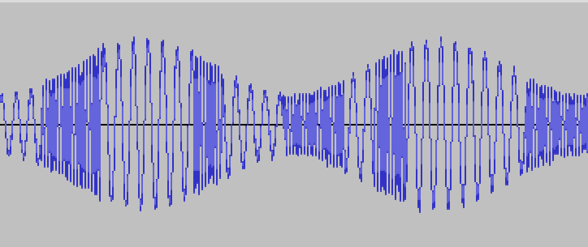
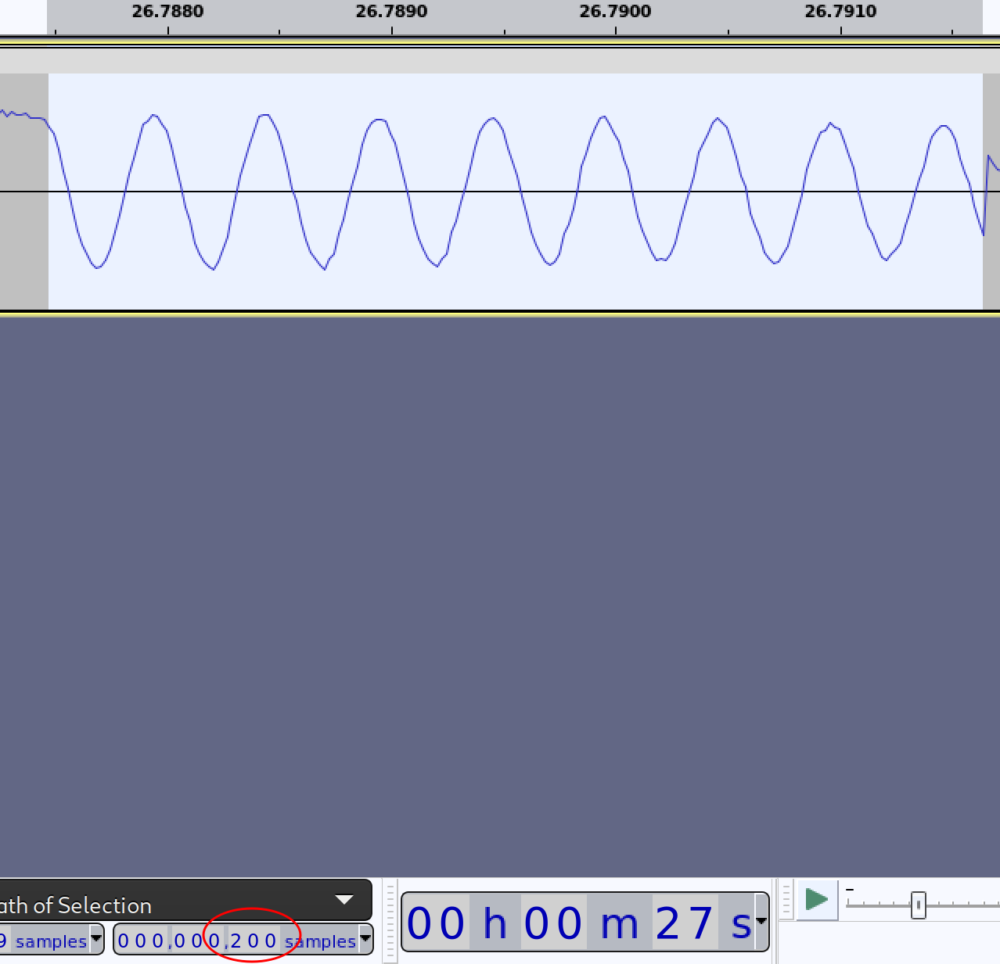

# Interception

## 题目简述

附件 `capture.wav` 是截获的无线信号录音。频谱与波形表明它不是语音，而是由两个稳定音调承载二进制数据的 BFSK 信号：

- 低频约为 495 Hz；
- 高频约为 1985 Hz；
- 每个比特占 200 个采样点；
- 开头和结尾各有 8,000 个噪声采样点。

flag 的获取依赖对采样信号的物理调制方式进行识别和解码，因此归入硬件与信号方向。

## 解题过程

### 确认双音调和比特宽度

整段信号的频谱中存在两个主要能量峰，符合二进制频移键控用两个载波分别表示 0 和 1 的特征：


时域波形呈现若干频率稳定的连续区间：



放大最短稳定区间后，测得其长度为 200 个采样点；录音采样率为 48,000 Hz，所以传输速率约为 $48000/200=240$ bit/s：



### 逐窗口判定载波

与其用 FFT 最大值的“频点编号是否大于 3”这种依赖采样率的判断，可以直接计算每个窗口在 495 Hz 和 1985 Hz 的相关能量。高频载波对应 1，低频载波对应 0：

```python
from pathlib import Path

import numpy as np
from scipy.io import wavfile


BIT_SAMPLES = 200
LOW_FREQUENCY = 495
HIGH_FREQUENCY = 1985
PREAMBLE = "1" * 32 + "0" * 32

sample_rate, samples = wavfile.read("capture.wav")
assert sample_rate == 48000
assert samples.ndim == 1
samples = samples[8000:-8000].astype(np.float64)

time_axis = np.arange(BIT_SAMPLES) / sample_rate
low_basis = np.exp(-2j * np.pi * LOW_FREQUENCY * time_axis)
high_basis = np.exp(-2j * np.pi * HIGH_FREQUENCY * time_axis)

bits = []
for offset in range(0, len(samples) - BIT_SAMPLES + 1, BIT_SAMPLES):
    window = samples[offset:offset + BIT_SAMPLES]
    low_energy = abs(window @ low_basis)
    high_energy = abs(window @ high_basis)
    bits.append("1" if high_energy > low_energy else "0")

bitstream = "".join(bits)
```

### 按前导序列拆包

比特流中反复出现 32 个 1 后接 32 个 0：

```text
1111111111111111111111111111111100000000000000000000000000000000
```

这是数据块的前导序列。去掉前导后，每 8 位按大端顺序恢复一个 ASCII 字节：

```python
blocks = []
for payload_bits in bitstream.split(PREAMBLE)[1:]:
    payload_bits = payload_bits[:len(payload_bits) // 8 * 8]
    payload = bytes(
        int(payload_bits[index:index + 8], 2)
        for index in range(0, len(payload_bits), 8)
    )
    if payload:
        blocks.append(payload.decode("ascii"))

for block in blocks:
    print(block)

last_hex = blocks[-1]
assert last_hex.startswith("0x")
print(bytes.fromhex(last_hex[2:]).decode())
```

前五块是后续 `Interception 2` 使用的 RSA 参数与密文；最后一块为：

```text
0x4e3050537b35674e346c5f50723063333535314e675f67305f4372347a597d
```

十六进制解码后得到：

```text
N0PS{5gN4l_Pr0c3551Ng_g0_Cr4zY}
```

## 方法总结

- 核心技巧：从频谱识别 BFSK 双载波，确定单比特采样宽度，再依据固定前导序列完成同步和分块。
- 识别信号：频谱有两个稳定峰值，时域中最短恒频区间长度一致，比特流中存在周期性重复前导。
- 复用要点：不要用固定 FFT 下标代替真实频率；采样率或窗口长度变化后，下标会失效。解调后还要验证前导、字节对齐和输出字符集，三者共同成立才能确认解码链。
