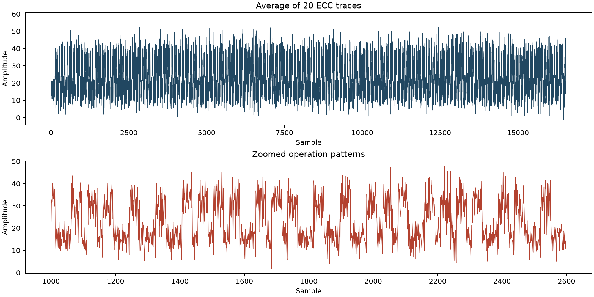

# Free n00psy

## 题目简述

题目分为两个阶段。第一阶段给出一批 ECDSA 风格的签名日志，需要利用随机数故障恢复私钥并取得加密 ZIP 的密码；第二阶段给出 20 条椭圆曲线运算的侧信道轨迹，需要通过简单功耗分析还原标量比特并解码 flag。

## 解题过程

签名日志中的每条记录都包含消息和两个 256 位整数，符合 ECDSA 的 $(r,s)$ 结构。检查所有记录后可以发现，多条不同消息拥有相同的 $r$：

```text
Sign("Approve access for ID 16400201")
r = 0xa53c9ec6c45a6d1d0347b09cb36f3bea52ac37d8e22f4d7cc344db033901bdc6
s = 0x43e149561f9246162d275e6a7354d53a9ce23a727c965a5fdc61c983df53bc4

Sign("Approve access for ID 16400294")
r = 0xa53c9ec6c45a6d1d0347b09cb36f3bea52ac37d8e22f4d7cc344db033901bdc6
s = 0x4a785c3f9055c48ac136118d3e2d7159a9123fe3b3e47aca74ae7b48a2ddb49
```

ECDSA 中 $r$ 由临时随机数 $k$ 决定，因此不同消息出现相同的 $r$ 表明 nonce 被复用。设 $z_i=\operatorname{SHA256}(m_i)$，则：

$$
k=(z_1-z_2)(s_1-s_2)^{-1}\bmod n
$$

$$
d=r^{-1}(s_1k-z_1)\bmod n
$$

这里使用 secp256k1 的群阶：

```python
from hashlib import sha256

m1 = b"Approve access for ID 16400201"
m2 = b"Approve access for ID 16400294"
r = 0xA53C9EC6C45A6D1D0347B09CB36F3BEA52AC37D8E22F4D7CC344DB033901BDC6
s1 = 0x43E149561F9246162D275E6A7354D53A9CE23A727C965A5FDC61C983DF53BC4
s2 = 0x4A785C3F9055C48AC136118D3E2D7159A9123FE3B3E47ACA74AE7B48A2DDB49
n = 0xFFFFFFFFFFFFFFFFFFFFFFFFFFFFFFFEBAAEDCE6AF48A03BBFD25E8CD0364141

z1 = int.from_bytes(sha256(m1).digest(), "big")
z2 = int.from_bytes(sha256(m2).digest(), "big")
k = (z1 - z2) * pow(s1 - s2, -1, n) % n
d = (s1 * k - z1) * pow(r, -1, n) % n

print(hex(k))
print(d.to_bytes((d.bit_length() + 7) // 8, "big"))
```

得到：

```text
k = 0x7a2dfed52190212bfc81f258b6878fc95f874c57787b7131aa76a5d001d2df37
*  z1p Pa5sW0rD: sC4_d3cRyP7#  *
```

因此 ZIP 密码为 `sC4_d3cRyP7#`。解压后取得 `traces_ECC.npy`，其形状为 `(20, 16551)`。20 条轨迹对应同一次运算，先沿轨迹维度求均值可以压低随机噪声：

```python
import numpy as np

traces = np.load("traces_ECC.npy", allow_pickle=True)
average_trace = np.mean(traces, axis=0)
```



放大后可以把轨迹分成高、低两种重复模式。高模式有时连续出现，而低模式总是夹在高模式之间。标量乘的 double-and-add 实现每一位都会执行倍点，只有比特为 1 时才执行加点，因此高模式对应倍点，低模式对应加点。

轨迹的第一个有效模式是低模式，说明实现按最低有效位到最高有效位处理标量。读取规则为：

- `低模式 + 高模式`：当前位为 `1`；
- 只有 `高模式`：当前位为 `0`。

按此规则读取到的最低位优先比特串为：

```text
101111101100110011100010011100100010110000010010110000100001101011001100111110101100110000110010000010101011001010001100110010101111101000101100111110100010101011001010101010100101001011111010010010100000110001100010110111101100101000001010000011000111001
```

将它反转为最高位优先，再按大端整数转换为字节：

```python
bitstring = (
    "10111110110011001110001001110010001011000001001011000010000110101100110011"
    "111010110011000011001000001010101100101000110011001010111110100010110011111"
    "010001010101100101010101010010100101111101001001010000011000110001011011110"
    "1100101000001010000011000111001"
)

value = int(bitstring[::-1], 2)
plain = value.to_bytes((len(bitstring) + 7) // 8, "big")
print(plain)
```

最终输出：

```text
N0PS{F0R_JUST_4_S1MPL3_3XCH4NG3}
```

仓库中的简短 `writeup.md` 末尾给出了另一条不一致的 flag；这里采用逐页核对后的官方 PDF 内容，并用 PDF 中的完整位串实际解码确认结果。

## 方法总结

第一阶段是典型的 ECDSA nonce 复用：相同 $r$ 将两条签名方程联系起来，使临时随机数和私钥都能被代数消去。第二阶段是 ECC 标量乘的简单功耗分析：多轨迹平均提升信噪比，再根据“倍点必做、加点条件执行”的控制流区分比特。题目的最终主障碍是物理侧信道轨迹解释，因此归入硬件与嵌入式方向，而不是只按附件所在的 Crypto 目录归类。
