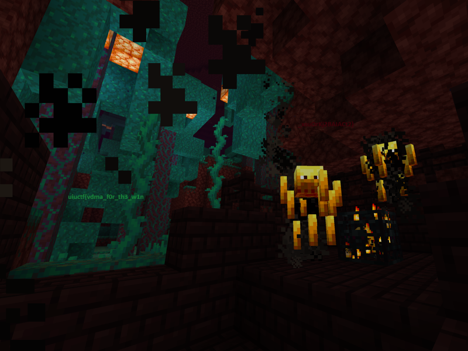

# blazing fast

## 题目简述

附件是一个运行在 FPGA 上的 32 位小端 MicroBlaze 程序。平台使用 VDMA（Video DMA）把内存中的像素缓冲区直接送往视频输出，并高速交替显示两帧图像。单独观察任一帧都看不到完整信息，但依据 Talbot–Plateau 效应，两帧的逐像素平均值会恢复真正的画面。

这题虽然发布在 Reverse 分类下，决定性障碍却是识别 MicroBlaze 软核、VDMA 帧缓冲区和像素布局，因此归入硬件与嵌入式方向。

## 解题过程

先用 `file` 或逆向工具识别架构：附件是 Xilinx MicroBlaze ELF。程序以 `-O0` 编译，初始化图像时没有被优化成紧凑的拷贝循环，而是反复出现近似的指令序列：

```text
imm   <address high>
addik r3, ...
imm   <pixel high>
addik r4, ...
swi   r4, r3, 0
```

也就是说，每个 `swi` 都把一个 32 位常量写入一个固定地址。大量重复写入之后，程序进入循环并轮流使用两块缓冲区。初始化 VDMA 的代码给出了两帧的基址：

```text
frame 0: 0x82000000
frame 1: 0x82269000
```

每帧恰有 $800\times600=480000$ 次像素写入。每个字的最高字节恒为零，结合常见视频格式可确定像素为 `0x00RRGGBB`：

$$
R=\left\lfloor\frac{p}{2^{16}}\right\rfloor\bmod256,\quad
G=\left\lfloor\frac{p}{2^8}\right\rfloor\bmod256,\quad
B=p\bmod256.
$$

从反汇编中收集两组 `(地址, 常量)`，按 `(地址-基址)/4` 排列成 $800\times600$ 图像。再对两个缓冲区逐通道取平均：

```python
from PIL import Image

WIDTH, HEIGHT = 800, 600

def rgb(word):
    return ((word >> 16) & 0xff, (word >> 8) & 0xff, word & 0xff)

# frame0_words、frame1_words 均按写入地址从小到大排列。
pixels = []
for a, b in zip(frame0_words, frame1_words):
    ca, cb = rgb(a), rgb(b)
    pixels.append(tuple((x + y) // 2 for x, y in zip(ca, cb)))

out = Image.new("RGB", (WIDTH, HEIGHT))
out.putdata(pixels)
out.save("averaged-frames-flag.png")
```

平均后的画面如下。图中左下和中央偏上的文字共同组成 flag；黑色块属于原始帧合成后的画面内容，不是图片损坏。



最终得到：

```text
uiuctf{vdma_f0r_th3_w1n_xsuOrKj2BAIACt2}
```

## 方法总结

- 核心技巧：从 MicroBlaze 的重复立即数写内存指令中恢复两块 VDMA 帧缓冲区，再逐像素平均。
- 识别信号：大量 `swi` 写入连续地址、固定的 `0x00RRGGBB` 高字节模式，以及循环中交替提交两个缓冲区，都指向未优化的视频帧初始化代码。
- 复用要点：必须确认 CPU 端序、像素通道顺序、分辨率和地址步长；直接平均打包后的 32 位整数会产生跨通道进位，应分别平均 R、G、B。
