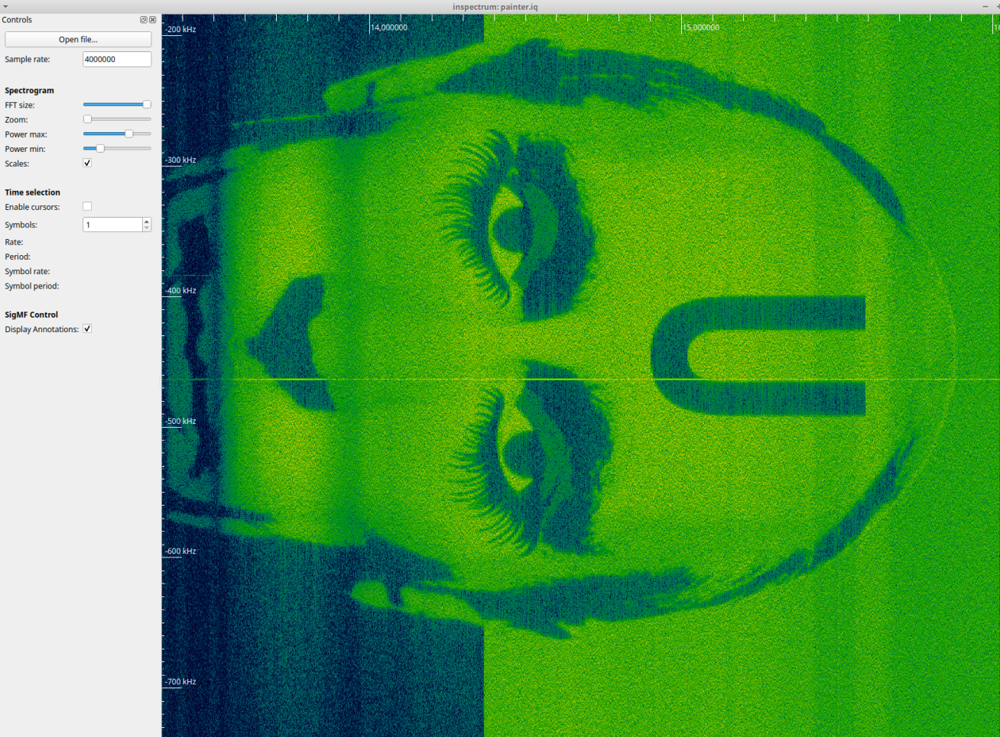
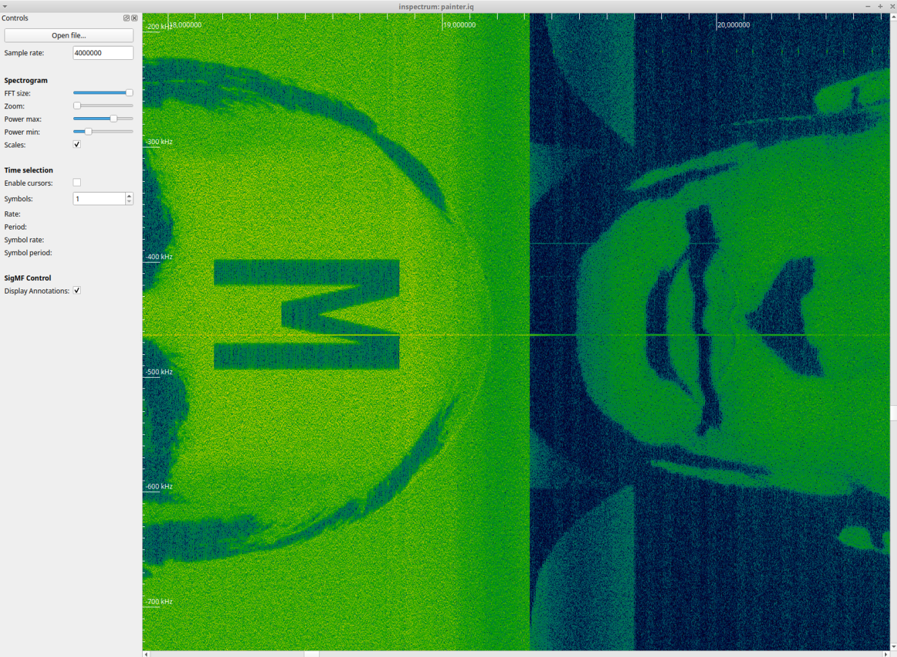

# UMDCTF2022 Gee, Queue Are Ex? Writeup

## 题目简述

原题提供复数 IQ 采样文件 `painter.iq`，提示从射频数据中观察可见内容。当前公开仓库只保留 Google Drive 下载链接和官方 flag，未收录 IQ 文件；公开复盘保留了使用 Inspectrum 查看原始信号时的截图。

信号的频谱随时间绘制出图像，因此决定性步骤是对 IQ 采样进行频谱可视化，归入 `hardware-embedded`。

## 解题过程

用 [Inspectrum](https://github.com/miek/inspectrum) 打开 `painter.iq`。公开截图显示采样率设置为 `4000000`，随后调节 FFT、功率上下限和缩放比例，使时频图中的高低能量区域形成清晰轮廓。

沿时间轴浏览时，可以看到 Shrek 面部等被“画”进频谱的图像：



后续区域还出现倒置、拼接的卡通画面：



解题方式不是解调语音或数字协议，而是继续平移、缩放频谱并读取其中绘制的内容。[原始参赛者复盘](https://github.com/K1nd4SUS/CTF-Writeups/tree/main/UMDCTF_2022/Gee%2C%20queue%20are%20ex)只保留了部分频谱帧和最终结果；仓库的官方 flag 文件确认提交值为：

```text
UMDCTF{D15RUP7_R4D10Z}
```

## 方法总结

IQ 文件未必承载常规调制协议。题面强调“what can you see”时，应先用时频图观察能量分布，并尝试改变采样率、FFT 尺寸、动态范围和视图方向。当前仓库缺少原始 `painter.iq`，所以这篇 WP 能说明准确工具、显示参数、视觉机制与结果，但不能仅依靠现有仓库完整重放滚动过程。
