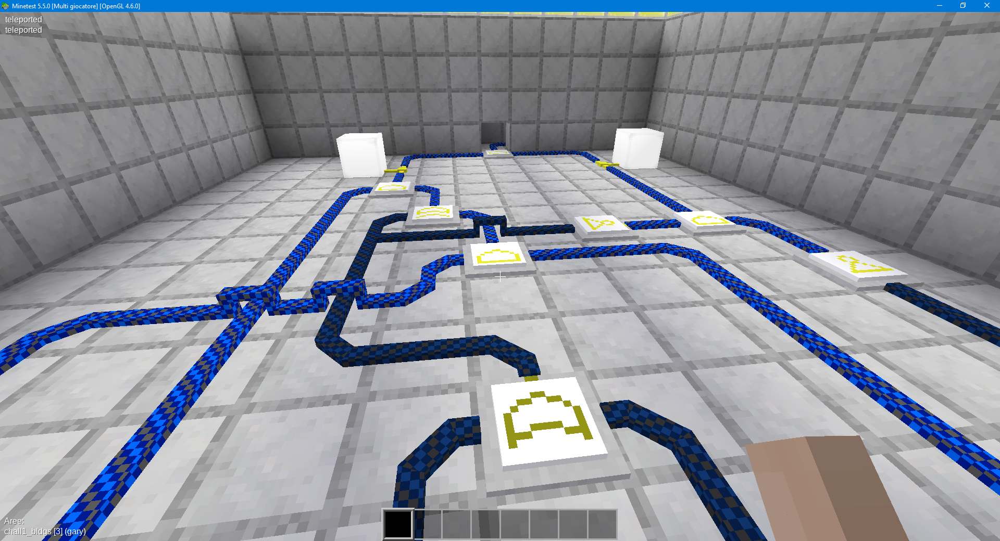
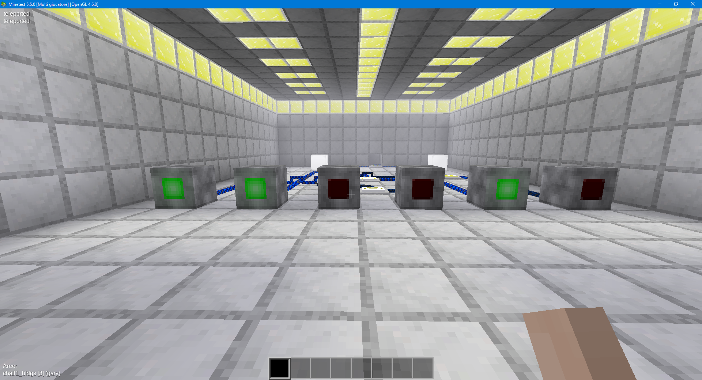

# UMDCTF2022 Minetest 1 - Digital Logic Primer Writeup

## 题目简述

这道题原本部署在 Minetest 服务器中，玩家需要在三维场景内找到数字逻辑房间，并根据门电路连接设置开关。仓库 README 称赛后可以打开世界文件，但当前公开目录实际没有该文件，只保留两个子题的 flag。

公开复盘留存了第一题的电路、成功灯态和最终结果，足以恢复其核心机制；第二题 MUX 缺少世界文件和可核对的解题记录，因此不据 flag 反推过程，也不生成第二题 WP。

## 解题过程

进入第一题房间后，可以看到由导线、逻辑门、输入拉杆和输出灯组成的组合逻辑电路：



解题时从各输入端沿导线向输出端追踪，对每个门按 AND、OR、NOT 等真值表计算。若支路交叉，应以实际连接方块为准，不能只按俯视投影判断是否相连。依次调整拉杆，使电路输出满足房间要求。

公开复盘保留的成功状态中，六盏指示灯从左到右呈现“亮、亮、灭、灭、亮、灭”：



在该状态下触发出口装置即可得到 flag。图片中的纯文字结果已直接转写，不重复保留截图：

```text
UMDCTF{g4t3s_r_kul}
```

[参赛者复盘](https://github.com/K1nd4SUS/CTF-Writeups/tree/main/UMDCTF_2022/Minetest%201%20-%20Digital%20Logic%20Primer)提供了上述三维场景证据；其重要信息已写入正文。

## 方法总结

三维沙盒中的数字逻辑题仍应回到组合逻辑本身：先辨认门类型和连线，再逐级计算，不要靠反复试开关。视觉截图能说明电路空间关系和成功灯态，因而保留；只显示 flag 的截图没有额外机制信息，直接转为文本。由于公开仓库缺少世界文件，本题无法恢复每个拉杆的精确坐标和完整交互顺序。
