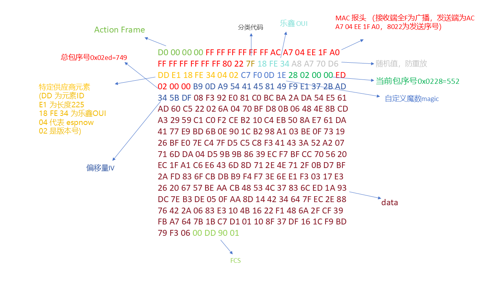
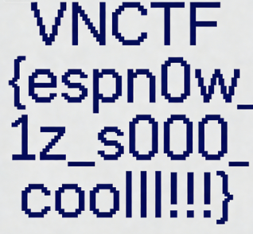

# ez_iot

## 题目简述

题目给出一个 Xtensa 架构的 ESP 固件和一段无线捕获数据。固件中符号信息保留较完整，可以从 `app_main`、`sender_task` 等函数名判断它使用 ESP-NOW 发送数据。逆向 `sender_task` 后可还原应用层包结构：

```text
Magic(4) | seq(4) | total_chunks(4) | IV(16) | AES-CBC ciphertext
```

每次读取明文长度约为 `0xc0`，不足一块时使用 PKCS#7 填充；加密算法是 AES-128-CBC，key 为 `uV9vG6mZ7mS8eC8b`。解题目标是从 `capture.raw` 中切出 ESP-NOW 数据帧，按 `seq` 解密并重组出原始 PNG。

## 解题过程

`file` 可以确认附件是 Xtensa 架构的 ESP 固件；`strings` 里能看到 ESP-IDF、`app_main`、`sender_task`、`esp_now_*` 等符号。由于符号保留较完整，用 IDA/Ghidra 直接从 `app_main` 跟到发送任务即可。

`sender_task` 中核心逻辑整理如下：

```c
struct app_packet {
    uint32_t magic;        // 0x1e0df0c7，题解中写作自定义 magic
    uint32_t seq;
    uint32_t total_chunks;
    uint8_t iv[16];
    uint8_t data[];
};

while ((n = fread(buf, 1, 0xc0, fp)) > 0) {
    if (n < 0xc0) {
        pkcs7_pad(buf, &n, 16);
    }
    esp_fill_random(pkt.iv, 16);
    aes_128_cbc_encrypt("uV9vG6mZ7mS8eC8b", pkt.iv, buf, n, pkt.data);
    esp_now_send(peer, (uint8_t *)&pkt, sizeof(header) + n);
}
```

所以自定义应用层包结构为：

```text
Magic(4) | seq(4) | total_chunks(4) | IV(16) | AES-CBC ciphertext
```

结合 [ESP-NOW - ESP32 - ESP-IDF 编程指南](https://docs.espressif.com/projects/esp-idf/zh_CN/stable/esp32/api-reference/network/esp_now.html)，供应商动作帧可按如下字段切开：

```text
MAC header(24) | category(1) | OUI(3) | random(4) | vendor content(7-x) | FCS(4)
vendor content(v1): element_id(1) | length(1) | OUI(3) | type(1) | reserved/version(1) | body(0-250)
```

我们选取其中一段数据进行解析：



至此我们可以写脚本从capture.raw恢复图像：

```python
from Crypto.Cipher import AES
from Crypto.Util.Padding import unpad
import struct
AES_KEY = b"uV9vG6mZ7mS8eC8b"
MAGIC = b"\xC7\xF0\x0D\x1E"
STATIC_HEADER = b"\xD0\x00\x00\x00\xFF\xFF\xFF\xFF\xFF\xFF"
INPUT_FILE = "capture.raw"
OUTPUT_FILE = "decrypted.png"
with open(INPUT_FILE, 'rb') as f:
    raw_data = f.read()
# 1. 切
frames = []
offset = 0
while True:
    idx = raw_data.find(STATIC_HEADER, offset)
    if idx == -1: break

    # 找下一个帧头确定结束位置
    next_idx = raw_data.find(STATIC_HEADER, idx + 10)
    if next_idx == -1: next_idx = len(raw_data)
    frames.append(raw_data[idx:next_idx])
    offset = next_idx
chunks_dict = {}
total_chunks = 0
# 2. 遍历解密
for frame in frames:
    # 定位 MAGIC
    magic_idx = frame.find(MAGIC)
    if magic_idx == -1: continue
    # 解析头: MAGIC(4) + SEQ(4) + TOTAL(4) + IV(16)
    if magic_idx + 28 > len(frame): continue
    seq, total = struct.unpack('<II', frame[magic_idx+4 : magic_idx+12])
    iv = frame[magic_idx+12 : magic_idx+28]
    total_chunks = total
    # 数据区: MAGIC后28字节 ~ 帧尾(去FCS)
    # 在espnow中 FCS 是最后4字节
    if len(frame) < magic_idx + 28 + 4: continue
    encrypted = frame[magic_idx+28 : -4]

    # 简单校验
    if len(encrypted) % 16 != 0:
        continue # 数据残缺或不是加密包
    # 解密
    cipher = AES.new(AES_KEY, AES.MODE_CBC, iv)
    decrypted = cipher.decrypt(encrypted)
    chunks_dict[seq] = decrypted
# 合并保存
chunks = sorted(chunks_dict.items())
with open(OUTPUT_FILE, 'wb') as f:
    for seq, data in chunks:
        if seq == total_chunks - 1:
            try:
                data = unpad(data, 16)
            except:
                pass
        f.write(data)
```

获得flag



有趣的是，尽管一些师傅已经获得了数据包的格式，但是在解密过程中使用了IV全零，然后丢弃前16位的做法。

```
payload = chunks[i] # 包含 TOTAL(4) + IV(16) + DATA...
ct = payload[4:]    # 跳过 TOTAL(4)。现在 ct = IV(16) + DATA...
# 注意：ct 的前 16 字节 正是 IV
pt = AES.new(KEY, AES.MODE_CBC, iv=IV).decrypt(ct) # 这里的 iv=IV 是全0
pt[0:16] #计算出来是乱码 (Dec(IV) ^ 0)
pt[16:32] #计算出来是 P0 (Dec(EncData0) ^ IV) -> 正确!
out.extend(pt[16:]) # 丢弃前 16 字节乱码，保留后面正确的明文
```

## 方法总结

IoT 固件取证题要把固件逆向和流量格式对齐：先确认架构和协议栈，再从发送函数里恢复应用层包头、分片字段、IV 和加密模式。ESP-NOW 帧里会有链路层头和 FCS，脚本切帧时不能直接把整帧当密文。CBC 模式下 IV 若紧贴密文，也可能出现“全零 IV 解密后丢前 16 字节仍然正确”的现象，本质是把真实 IV 当成第一块密文参与了解密。
