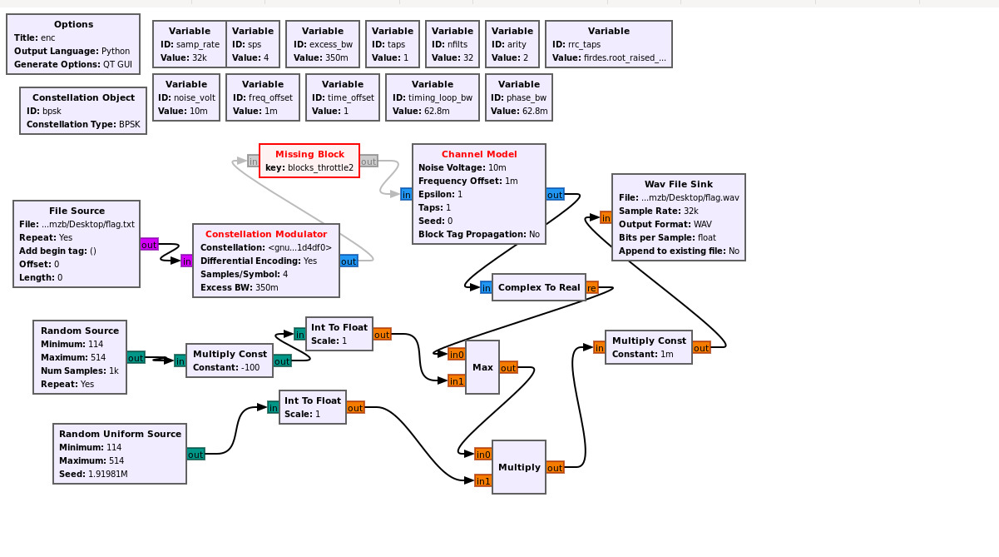
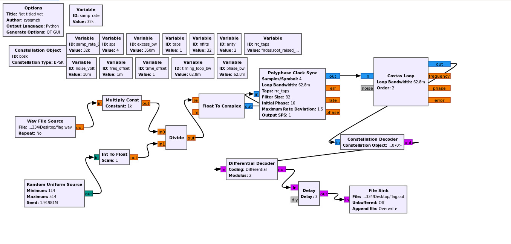
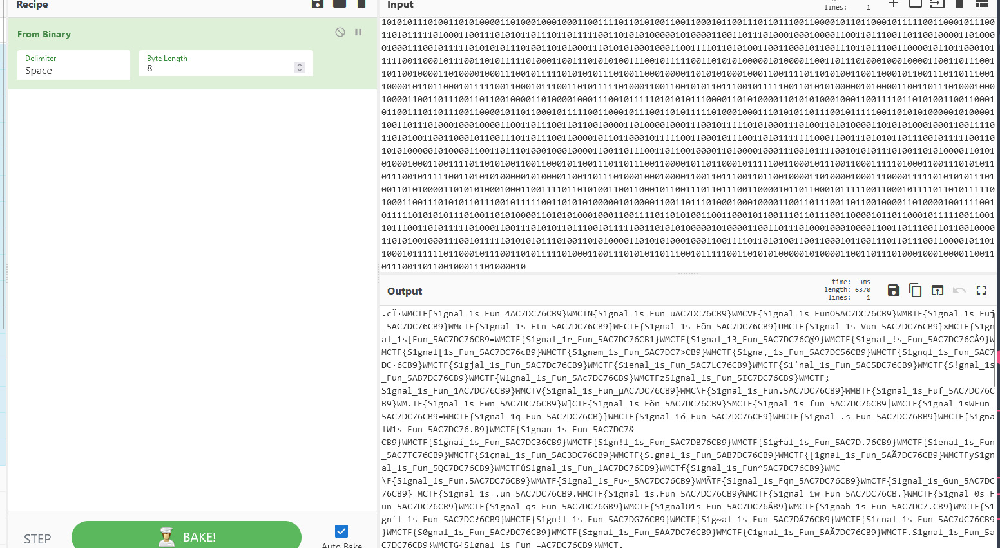

# Random

## 题目简述

题目给出 GnuRadio `.grc` 和音频信号。流程中先读取 `flag.txt` 做 BPSK 调制，再叠加/相乘两个随机源。关键弱点是随机源并不真正随机：一个比较分支可被忽略，另一个由固定种子 `1919810` 生成，因此可以把信号还原后按 BPSK 解调。

## 解题过程

grc 文件可以使用 gnuradio 打开，安装完成后，可以直接使用 gnuradio-companion 启动它

然后分析其逻辑



实际上逻辑非常简单，读取 flag.txt 后进行 bpsk 调制，然后与随机数比较大小，接着与随机数相乘，最后整体再进行一次乘法运算

值得注意的是这两个随机数，仔细观察第一个随机数可以发现，它是先乘以 -100 再去比较大小，因此这一步可以直接忽略，从而还原出原始信号！

第二个随机数实际上是固定种子 1919810 生成的，然后用于乘法运算，所以这个随机数其实并不随机！

因此只需读取 wav 文件，然后将整体乘以前一步乘法的倒数，再除以固定种子 1919810，得到范围在 114~514 的随机数，最后进行解调即可。

dec.grc：

```
options:
  parameters:
    author: zysgmzb
    catch_exceptions: 'True'
    category: '[GRC Hier Blocks]'
    cmake_opt: ''
    comment: ''
    copyright: ''
    description: ''
    gen_cmake: 'On'
    gen_linking: dynamic
    generate_options: qt_gui
    hier_block_src_path: '.:'
    id: dec
    max_nouts: '0'
    output_language: python
    placement: (0,0)
    qt_qss_theme: ''
    realtime_scheduling: ''
    run: 'True'
    run_command: '{python} -u {filename}'
    run_options: prompt
    sizing_mode: fixed
    thread_safe_setters: ''
    title: Not titled yet
    window_size: (1000,1000)
  states:
    bus_sink: false
    bus_source: false
    bus_structure: null
    coordinate: [8, 8]
    rotation: 0
    state: enabled

blocks:
- name: arity
  id: variable
  parameters:
    comment: ''
    value: '2'
  states:
    bus_sink: false
    bus_source: false
    bus_structure: null
    coordinate: [576, 88.0]
    rotation: 0
    state: enabled
- name: bpsk
  id: variable_constellation
  parameters:
    comment: ''
    const_points: '[-1-1j, -1+1j, 1+1j, 1-1j]'
    dims: '1'
    normalization: digital.constellation.AMPLITUDE_NORMALIZATION
    precision: '8'
    rot_sym: '4'
    soft_dec_lut: None
    sym_map: '[0, 1, 3, 2]'
    type: bpsk
  states:
    bus_sink: false
    bus_source: false
    bus_structure: null
    coordinate: [24, 120.0]
    rotation: 0
    state: true
- name: excess_bw
  id: variable
  parameters:
    comment: ''
    value: '0.35'
  states:
    bus_sink: false
    bus_source: false
    bus_structure: null
    coordinate: [336, 88.0]
    rotation: 0
    state: enabled
- name: freq_offset
  id: variable
  parameters:
    comment: ''
    value: '0.001'
  states:
    bus_sink: false
    bus_source: false
    bus_structure: null
    coordinate: [264, 152.0]
    rotation: 0
    state: true
- name: nfilts
  id: variable
  parameters:
    comment: ''
    value: '32'
  states:
    bus_sink: false
    bus_source: false
    bus_structure: null
    coordinate: [504, 88.0]
    rotation: 0
    state: enabled
- name: noise_volt
  id: variable
  parameters:
    comment: ''
    value: '0.01'
  states:
    bus_sink: false
    bus_source: false
    bus_structure: null
    coordinate: [176, 152.0]
    rotation: 0
    state: true
- name: phase_bw
  id: variable
  parameters:
    comment: ''
    value: '0.0628'
  states:
    bus_sink: false
    bus_source: false
    bus_structure: null
    coordinate: [576, 152.0]
    rotation: 0
    state: true
- name: rrc_taps
  id: variable
  parameters:
    comment: ''
    value: firdes.root_raised_cosine(nfilts, nfilts, 1.0/float(sps), 0.35, 45*nfilts)
  states:
    bus_sink: false
    bus_source: false
    bus_structure: null
    coordinate: [648, 88.0]
    rotation: 0
    state: enabled
- name: samp_rate
  id: variable
  parameters:
    comment: ''
    value: '32000'
  states:
    bus_sink: false
    bus_source: false
    bus_structure: null
    coordinate: [184, 12]
    rotation: 0
    state: enabled
- name: samp_rate_0
  id: variable
  parameters:
    comment: ''
    value: '32000'
  states:
    bus_sink: false
    bus_source: false
    bus_structure: null
    coordinate: [176, 88.0]
    rotation: 0
    state: enabled
- name: sps
  id: variable
  parameters:
    comment: ''
    value: '4'
  states:
    bus_sink: false
    bus_source: false
    bus_structure: null
    coordinate: [264, 88.0]
    rotation: 0
    state: enabled
- name: taps
  id: variable
  parameters:
    comment: ''
    value: '[1.0 + 0.0j, ]'
  states:
    bus_sink: false
    bus_source: false
    bus_structure: null
    coordinate: [432, 88.0]
    rotation: 0
    state: enabled
- name: time_offset
  id: variable
  parameters:
    comment: ''
    value: '1.0'
  states:
    bus_sink: false
    bus_source: false
    bus_structure: null
    coordinate: [360, 152.0]
    rotation: 0
    state: true
- name: timing_loop_bw
  id: variable
  parameters:
    comment: ''
    value: '0.0628'
  states:
    bus_sink: false
    bus_source: false
    bus_structure: null
    coordinate: [456, 152.0]
    rotation: 0
    state: true
- name: analog_random_uniform_source_x_1
  id: analog_random_uniform_source_x
  parameters:
    affinity: ''
    alias: ''
    comment: ''
    maximum: '514'
    maxoutbuf: '0'
    minimum: '114'
    minoutbuf: '0'
    seed: '1919810'
    type: int
  states:
    bus_sink: false
    bus_source: false
    bus_structure: null
    coordinate: [64, 476.0]
    rotation: 0
    state: true
- name: blocks_delay_0
  id: blocks_delay
  parameters:
    affinity: ''
    alias: ''
    comment: ''
    delay: '3'
    maxoutbuf: '0'
    minoutbuf: '0'
    num_ports: '1'
    type: byte
    vlen: '1'
  states:
    bus_sink: false
    bus_source: false
    bus_structure: null
    coordinate: [792, 480.0]
    rotation: 0
    state: enabled
- name: blocks_divide_xx_0
  id: blocks_divide_xx
  parameters:
    affinity: ''
    alias: ''
    comment: ''
    maxoutbuf: '0'
    minoutbuf: '0'
    num_inputs: '2'
    type: float
    vlen: '1'
  states:
    bus_sink: false
    bus_source: false
    bus_structure: null
    coordinate: [440, 332.0]
    rotation: 0
    state: true
- name: blocks_file_sink_0
  id: blocks_file_sink
  parameters:
    affinity: ''
    alias: ''
    append: 'False'
    comment: ''
    file: /mnt/c/Users/16334/Desktop/flag.out
    type: byte
    unbuffered: 'False'
    vlen: '1'
  states:
    bus_sink: false
    bus_source: false
    bus_structure: null
    coordinate: [928, 492.0]
    rotation: 0
    state: enabled
- name: blocks_float_to_complex_0
  id: blocks_float_to_complex
  parameters:
    affinity: ''
    alias: ''
    comment: ''
    maxoutbuf: '0'
    minoutbuf: '0'
    vlen: '1'
  states:
    bus_sink: false
    bus_source: false
    bus_structure: null
    coordinate: [528, 248.0]
    rotation: 0
    state: enabled
- name: blocks_int_to_float_2
  id: blocks_int_to_float
  parameters:
    affinity: ''
    alias: ''
    comment: ''
    maxoutbuf: '0'
    minoutbuf: '0'
    scale: '1'
    vlen: '1'
  states:
    bus_sink: false
    bus_source: false
    bus_structure: null
    coordinate: [264, 396.0]
    rotation: 0
    state: true
- name: blocks_multiply_const_vxx_0
  id: blocks_multiply_const_vxx
  parameters:
    affinity: ''
    alias: ''
    comment: ''
    const: '1000'
    maxoutbuf: '0'
    minoutbuf: '0'
    type: float
    vlen: '1'
  states:
    bus_sink: false
    bus_source: false
    bus_structure: null
    coordinate: [272, 252.0]
    rotation: 0
    state: true
- name: blocks_wavfile_source_0
  id: blocks_wavfile_source
  parameters:
    affinity: ''
    alias: ''
    comment: ''
    file: /mnt/c/Users/16334/Desktop/flag.wav
    maxoutbuf: '0'
    minoutbuf: '0'
    nchan: '1'
    repeat: 'False'
  states:
    bus_sink: false
    bus_source: false
    bus_structure: null
    coordinate: [40, 308.0]
    rotation: 0
    state: true
- name: digital_constellation_decoder_cb_0
  id: digital_constellation_decoder_cb
  parameters:
    affinity: ''
    alias: ''
    comment: ''
    constellation: bpsk
    maxoutbuf: '0'
    minoutbuf: '0'
  states:
    bus_sink: false
    bus_source: false
    bus_structure: null
    coordinate: [904, 356.0]
    rotation: 0
    state: enabled
- name: digital_costas_loop_cc_0
  id: digital_costas_loop_cc
  parameters:
    affinity: ''
    alias: ''
    comment: ''
    maxoutbuf: '0'
    minoutbuf: '0'
    order: arity
    use_snr: 'False'
    w: phase_bw
  states:
    bus_sink: false
    bus_source: false
    bus_structure: null
    coordinate: [992, 152.0]
    rotation: 0
    state: enabled
- name: digital_diff_decoder_bb_0
  id: digital_diff_decoder_bb
  parameters:
    affinity: ''
    alias: ''
    coding: digital.DIFF_DIFFERENTIAL
    comment: ''
    maxoutbuf: '0'
    minoutbuf: '0'
    modulus: '2'
  states:
    bus_sink: false
    bus_source: false
    bus_structure: null
    coordinate: [600, 420.0]
    rotation: 0
    state: enabled
- name: digital_pfb_clock_sync_xxx_0
  id: digital_pfb_clock_sync_xxx
  parameters:
    affinity: ''
    alias: ''
    comment: ''
    filter_size: nfilts
    init_phase: nfilts/2
    loop_bw: timing_loop_bw
    max_dev: '1.5'
    maxoutbuf: '0'
    minoutbuf: '0'
    osps: '1'
    sps: sps
    taps: rrc_taps
    type: ccf
  states:
    bus_sink: false
    bus_source: false
    bus_structure: null
    coordinate: [688, 180.0]
    rotation: 0
    state: enabled

connections:
- [analog_random_uniform_source_x_1, '0', blocks_int_to_float_2, '0']
- [blocks_delay_0, '0', blocks_file_sink_0, '0']
- [blocks_divide_xx_0, '0', blocks_float_to_complex_0, '0']
- [blocks_float_to_complex_0, '0', digital_pfb_clock_sync_xxx_0, '0']
- [blocks_int_to_float_2, '0', blocks_divide_xx_0, '1']
- [blocks_multiply_const_vxx_0, '0', blocks_divide_xx_0, '0']
- [blocks_wavfile_source_0, '0', blocks_multiply_const_vxx_0, '0']
- [digital_constellation_decoder_cb_0, '0', digital_diff_decoder_bb_0, '0']
- [digital_costas_loop_cc_0, '0', digital_constellation_decoder_cb_0, '0']
- [digital_diff_decoder_bb_0, '0', blocks_delay_0, '0']
- [digital_pfb_clock_sync_xxx_0, '0', digital_costas_loop_cc_0, '0']

metadata:
  file_format: 1
  grc_version: 3.10.5.1
```


其他参数，如果你在 gnuradio 中搜索 bpsk 的实现，实际上就是官方示例中使用的那些参数

https://wiki.gnuradio.org/index.php/Simulation_example:_BPSK_Demodulation

官方示例的关键点是：BPSK 解调链路通常会把输入转成复数基带信号，再依次经过符号同步、Costas Loop 载波恢复、星座判决和差分解码。这里的 `digital_pfb_clock_sync`、`digital_costas_loop`、`digital_constellation_decoder`、`digital_diff_decoder` 参数沿用示例即可，题目真正需要处理的是前面的随机乘法还原。

解调也是按照官方示例进行的。

对生成的文件进行二进制解码后，你会得到一堆带有个别错误的 flag。



观察到 flag 为 32 位

这里我们只需要分析 flag 的每一位，看看哪个字符出现得最频繁。

最后，我们得到了 flag

```
WMCTF{S1gnal_1s_Fun_5AC7DC76CB9}
```

## 方法总结

- 核心技巧：还原被固定随机源扰动的 BPSK 信号，再按标准 GnuRadio 解调链恢复比特。
- 识别信号：`.grc` 中出现 `random_uniform_source`、固定 seed、BPSK 调制和 wav 输出时，应先检查随机源是否可复现。
- 复用要点：通信题的外部示例只负责标准解调链；题目差异通常藏在信道扰动、随机源或预处理模块中。
