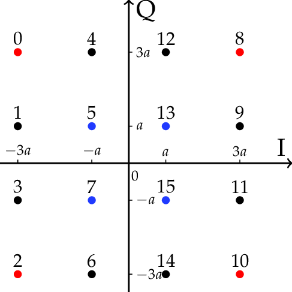

# Radio

## 题目简述

WelcomeCTF2021 的 Radio 提供一个带噪声的无线信号采样服务。服务公布随机载波频率、总时长和 16-QAM 星座映射，允许在最多 1000 个时间点查询振幅。flag 先转成十六进制，每个十六进制字符映射为一组同相分量 $I$ 和正交分量 $Q$，每个符号持续四个载波周期。

## 解题过程

题目给出的星座图如下。数字 $0\ldots15$ 对应一个十六进制半字节，横轴为 $I$，纵轴为 $Q$，坐标均取 $\{-3,-1,1,3\}$。



服务生成的信号为

$$
S(t)=I\sin(2\pi f t)+Q\cos(2\pi f t)+\varepsilon,
$$

其中噪声 $\varepsilon\in[-0.2,0.2]$。载波周期为 $T=1/f$，每个符号覆盖 $4T$。从服务给出的总时长可算出符号数：

$$
n=\frac{\text{total}}{4T}.
$$

官方脚本对每个符号均匀采样 10 次：

```python
period = 1 / frequency
rounds = 10
times = []

for i in range(symbol_count):
    for j in range(rounds):
        times.append(4 * period * i + 4 * period * j / rounds)
```

收到全部振幅后，分别与载波的正弦、余弦相乘并乘 2：

```python
i_samples.append(amplitude[k] * sin(2 * pi * frequency * times[k]) * 2)
q_samples.append(amplitude[k] * cos(2 * pi * frequency * times[k]) * 2)
```

对一个完整符号区间采样后，双频交叉项的正负范围近似对称。官方脚本分别取每组样本最大值和最小值的中点，估计 $I$ 与 $Q$，再吸附到最近的合法电平：

```python
levels_i = [-3, -1, 1, 3]
levels_q = [3, 1, -1, -3]

i_level = min(range(4), key=lambda k: abs(i_estimate - levels_i[k]))
q_level = min(range(4), key=lambda k: abs(q_estimate - levels_q[k]))
nibble = constellation[q_level][i_level]
```

按时间顺序把所有半字节拼成整数并转回字节，得到：

```text
greyhats{IT5_e45Y_70_S3nD_D@T4_W17h_RaD10w4ve}
```

## 方法总结

本题的决定性步骤是正交解调，而不是对噪声逐点猜测。已知载波频率后，在每个符号区间覆盖完整相位进行多点采样，就能把正弦与余弦分量分离；再利用星座只有 16 个离散点的先验做最近邻判决，可以稳定消除小幅噪声。
