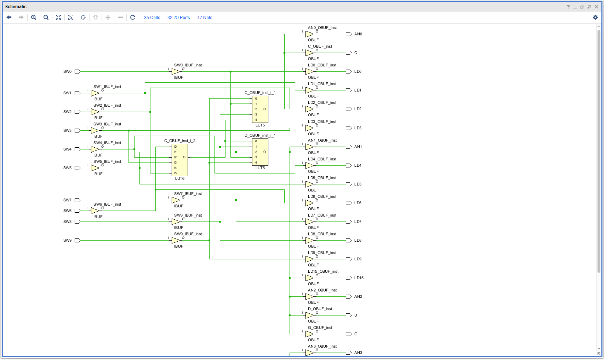

# EE2026

## 题目简述

附件是一个 Basys 3 FPGA 作业工程及规格说明。学号格式为 `A + 五位密码 + B + C`：Value A 决定初始化七段显示，密码决定哪些开关必须开启，字母 B 和 Value C 则决定密码正确时显示的字符与数码管位置。目标是在 Vivado 中逆向综合网表恢复四部分。

## 解题过程

### 打开综合网表

在 Vivado 导入工程并运行 Synthesis，选择 **Open Synthesized Design → Schematic**。沿 `LD15`、`AN0`–`AN3` 和七段输出回溯，可看到开关输入经过两级 LUT 产生密码正确信号及显示控制。



### 恢复五位密码

密码检测的外层 LUT5 为：

$$O=I_0\land I_1\land\neg I_2\land\neg I_3\land\neg I_4$$

其中 $I_0$ 来自内层 LUT6，其他输入依次映射到 `SW8`、`SW7`、`SW0`、`SW9`。内层 LUT6 为：

$$O=\neg SW6\land\neg SW5\land SW4\land\neg SW3\land SW1\land SW2$$

合并得密码正确条件：

$$\neg SW6\land\neg SW5\land SW4\land\neg SW3\land SW1\land SW2\land SW8\land\neg SW7\land\neg SW0\land\neg SW9$$

只有 `SW1`、`SW2`、`SW4`、`SW8` 为开，按规格将数字排序并以 `X` 补足五位，密码为 `1248X`。

### 恢复 Value C 与字母 B

密码正确时位选线观察为：

```text
AN0=0, AN1=1, AN2=1, AN3=0
```

Basys 3 的四位共阳数码管位选为低有效，因此取反后是 `1001`。对照题目表，开启 AN3 与 AN0 的组合对应 Value C `8`。

段选同样是低有效。综合网表显示在密码正确时，`A/C/E` 为低、`B/D/F/G` 为高；按低有效解释，点亮的段形成字母 `G`，所以 B 为 `G`。

### 恢复 Value A 并组合

密码错误的初始化显示模式对应规格表中的 Value A `2`。按 `A + password + B + C` 组合：

```text
2 + 1248X + G + 8 = 21248XG8
```

这里的 `X` 是作业规格中用于补足五位密码的占位符；官方 `challenge.yml` 与解题 PDF 在最终 flag 中将它记作小写 `x`。因此提交值为：

```text
grey{21248xG8}
```

题目说明与 9 页官方解题 PDF 已逐页视觉对照：密码 LUT、低有效位选、字符段码和最终字段顺序均相互一致。

## 方法总结

FPGA 综合网表逆向要先从有语义的输出网络回溯 LUT，再把 LUT 真值/布尔式映射回物理开关。七段数码管尤其要确认位选和段选的有效电平；若忽略共阳器件的低有效逻辑，Value C 与字符都会被整体取反而判断错误。
