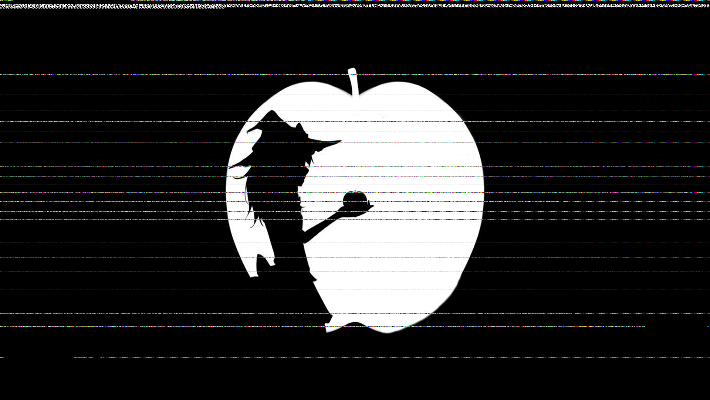
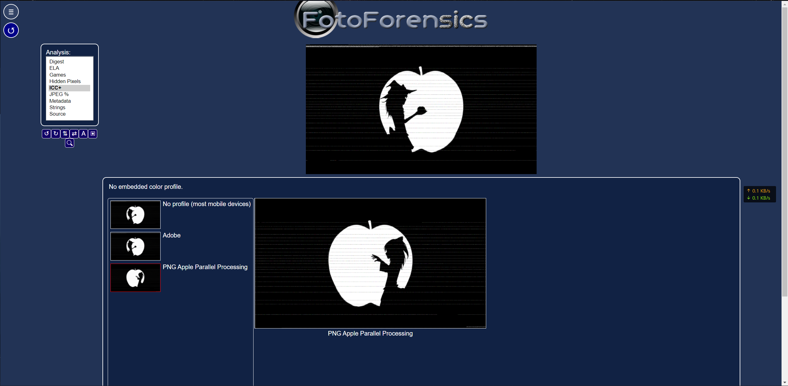

# WannaWacca

## 题目简述

OMG, I think this is a ransomware virus.

题目是内存取证、恶意程序流量复现、ZIP 已知明文攻击、PNG/iDOT 差异图像、盲文和文本盲水印的组合题。主线是从 Windows 内存镜像中提取 `SmartFalcon.exe` 与 `readme.txt`，还原远控流量协议解密 `flag.zip.WannaWacca`，再连续解出图片和文本中的隐藏信息。

## 解题过程

首先拿到一个内存镜像，通过 cmdscan  、cmdline  、psist  不难发现 pid 为 1404 的可疑进程SmartFalcon.exe ，同时还有 readme.txt

关键 Volatility 结果是：`pslist/cmdscan/cmdline` 均指向 pid 1404 的 `SmartFalcon.exe`，命令行里能看到 `dumpfiles` 提取相关痕迹，并且 `readme.txt` 出现在可疑用户目录下。

然后使用 filescan  和 dumpfiles  将它们提取出来

```
python2 vol.py -f d3-win7-5f799647.vmem --profile=Win7SP1x64 filescan | grep
SmartFalcon
# 0x000000003dec4a70      5      0 R--r-d
\Device\HarddiskVolume1\Users\D3CTF\Desktop\SmartFalcon.exe

python2 vol.py -f d3-win7-5f799647.vmem --profile=Win7SP1x64 filescan | grep
readme.txt
# 0x000000003e306830     16      0 RW-rw-
\Device\HarddiskVolume1\Users\D3CTF\Desktop\readme.txt

python2 vol.py -f d3-win7-5f799647.vmem --profile=Win7SP1x64 dumpfiles -Q
0x000000003dec4a70 -D ./
# ImageSectionObject 0x3dec4a70   None
\Device\HarddiskVolume1\Users\D3CTF\Desktop\SmartFalcon.exe

python2 vol.py -f d3-win7-5f799647.vmem --profile=Win7SP1x64 dumpfiles -Q
0x000000003e306830 -D ./
# DataSectionObject 0x3e306830   None
\Device\HarddiskVolume1\Users\D3CTF\Desktop\readme.txt

file file.None.0xfffffa800ec68010.img
# file.None.0xfffffa800ec68010.img: PE32+ executable (console) x86-64 (stripped
to external PDB), for MS Windows

file file.None.0xfffffa800ebd7180.dat
# file.None.0xfffffa800ebd7180.dat: ASCII text, with CRLF line terminators
```

根据 readme.txt  最后一句 YOU WILL NEVER KNOW MY IP ADDRESS!  得知要找 IP, 方便进行流量分析

查壳，发现用了 upx，直接 upx -d  运行不了，参考下面的 issue 添加参数解决

https://github.com/upx/upx/issues/359

该 UPX issue 的关键信息是：某些 Windows PE 在普通 `upx -d` 后可能因为 relocation 处理问题无法正常运行，讨论中给出的绕过方式是解包时保留 relocation，即添加 `--strip-relocs=0`。本题需要这个参数才能得到可运行/可分析的 `SmartFalcon.exe`。

```
.\upx.exe -d --strip-relocs=0 SmartFalcon.exe
```

拖进 IDA 发现函数名被混淆难以逆向，尝试寻找别的方法

```
strings SmartFalcon.exe > strs.txt
```

然后用文本编辑器加正则 [0-9]{1,3}\.[0-9]{1,3}\.[0-9]{1,3}\.[0-9]{1,3}:[0-9]{1,5}  可以找到 114.116.210.244:53939

将地址改到本机

```
sed -i "s/114.116.210.244/127.127.127.127/" SmartFalcon.exe
```

查看流量包, filter 填上 ip.addr == 114.116.210.244

9518 号包包含明文 enc flag.zip 公钥

随后 12185 号包命令执行 dir

12190 返回文件目录 flag.zip  变成了 flag.zip.WannaWacca

猜测为 9518 加密指令

15024 号包包含明文 dec flag.zip.WannaWacca 私钥

随后 15304 号包命令执行 dir

15309 返回文件目录 flag.zip.WannaWacca  变成了 flag.zip

猜测为 15024 解密指令

同时，每个客户端返回结果后服务端都要有一个 OK 包

分别导出分组字节流后写脚本伪造服务端，将 flag.zip.WannaWacca  与 SmartFalcon.exe  放在同一目录下运行

```
from pwn import *
data1 = open("001.bin", "rb").read() # OK
data2 = open("002.bin", "rb").read() # dir
data3 = open("003.bin", "rb").read() # enc
data4 = open("004.bin", "rb").read() # dec

l = listen(port=53939)
l.wait_for_connection()
print(l.recv())
l.send(data1)

l = listen(port=53939)
l.wait_for_connection()
print(l.recv())
l.send(data4)

l = listen(port=53939)
l.wait_for_connection()
print(l.recv())
l.send(data2)

l = listen(port=53939)
l.wait_for_connection()
print(l.recv())
l.send(data1)
```

解密后得到加密压缩文件 flag.zip  哈哈哈我才不会告诉你密码是

```
95e4uci&QoGQ@KV*Fk3BuZY@kPknLFDE
```

用 PNG  文件头进行已知明文攻击: https://www.freebuf.com/articles/network/255145.html

这里利用的是传统 ZIP 加密的 known-plaintext attack：如果知道压缩包内某个文件的部分明文，就可以恢复 ZipCrypto 的三组内部 key。PNG 文件头和 IHDR 开头固定，因此可把 `89504E470D0A1A0A0000000D49484452` 作为已知明文交给 `bkcrack`，恢复 key 后无需原密码即可解出图片。

```
echo 89504E470D0A1A0A0000000D49484452 | xxd -r -ps > png_header
bkcrack -C flag.zip -c "I can't see any light.png" -p png_header -o 0
# bd363f25 3a7da3aa 4bbe3175
bkcrack -C flag.zip -c "I can't see any light.png" -k bd363f25 3a7da3aa 4bbe3175 -d flag1.png
```

打开图片， 可以在上部发现黑白像素编码的东西 (中间的彩色像素为篡改iDOT产生的，可以无视)



由图片名 I can't see any light  可知为盲文，其中有两个符号需要特殊处理：

其中大写标记和数字标记只起修饰作用，不直接对应一个普通可打印字符：大写标记表示后面的字母按大写解释，数字标记表示后续盲文按数字解释。

用脚本解成字符串后发现以 50 4B 03 04  开头，用以下脚本保存成 flag.zip

```
from PIL import Image
import numpy as np
import binascii

digittab = {"1": [0], "2": [0, 2], "3": [0, 1], "4": [0, 1, 3], "5": [0, 3],
"6": [0, 1, 2], "7": [0, 1, 2, 3], "8": [0, 2, 3], "9": [1, 2], "0": [1, 2, 3]}
alphabet = {"a": [0], "b": [0, 2], "c": [0, 1], "d": [0, 1, 3], "e": [0, 3],
"f": [0, 1, 2], "g": [0, 1, 2, 3], "h": [0, 2, 3], "i": [1, 2], "j": [1, 2, 3],
            "k": [0, 4], "l": [0, 2, 4], "m": [0, 1, 4], "n": [0, 1, 3, 4], "o":
[0, 3, 4], "p": [0, 1, 2, 4], "q": [0, 1, 2, 3, 4], "r": [0, 2, 3, 4], "s": [1,
2, 4], "t": [1, 2, 3, 4],
            "u": [0, 4, 5], "v": [0, 2, 4, 5], "w": [1, 2, 3, 5], "x": [0, 1, 4,
5], "y": [0, 1, 3, 4, 5], "z": [0, 3, 4, 5], "num": [1, 3, 4, 5], "cap": [5], "": []}

def braille2bin(src: str, res: str, origin_point: tuple):
    res_str = braille2str(src, origin_point).replace(" ", "")
    res_data = binascii.a2b_hex(res_str)
    open(res, "wb+").write(res_data)

def braille2str(src: str, origin_point: tuple):
    braille_pic = Image.open(src)
    braille_arr = np.array(braille_pic)
    size = braille_pic.size
    res_str = ''
    black = 0
    is_digit = False
    is_upper = False
    for oy in range(origin_point[1], size[1], 3):
        for ox in range(origin_point[0], size[0], 2):
            dots = []
            for y in range(oy, oy+3):
                for x in range(ox, ox+2):
                    if braille_arr[y][x][0] > 127:
                        dots.append((y-oy)*2+(x-ox))
            if dots == alphabet['num']:
                is_digit = True
                continue
            elif dots == alphabet['cap']:
                is_upper = True
                continue
            if is_digit:
                for i in digittab:
                    if digittab[i] == dots:
                        res_str += i
                is_digit = False
            else:
                for i in alphabet:
                    if alphabet[i] == dots:
                        if is_upper:
                            res_str += i.upper()
                            is_upper = False
                        else:
                            res_str += i
            if dots == []:
                black += 1
            else:
                black = 0
            if black > 2: # 连续的黑块，代表已经读取完成
                return res_str
    return res_str

braille2bin("flag1.png", "flag1.zip", (0,11)) # decode
```

图片来自 Bad Apple!!  ，图片格式为 PNG  想到 PNG Apple Parallel Processing

https://fotoforensics.com/

FotoForensics 是在线图像取证服务，常用于查看图片的元数据、压缩痕迹和异常显示结果。这里它的作用是辅助观察这张特殊 PNG：图片利用 Apple PNG parallel processing/iDOT 相关差异，使不同解码器或不同处理方式看到的内容不一致，从而引出后续保存 `flag2.png` 并读取右下角盲文。



将 PNG Apple Parallel Processing  保存为 flag2.png ，同样在右下角可以发现盲文，对照盲文表可以得知该段盲文被翻转了180°，转回来后运行以下脚本

```
from PIL import Image
import numpy as np

digittab = {"1": [0], "2": [0, 2], "3": [0, 1], "4": [0, 1, 3], "5": [0, 3],
"6": [0, 1, 2], "7": [0, 1, 2, 3], "8": [0, 2, 3], "9": [1, 2], "0": [1, 2, 3]}
alphabet = {"a": [0], "b": [0, 2], "c": [0, 1], "d": [0, 1, 3], "e": [0, 3],
"f": [0, 1, 2], "g": [0, 1, 2, 3], "h": [0, 2, 3], "i": [1, 2], "j": [1, 2, 3],
            "k": [0, 4], "l": [0, 2, 4], "m": [0, 1, 4], "n": [0, 1, 3, 4], "o":
[0, 3, 4], "p": [0, 1, 2, 4], "q": [0, 1, 2, 3, 4], "r": [0, 2, 3, 4], "s": [1,
2, 4], "t": [1, 2, 3, 4],
            "u": [0, 4, 5], "v": [0, 2, 4, 5], "w": [1, 2, 3, 5], "x": [0, 1, 4,
5], "y": [0, 1, 3, 4, 5], "z": [0, 3, 4, 5], "num": [1, 3, 4, 5], "cap": [5], "": []}

def braille2str(src: str, origin_point: tuple):
    braille_pic = Image.open(src)
    braille_arr = np.array(braille_pic)
    size = braille_pic.size
    res_str = ''
    black = 0
    is_digit = False
    is_upper = False
    for oy in range(origin_point[1], size[1], 3):
        for ox in range(origin_point[0], size[0], 2):
            dots = []
            for y in range(oy, oy+3):
                for x in range(ox, ox+2):
                    if braille_arr[y][x][0] > 127:
                        dots.append((y-oy)*2+(x-ox))
            if dots == alphabet['num']:
                is_digit = True
                continue
            elif dots == alphabet['cap']:
                is_upper = True
                continue
            if is_digit:
                for i in digittab:
                    if digittab[i] == dots:
                        res_str += i
                is_digit = False
            else:
                for i in alphabet:
                    if alphabet[i] == dots:
                        if is_upper:
                            res_str += i.upper()
                            is_upper = False
                        else:
                            res_str += i
            if dots == []:
                black += 1
            else:
                black = 0
            if black > 2: # 连续的黑块，代表已经读取完成
                return res_str
    return res_str

print(braille2str("flag2.png", (0,11)))

# VGV4dF9ibGluZF93YXRlcm1hcmsgcHdkIGlzOiBSQHkwZjEhOWh0
```

base64  解码得到

```
Text_blind_watermark pwd is: R@y0f1!9ht
```

打开 flag.zip  发现 Future will lead.txt  可能是隐写，去 github 搜到这个项目

https://github.com/guofei9987/text_blind_watermark

`text_blind_watermark` 项目用于把不可见盲水印嵌入普通文本，并在知道 password 的情况下从文本中提取隐藏信息；它强调嵌入后文本外观和可读性基本不变。本题前一步得到的 `Text_blind_watermark pwd is: R@y0f1!9ht` 就是提取 `Future will lead.txt` 中隐藏水印的密码。

```
from text_blind_watermark import embed, extract

password = 'R@y0f1!9ht'
sentence_embed = open("Future will lead.txt", "r").read()
wm_extract = extract(sentence_embed, password)
print(wm_extract)

# b576241258a44b868ea25804b0ec1d4e
```

flag 即为 d3ctf{b576241258a44b868ea25804b0ec1d4e}

参考:

- https://www.da.vidbuchanan.co.uk/widgets/pngdiff/

- https://github.com/DavidBuchanan314/ambiguous-png-packer

这两个链接解释了 PNG Apple Parallel Processing/iDOT 差异图像：同一 PNG 在 Apple 软件和非 Apple 解码器中可显示不同内容；`ambiguous-png-packer` 可以构造这类“不同解码器看到不同图”的 PNG。本题中的 Bad Apple 图片与 `PNG Apple Parallel Processing` 提示对应这里。

- https://zhuanlan.zhihu.com/p/446538506

- https://github.com/KutouAkira/SmartFalcon

`SmartFalcon` 仓库说明它是一个远控木马玩具项目，本题内存镜像中的 `SmartFalcon.exe` 正是围绕这类客户端/服务端通信逻辑改造：客户端执行服务端下发的 `dir`、`enc`、`dec` 等命令，选手通过伪造服务端包让样本执行解密。

- https://www.bilibili.com/video/BV1xx411c79H

- https://music.163.com/song?id=562592186&userid=431666683

- https://music.163.com/song?id=562598189&userid=431666683

音乐链接用于定位 Bad Apple!! 相关素材来源；真正的解题信息来自 PNG 差异显示、盲文编码和文本盲水印提取。

## 方法总结

- 核心链路：内存镜像定位进程和文件 $\rightarrow$ dump 样本和说明 $\rightarrow$ UPX 修复解包 $\rightarrow$ 字符串找 C2 地址 $\rightarrow$ 复现流量解密压缩包。
- 压缩包阶段：用 PNG 固定文件头对 ZipCrypto 做已知明文攻击，恢复 key 后解出第一张图，再从盲文中还原下一层 ZIP。
- 图片阶段：Bad Apple + PNG Apple Parallel Processing 提示指向 iDOT/解码器差异图像；右下角盲文旋转后得到文本盲水印密码。
- 收尾阶段：用 `text_blind_watermark` 对 `Future will lead.txt` 提取水印，得到最终 flag 内容。
