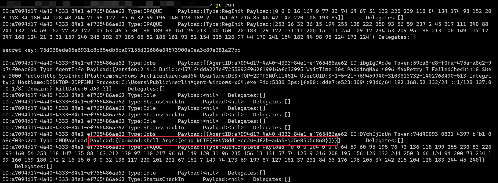

# Merlin

## 题目简述

Merlin C2 流量分析题。附件给了一份 Merlin Agent 进程转储和一段通信流量，题名直接指向 [Merlin](https://github.com/Ne0nd0g/merlin) 项目。官方 WP 引用的参考文章是 [Merlin Agent 木马破绽：内存密钥暴露与加密流量破解全解](https://xz.aliyun.com/news/18418)。参考文章的核心不是“有现成脚本”，而是：Merlin 初始通信使用 PSK，后续通过 OPAQUE 协商新的会话密钥；新密钥会以字符串形式留在 Agent 进程内存中，因此可以从进程 dump 中提取候选密钥并解密 PCAP 载荷。

## 解题过程

Merlin Agent 默认配置里有两个关键点：

```text
psk        = "merlin"        # 默认预共享密钥，可被编译参数覆盖
transforms = "jwe,gob-base"  # 默认消息转换链
auth       = "opaque"        # 默认认证协议
```

官方文档说明 `-transforms` 是有序的消息构造/还原链，默认值是 `jwe,gob-base`，并且 `gob-base` 必须放在最后用于还原 Go 结构。可用 transform 包括：

```text
aes
base64-byte
base64-string
hex-byte
hex-string
gob-base
gob-string
jwe
rc4
xor
```

默认 `jwe` 使用的参数是：

```text
alg = PBES2_HS512_A256KW
enc = A256GCM
p2c = 3000
```

这解释了为什么默认 Merlin 流量中常能看到类似 JWE compact serialization 的开头，例如 `eyJhbGciOiJQQkVT...`。解密时不能把 HTTP/SMB/TCP/UDP 载荷当作普通明文协议看，而要按 Merlin 的 transform 链逆向还原。

### 密钥来源

Merlin 的 `-psk` 是 Agent 与 Server 初始通信的 Pre-Shared Key。第一条认证相关消息可以用 PSK 解；之后 Agent 与 Server 通过 OPAQUE 建立新的会话密钥，后续通信使用新密钥加密。

参考文章指出，Merlin Agent 协商后的共享密钥会以字符串形式存放在 `client.secret` 变量中，长度为 64 字节。因为题目给了进程转储，可以从 dump 里搜索 64 字节可打印字符串作为候选通信密钥，再逐个尝试解密流量。

所以本题的关键不是爆破，而是把两个来源结合起来：

1. 从 PCAP 或导出的 HTTP 对象中提取 Merlin 载荷。
2. 用 PSK 尝试解最早的认证/注册阶段流量。
3. 从进程 dump 中提取 64 字节候选 secret。
4. 用候选 secret 按 `jwe,gob-base` 或题目实际 transform 链尝试还原后续消息。
5. 找到能成功解出 Go message 结构的候选密钥后，继续批量解密剩余载荷。

### 解密流程

默认 transform 场景下，解密流程可以理解为：

```text
raw payload
  -> JWE 解密/解包，密钥来自 PSK 或内存中的 session secret
  -> gob-base 反序列化，还原 Merlin message/job/result 结构
  -> 从返回结果或任务输出中找 flag
```

如果流量不是默认 `jwe,gob-base`，仍按相同思路处理，只是 transform 链不同。例如参考文章测试过 `aes,gob-base`、`base64-string,gob-base`、`hex-byte,gob-base`、`rc4,gob-base`、`xor,gob-base` 等组合。识别方式是看载荷格式：JWE 通常像 base64url JSON token；hex/base64/string 编码会有明显字符集特征；SMB/TCP/UDP 跳板流量则需要先手动切出应用层 payload。

### 自动化脚本思路

参考文章中的自动化解密脚本大致按下面逻辑组织：

```python
def extract_payloads(pcap_or_exported_objects):
    \"\"\"从 HTTP 对象、TCP 流、SMB 载荷或 UDP 数据中提取 Merlin 原始载荷。\"\"\"
    ...

def extract_candidate_secrets(memory_dump):
    \"\"\"从进程 dump 中提取长度为 64 的可打印字符串，作为 session secret 候选。\"\"\"
    ...

def try_decode(payload, key, transforms):
    \"\"\"按 Merlin transformers 的逆向顺序尝试解密和反序列化。\"\"\"
    ...

payloads = extract_payloads(\"traffic.pcap\")

# 初始认证阶段：优先用 PSK。
for payload in payloads:
    msg = try_decode(payload, psk, [\"jwe\", \"gob-base\"])
    if msg:
        print(msg)

# 后续通信：从内存 dump 找 OPAQUE 后的新 secret。
for secret in extract_candidate_secrets(\"agent.dmp\"):
    decoded = []
    for payload in payloads:
        msg = try_decode(payload, secret, [\"jwe\", \"gob-base\"])
        if msg:
            decoded.append(msg)
    if decoded:
        print(\"session secret:\", secret)
        print(decoded)
        break
```

这里的 `try_decode` 不应自己重写协议猜测，最好复用 Merlin 项目 transformers 库的逻辑，或按其源码实现对应的 `jwe`、`gob-base`、`aes`、`rc4`、`xor` 等 transform。判断密钥正确的标准是：JWE 能正常解密，后续 gob 反序列化能得到合法 Merlin 消息结构。

官方 PDF 中保留的截图如下，原意是展示参考脚本能够对给定流量完成解密：



## 方法总结

- 核心技巧：Merlin C2 流量解密。利用 PSK 解初始认证流量，再从 Agent 进程 dump 中提取 OPAQUE 后的 64 字节 session secret，按 Merlin transformers 链还原消息。
- 识别信号：题名、GitHub 链接、JWE 载荷头、`jwe,gob-base` 默认 transform、以及附件同时给出 PCAP 和进程转储，都指向 Merlin 流量解密。
- 复用要点：参考文章链接要保留，但 WP 必须写清密钥为什么在内存里、候选密钥如何提取、payload 如何按 transform 链还原，以及如何判断解密成功。只写“参考文章脚本即可”不够。
