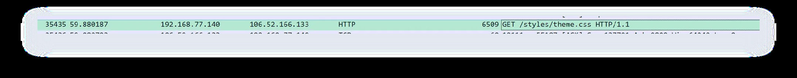
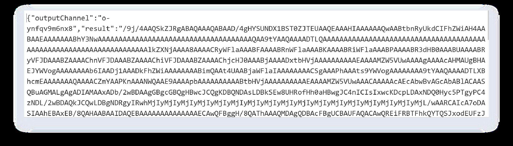

# Asgard Fallen Down

## 题目简述

流量/恶意通信取证题。根据 build/version 恢复 AES key/iv，解密 `X-Cache-Data` 和 `/contact` 分片中的命令回显与环境信息，最终从 base64 图像识别出工具并得到 flag。

## 解题过程

### 关键观察

流量/恶意通信取证题。

### 求解步骤

chall1：
从build和version找到AES解密的key和iv
key = VdmEJO6SDkVWYkSQD4dPfLnvkmqRUCvrELipO14dfVs=
iv = EjureNfe2IA6jFEZEih84w==
GET /styles/theme.css 中 X-Cache-Data内容为命令回显，第一个回显解密出来是
尝试whoami ，id 等提交，最终尝试出命令为spawn whoami
chall2：10
观察规律发现心跳包是随机GET，每10秒一次
chall3：
继续解密X-Cache-Data回传的数据
其中
{"outputChannel":"o-
27kgboxah4l","result":"desktopeo5qi9p\\\\dell""timestamp":1763185539163}
解密后找到硬件信息
cahll4:
观察 POST /contact 发现有chunkIndex=0字样，而且进行AES解密后有明显数据，于是追踪流并
解析
{"outputChannel":"o-lbgp59stp4","result":"{\n  \"ALLUSERSPROFILE\":
\"C:\\\\ProgramData\",\n  \"APPDATA\":
\"C:\\\\Users\\\\dell\\\\AppData\\\\Roaming\",\n  \"CommonProgramFiles\":
\"C:\\\\Program Files\\\\Common Files\",\n  \"CommonProgramFiles(x86)\":
\"C:\\\\Program Files (x86)\\\\Common Files\",\n  \"CommonProgramW6432\":
\"C:\\\\Program Files\\\\Common Files\",\n  \"COMPUTERNAME\": \"DESKTOP-
EO5QI9P\",\n  \"ComSpec\": \"C:\\\\Windows\\\\system32\\\\cmd.exe\",\n
\"DriverData\": \"C:\\\\Windows\\\\System32\\\\Drivers\\\\DriverData\",\n
\"HOMEDRIVE\": \"C:\",\n  \"HOMEPATH\": \"\\\\Users\\\\dell\",\n
\"LOCALAPPDATA\": \"C:\\\\Users\\\\dell\\\\AppData\\\\Local\",\n
\"LOGONSERVER\": \"\\\\\\\\DESKTOP-EO5QI9P\",\n  \"NUMBER_OF_PROCESSORS\":
\"2\",\n  \"ORIGINAL_XDG_CURRENT_DESKTOP\": \"undefined\",\n  \"OS\":
\"Windows_NT\",\n  \"Path\":
\"C:\\\\Windows\\\\system32;C:\\\\Windows;C:\\\\Windows\\\\System32\\\\Wbem;C:
\\\\Windows\\\\System32\\\\WindowsPowerShell\\\\v1.0\\\\;C:\\\\Windows\\\\Syst
em32\\\\OpenSSH\\\\;C:\\\\Users\\\\dell\\\\AppData\\\\Local\\\\Microsoft\\\\Wi
ndowsApps;\",\n  \"PATHEXT\":
\".COM;.EXE;.BAT;.CMD;.VBS;.VBE;.JS;.JSE;.WSF;.WSH;.MSC\",\n
\"PROCESSOR_ARCHITECTURE\": \"AMD64\",\n  \"PROCESSOR_IDENTIFIER\": \"Intel64
Family 6 Model 191 Stepping 2, GenuineIntel\",\n  \"PROCESSOR_LEVEL\":
\"6\",\n  \"PROCESSOR_REVISION\": \"bf02\",\n  \"ProgramData\":
\"C:\\\\ProgramData\",\n  \"ProgramFiles\": \"C:\\\\Program Files\",\n
\"ProgramFiles(x86)\": \"C:\\\\Program Files (x86)\",\n  \"ProgramW6432\":
\"C:\\\\Program Files\",\n  \"PSModulePath\": \"C:\\\\Program
Files\\\\WindowsPowerShell\\\\Modules;C:\\\\Windows\\\\system32\\\\WindowsPowe
rShell\\\\v1.0\\\\Modules\",\n  \"PUBLIC\": \"C:\\\\Users\\\\Public\",\n
\"SESSIONNAME\": \"Console\",\n  \"SystemDrive\": \"C:\",\n  \"SystemRoot\":
\"C:\\\\Windows\",\n  \"TEMP\":
\"C:\\\\Users\\\\dell\\\\AppData\\\\Local\\\\Temp\",\n  \"TMP\":
\"C:\\\\Users\\\\dell\\\\AppData\\\\Local\\\\Temp\",\n  \"USERDOMAIN\":
\"DESKTOP-EO5QI9P\",\n  \"USERDOMAIN_ROAMINGPROFILE\": \"DESKTOP-EO5QI9P\",\n
\"USERNAME\": \"dell\",\n  \"USERPROFILE\": \"C:\\\\Users\\\\dell\",\n
\"windir\": \"C:\\\\Windows\"\n}","timestamp":1763185574274}
得到的数据为base64，解码出来为一张图像
能看出是无影TscanPlus
RCTF{Wh1l3_Th0r_Struck_L1ghtn1ng_L0k1_St0l3_Th3_Thr0n3}

### PDF 图片

## 方法总结

- 核心技巧：从流量中恢复密钥并解密 C2/分片数据。
- 识别信号：HTTP 头或 POST 参数中有加密回传、chunkIndex、base64 图像等结构。
- 复用要点：先还原通信密钥，再把命令回显、环境变量和图像证据串成答案。
