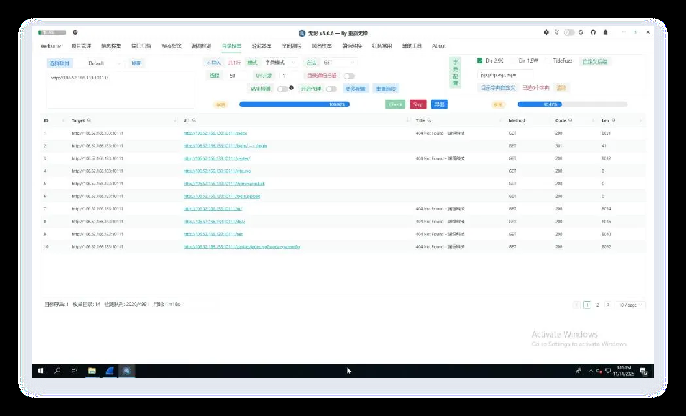

# Asgard Fallen Down

## 题目简述

附件是一份混有大量扫描流量的 HTTP PCAP。Loki 的 Agent 把注册信息、任务下发、命令回显和截图外传伪装进正常网页、CSS 请求及表单提交中；需要恢复会话密钥和 Agent 流量，依次回答首条命令、心跳周期、CPU 型号和截图中的扫描工具。

与 `Shadows of Asgard` 相比，本题没有在一个明显的 JSON 注册包中直接给出所有字段，而是把 key、IV 和 session 藏进 HTML 注释，并对任务与结果采用不同层数的编码。

## 解题过程

### 1. 从注册响应恢复会话

按包长检查异常 HTTP 请求，可以定位最早的 `POST /contact`，对应 `tcp.stream eq 207`。服务端响应的 HTML 注释中有三行异常元数据：

```html
<!-- build:20251115-VdmEJO6SDkVWYkSQD4dPfLnvkmqRUCvrELipO14dfVs= -->
<!-- version:1.2.3-EjureNfe2IA6jFEZEih84w== -->
<!-- session:20251115-OTI1ZjcxMTktMDU1Ni00NDEwLTk4MjAtMDFjYTYzOGQ2Zjcz -->
```

去掉日期和版本前缀后，`build` 的 Base64 字符串是 32 字节 AES key，`version` 是 16 字节 IV：

```text
key = VdmEJO6SDkVWYkSQD4dPfLnvkmqRUCvrELipO14dfVs=
iv  = EjureNfe2IA6jFEZEih84w==
```

`session` 的后半段 Base64 解码为 UUID：

```text
925f7119-0556-4410-9820-01ca638d6f73
```

后续请求把它作为 `session_id` Cookie，因此可用以下显示过滤器从扫描噪声中抽出 Agent 会话：

```text
http.cookie contains "session_id=925f7119-0556-4410-9820-01ca638d6f73"
```

### 2. 还原任务与结果编码

C2 的一次常规轮询由三步组成：

```text
GET /index.html          # 获取任务
GET /                    # 确认已接收任务
GET /styles/theme.css    # 在 X-Cache-Data 中回传结果
```

`/index.html` 响应把任务藏在 HTML 的 `build` 注释里，生成顺序是 `AES-CBC → hex → Base64 → Base64`，所以解码时应做两次 Base64、把 hex 文本转为字节，再用已恢复的 key/IV 解密并去除 PKCS#7 填充。

`X-Cache-Data` 少一层外包装，生成顺序是 `AES-CBC → hex → Base64`；解码时只做一次 Base64。两种载荷如果无差别套同一个函数，前者会少解一层，后者则会多解一层。

### 3. The First Command：确定首条指令

从注册完成后的第一次任务下发开始按时间排序，解密第二个 `/index.html` 响应，明文命令为：

```text
spawn whoami
```

`whoami` 只是子命令，题目要求精确提交 Loki 发给 Agent 的完整命令，因此第一问不能省略 `spawn`。

### 4. The Heartbeat：计算轮询周期

过滤同一 session 后比较相邻三步轮询组的时间戳。扫描器产生的 GET 间隔随机，而 Agent 的 `/index.html → / → /styles/theme.css` 组合稳定地每 10 秒出现一次，因此第二问为：

```text
10
```

### 5. The Heart of Iron：读取环境变量

继续解密 `GET /styles/theme.css` 的 `X-Cache-Data`，可以找到 `env` 命令返回的环境变量 JSON。题目所需字段是 `PROCESSOR_IDENTIFIER`：

```text
Intel64 Family 6 Model 191 Stepping 2, GenuineIntel
```

应提交完整字符串，`AMD64` 只是 `PROCESSOR_ARCHITECTURE`，不是处理器型号答案。

### 6. Odin's Eye：重组分片截图

在 `Date: Sat, 15 Nov 2025 05:46:39 GMT` 附近可看到 C2 下发 `screenshot` 命令。截图体积较大，Agent 不再通过 CSS 请求的响应头回传，而是连续 `POST /contact`，表单中带有 `chunkIndex` 等分片字段。

按同一会话和输出通道收集分片，依据 `chunkIndex` 排序后拼接，再按 AES-CBC 载荷格式解密。解密所得 JSON 的 `result` 是图片 Base64；再次 Base64 解码即可恢复截图：



截图窗口标题使用“无影”名称，但界面和项目对应的 GitHub 仓库名是题目要求的：

```text
TscanPlus
```

四问提交完成后得到最终 flag：

```text
RCTF{Wh1l3_Th0r_Struck_L1ghtn1ng_L0k1_St0l3_Th3_Thr0n3}
```

## 方法总结

- 面对被扫描流量掩护的 C2，先用包长、罕见路由、HTML 注释和固定 Cookie 建立会话指纹，再分析具体命令；仅按源/目的 IP 过滤会保留大量噪声。
- 同一协议可能按方向使用不同编码层数。应从载荷字符集和解码后的类型逐层验证，而不是看到 Base64 就机械重复解码。
- 大对象常从单包头字段切换为 POST 分片。重组时至少校验 session、输出通道、分片序号和总数，完成后再解密及解释内层 Base64。
