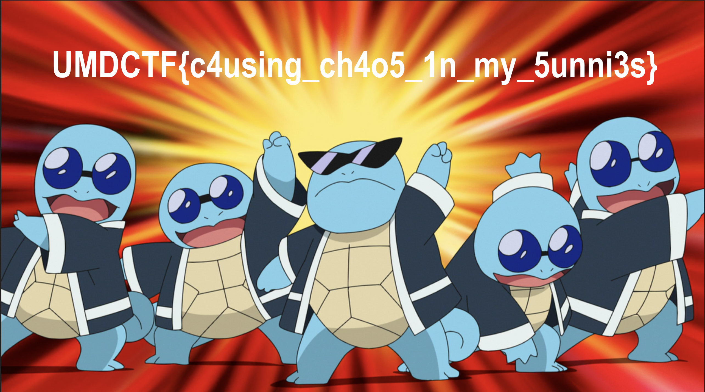

# Squirtleware

## 题目简述

题目提供一个“损坏”的 Go 恶意客户端和对应 Java C2 服务。客户端会登录、获取会话 token、请求加密图片并解密，但故意使用只能返回部分数据的请求类型。目标是恢复认证参数、自定义协议和会话密钥用法，重新实现客户端以取得完整载荷。

## 解题过程

Go 客户端中的西班牙语符号可还原出登录流程：

```text
POST /squirtle/i-love-shakira
Content-Type: application/json

{"name":"wartortle","node":420}
```

服务端只检查 `node` 是否等于配置值，名称可以作为会话所有者。成功响应中的
`token` 既要作为后续请求的 Cookie，也直接充当循环异或密钥。

原客户端向 `/connection` 发送 `BANDERA_POR_FAVOR`。服务端对该枚举值只返回由用户名哈希决定的图片前缀；完整分支实际名为：

```text
BANDERA_COMPLETA_POR_FAVOR
```

请求中的 `data` 是要读取的资源名 Base64 编码。题目解法使用：

```python
request = {
    "type": "BANDERA_COMPLETA_POR_FAVOR",
    "data": base64.b64encode(b"bandera").decode(),
}
```

响应封包格式由服务端静态常量确定：

```text
"squirtleenespanol" || 8 个零字节
|| XOR(payload, token)
|| 8 个零字节 || "squirtleenespanol"
```

去掉首尾包装后，对内容逐字节执行
$p_i=c_i\oplus token_{i\bmod |token|}$，得到一段 Base64 文本；再做一次 Base64 解码即可恢复 PNG。



图片中给出：

```text
UMDCTF{c4using_ch4o5_1n_my_5unni3s}
```

客户端源码内 `Bandera.Obtener()` 返回的另一条字符串是诱饵，不是最终 flag。

## 方法总结

- 核心技巧：把客户端当作 C2 协议样本，分别恢复登录路由、节点值、Cookie、请求枚举和封包层。
- 服务端 token 同时承担认证凭据和循环异或密钥，拿到 token 后加密没有独立保密性。
- 原客户端的错误请求类型是人为截断逻辑；枚举中相邻的“完整旗帜”分支才会返回全部载荷。
- 解密顺序是“剥离头尾 → token 循环异或 → Base64 解码”，顺序颠倒会得到无效数据。
