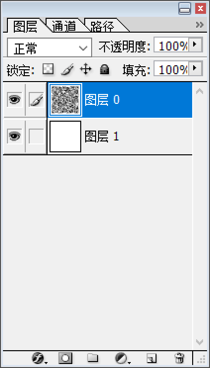
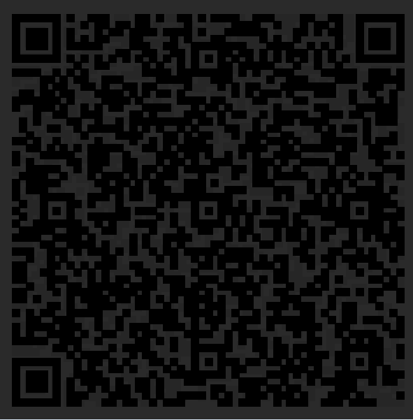

# BadW3ter

## 题目简述

当时打题目名字的时候也没有多想，后来发现Water拼错了，笑死。

题目是音频隐写 + 图片格式识别 + 幻影坦克二维码。入口文件伪装成损坏音频，修复 WAV 头后用 DeepSound 提取隐藏文件；得到的 `flag.png` 实际是 TIF/Photoshop 图像，二维码前景在白底和黑底下会显示不同内容，需要切换背景后再扫。

## 解题过程

用010Editor打开文件，

发现文件头被篡改（我超，初音未来）。

这里只改了RIFF区块前后和FORMAT区块开头的标识符，可以相对容易地恢复成正常的文件格式，并且得到字符串CUY1nw31lai

根据题目提示「Dive into」the w3ter, deeper and deeper. 使用DeepSound解密，密码为

CUY1nw31lai 得到一个flag.png，直接扫发现被 骗 了。

DeepSound 是 Windows 下的音频隐写工具，可把文件隐藏进音频，也可从音频中提取隐藏文件；若隐藏内容被加密，提取时需要输入密码。本题中修复 WAV 头得到的字符串 `CUY1nw31lai` 就是 DeepSound 提取密码。

查看文件头，发现并不是一个PNG文件。结合开头的II* 标识和大量的Adobe Photoshop 注释信息可以推测出是TIF存储格式，改后缀名后用Adobe Photoshop 打开。你也可以选择使用file 进行识别。



发现图片包含一张透明底的二维码图片和一个白底。通过大眼观察（或是Stegsolve之类的工具）是可以发现前景的二维码图片并不是纯黑的，并且颜色分布有一点微妙。这是因为前景图片的颜色是通过计算使得其在白色背景和黑色背景下显示效果不同的。

使用油漆桶工具将背景改为黑色。可以发现二维码内容发生了变化。



用魔棒之类的工具处理一下，扫描得到flag

```text
D3CTF{M1r@9e_T@nK_1s_Om0sh1roiii1111!!!!!Isn't_1t?}
```

参考资料：https://zhuanlan.zhihu.com/p/32532733

该参考资料对应“幻影坦克”类图像技巧：利用前景像素的透明度/颜色，让同一张图在白色背景和黑色背景下呈现不同视觉结果。本题二维码前景并非纯黑，换成黑底后二维码内容变化，正是这个技巧。

原曲：https://www.bilibili.com/video/BV1tJ411m7Az

原曲链接用于确认题目音频素材来源；真正解题关键仍是文件头修复、DeepSound 密码提取和后续图片背景切换。

## 方法总结

- 核心技巧：文件头被改时先按 RIFF/WAVE/FMT 基本结构恢复音频，再用题面提示判断是否存在音频隐写。
- 解题链：修复 WAV $\rightarrow$ 读出密码 `CUY1nw31lai` $\rightarrow$ DeepSound 提取伪 `flag.png` $\rightarrow$ 识别 TIF $\rightarrow$ 黑底显示真实二维码。
- 复用要点：图片“看起来能扫但结果不对”时，应检查格式、透明通道、背景色依赖和多图层信息。
