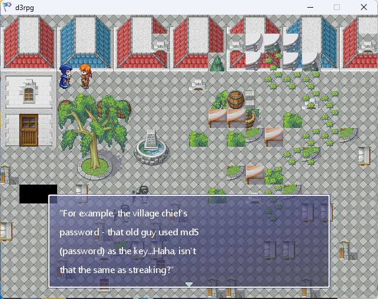
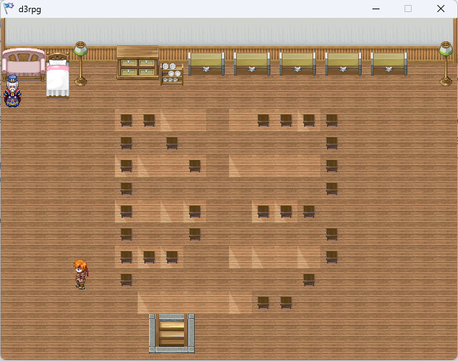
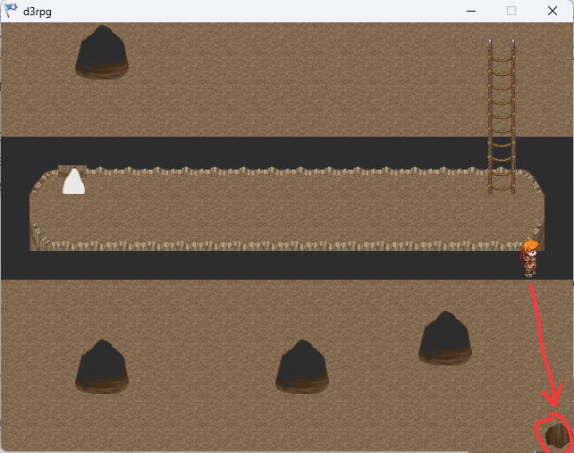
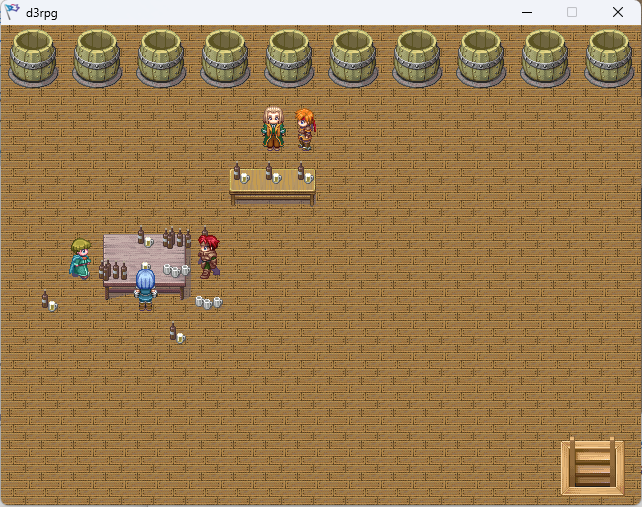

# d3rpg-signin

## 题目简述

题目是 RPG Maker 风格的签到题，重点不是复杂逆向，而是从 NPC 对话、广告牌提示和地图异常中收集分段 flag。关键机制包括：村长家密码为 `md5(password)`、二楼地板隐藏摩尔斯电码、金钱变量是 1 字节有符号数可溢出、`Debug 麦酒` 可查看寄存器和内存、井口密码来自未初始化局部变量。

## 解题过程

注意：对于使用非中文操作系统的挑战者，本题的字体渲染可能会出现问题，即无法显示中英文字体。这是因为游戏引擎比较老（2004 年流行的引擎），并且该开发工具是由中国网友翻译成中文的，所以字体列表中只写了“SimHei”字体。后来我添加了“Segoe UI”字体进行改进。对此深感抱歉。本次挑战的娱乐性更强，主要考验选手的信息收集能力。进入游戏后，与村口的醉酒程序员对话。程序员会告诉你村长家的密码是md5(password)。



然后前往地图右侧并与广告牌互动。


您将获得以下 5 条提示。

```text
1. 井底的宝箱因为 xdarkeagle 权限错误暂时关闭，并且需要密码。
2. 最近村长家一楼天花板漏水。
3. 酒馆出售 “DEBUG 麦酒”，可以查看寄存器和内存数据。
4. 每个人最多只能持有 1 字节有符号数范围内的钱。
5. 如果因为段寄存器异常走进虚空，请联系村长。
```

提示1 告诉你，地图右下方的井需要密码验证，也就是说，Flag 的一部分就在井里。提示2 告诉你，村长家一楼的天花板漏水，我们认为二楼的地板有问题。提示3 告诉你，"Debug 麦酒" 可以观察寄存器和内存数据。提示4 告诉你，存储金钱的数据是1 字节的有符号数据，选手很容易想到有符号数据溢出的问题。提示5 告诉你，你可以去地图上一些你无法去的地方。然后前往地图右下角的井边，与老乡交谈。同伴会告诉你，由于变量未初始化，他自己也不知道密码。所以，结合技巧1 和技巧3，你可以将“Debug 麦酒”与查看寄存器和内存值以获取局部变量正确密码的需求联系起来。我们进入村长的家，与 GM 交谈，选择“Muscer”，然后 GM 会给你 flag1。

Flag1: BtM183b19k

随后我们进入了村长家的二楼，和村长对话后发现flag3 就在我们面前，村长也给了提示。

```text
Hint:
Lower Capital Lower Lower Capital Lower Lower
Capital Capital Capital -
```

那么我们可以从二楼房间右上角的宝箱中获取信息：

```text
The note in the treasure chest:
A - -
B - - -
C - -
```

这里再次强调了有符号数的溢出问题。

```text
Note in the treasure chest:
When does 127 + 1 equal -128...
```

所以思路就清晰了：根据Tip2，我们知道二楼的地板有问题。根据宝箱的提示，我们可以知道这是一段摩尔斯电码。根据村长的大写提示，我们可以正确标注摩尔斯电码的大小写。然后我们观察地板，解决flag3。



地板有两种颜色，所以很容易区分0 和1。而且因为村长暗示了最后有一个等号，所以如果把它倒过来标记也很容易找到。

Flag3: fVzByMWQ=

然后我们上一楼，进入地下室，输入村口程序员给你的md5 密码（password）即可进入。（有个细节，如果不和村口的程序员对话，就进不了地下室。）

地下室入口的密码选项中应选择 `md5(password)`。

进入地下室后，由于出口是假的，所以我们想到了提示5，提示告诉我们地图上有一些地方可以去，我们可以来到右下角进入酒馆。





到达酒馆后，与酒保对话。酒馆里有四件物品可供购买，但你目前没有钱。此时，想想Tip 4 以及村长家二楼宝箱里的提示。我们可以知道，存储金钱的变量是一个1 字节的有符号数。我们可以想到整数溢出，所以我们以255 元（即-1 元）购买了[Object]，酒保会给我们1 元，这样我们就可以购买flag2 和“Debug 麦酒”。

Flag2: M19ScEd

最后我们来到井口，使用“Debug 麦酒”观察内存和寄存器的值。这里的一个知识点是局部变量是存储在栈上的。我们观察内存值，发现[RBP-0x20]上方的字段正好是“ImPsw”按小端序排列的值，因此输入正确的密码即可打开井口，取出Flag0。

Flag0: VzNsYz

最后，我们将 Flag0 到 Flag4 的值组合成一个字符串。挑战者可以轻松识别出这是一个标准的 Base64 编码字符串。解码后，我们可以得到正确的 Flag，并将其封装到d3ctf{} 中提交。

Flag: d3ctf{W3lc0m3_7o_d3_RpG_W0r1d}

彩蛋：酒馆里持续赚钱，当你赚到128 元（溢出）时，酒保会奖励你完整的Flag。

意外解决办法：使用Cheat Engine 或者其他工具搜索内存。

## 方法总结

- 核心技巧：把游戏内提示逐条映射到具体机制：密码、摩尔斯电码、整数溢出、内存观察和地图穿越。
- 识别信号：签到题如果给出多个 NPC 提示和看似无关的道具，应优先把每条提示对应到一个 flag 片段或一条进入隐藏区域的路径。
- 复用要点：RPG Maker 老游戏常把变量、脚本和 UI 文本留得较直观；可先按游戏逻辑完整跑一遍，必要时再用 Cheat Engine 直接搜索内存验证。
