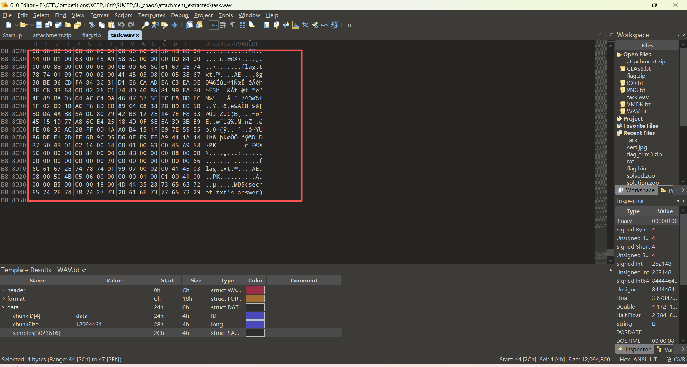

# SU_chaos

## 题目简述
题目是加密 ZIP 的已知明文攻击。压缩包里有 AVIF 文件，ZipCrypto 可被连续已知明文字节攻击；难点是 AVIF/ISOBMFF 文件头字段存在多种合法排列，需要找到稳定可用的已知明文片段。附件主要是加密/图片二进制载体，WP 中保留 AVIF 头部结构和 ZipCrypto 明文攻击过程即可，不应把二进制内容写入正文。

## 解题过程
拿到压缩包用 7z 打开查看能知道是 ZipCrypto 的加密方式,能想到是明文攻击,这里一开始先去尝试用
ELF 头去攻击 task 文件,但是其实这里不行,然后回到 AVIF 文件查看如何构建文件头,这里我的选择是查
看此文章,解救之道就在其中

AVIF 文件基于 ISOBMFF(ISO Base Media File Format)容器,文件头结构为 ftyp box

```
[4 bytes box size][4 bytes "ftyp"][4 bytes major brand][4 bytes minor version]
[N*4 bytes compatible brands...]

offset: 0 4 8 12 16+
content: [box size] [ftyp] [major brand] [version] [compatible brands] hex:
uncertain 66747970 difference 00000000
```

然而在这里 major brand 有很多种可能, avif 为普通静态图, avis 为动画序列(AVIF Image
Sequence),然后 compatible brands 的顺序和数量也不固定( avif/mif1/miaf/MA1B ),这里
构造十二个连续的字节因为 box size 是不确定的,如果改变 offset 0-3 也会变,那我们直接从 offset 4 的
地方开始构造连续的字节,那就小小的猜测和测试一下最后发现是 avis 的能攻击成功

然后我们能拿到这个 key b76b3323 6eebbce4 00a94706 进行解密,能拿到这个 task 文件,用
010 查看能知道是 RIFF 的头就是 wav 格式的文件,然后文件尾部还有一个压缩包然后还能拿到那个
avif 文件时长约 5 秒,提取出来发现有一张主图和一个 5 帧序列流

`bkcrack` 使用 AVIF 已知明文恢复出 ZipCrypto 内部 key：

```text
$ bkcrack.exe -C attachment.zip -c challenge.avif -x 4 667479706176697300000000
bkcrack 1.7.1
[23:07:06] Z reduction using 4 bytes of known plaintext
[23:07:06] Attack on 1251703 Z values at index 11
Keys: b76b3323 6eebbce4 00a94706
Found a solution. Stopping.
```

然后那个序列流很顶针的拼一下能知道是汉信码,然后用在线工具扫一下能得到
0f87b6f831b312a0b6748c4a792b9362c033c75cc230aae63be2c9cfab12a0e4 ,现在不
知道咋使用,然后上面的压缩包提示密码为 secret.txt 的内容的 MD5 格式为密码,那我们先去找这个文件
在哪里,然后尝试用 deepsound 解密发现需要输入密码可以提取隐藏的文件,那就去找密码,然后 wav 的
文件就试错看看有没有存在摩斯的隐写(用 spectrogram 看),然后在 700hz 的找到了解密为
SUPERIDOL,然后拿去 deepsound 解密能得到 secret.txt

```
A：寒江夜阔云初散，秋灯入梦染空山。潮声拍岸惊归鹤，旧径松深客未还。
B：星沉古岸月微寒，竹林深锁远钟音。长江如练横天际，画舟轻渡入云岚。
A：你刚写的那几句，我真挺喜欢的，看着很安静。
B：真的？我还怕有点太那个了。你那句一下就把情绪点出来了。
A：可能就是那一瞬间的感觉吧，说不清楚，但心里动了一下。
B：我也是。读你的时候，会有种“哦，他懂这个”的感觉，挺难得的。
A：那还是老样子，以诗做表相切，一二三四，阴阳上去，定为声调
A：
3-21-1
10-21-4
13-7-4
2-9-4
15-15-2
0-28-1
28-22-1
B：甚好，待等有缘人探所之文，寻我二者之密
```



解密方法也写在这里了,把两首诗当成两个索引表,每组数字按反切取声母和韵母,第三位定声调,最后能
解出密文为 一日看尽长安花,然后那这个去 MD5 加密作为密码去解密可以解压出来 flag.txt

```text
$zip2$*0*3*0*ee1f6cc09449ea4174cb45bd0d667d1c*258b*1c*0a6bd41815d0d2af8b30c25ce
```

$$
506b2ead194b0f3c4186913c80d2a2b*408973cbd18faafa7355*$/zip2$
$$

里面的内容为 zip 的 hash,这里和之前强网拟态的和 buckeyectf 的考点类似为 Data in hash 然后
去反推,但是这里的 hash 的格式为 Winzip AES 的,那这里我们结合之前汉信码得到的那一串可以写解密
脚本

```python
from cryptography.hazmat.primitives.ciphers import Cipher, algorithms, modes
import zlib, hmac, hashlib, binascii

key=bytes.fromhex("0f87b6f831b312a0b6748c4a792b9362c033c75cc230aae63be2c9cfab12
a0e4")
ct=bytes.fromhex("0a6bd41815d0d2af8b30c25ce506b2ead194b0f3c4186913c80d2a2b")
auth=bytes.fromhex("408973cbd18faafa7355")

def aes_ecb_encrypt_block(key, block16):
cipher = Cipher(algorithms.AES(key), modes.ECB())
enc = cipher.encryptor()
return enc.update(block16) + enc.finalize()

def aes_ctr_le_decrypt(key, ct, init):
out=bytearray()
counter=init
for i in range(0,len(ct),16):
block=ct[i:i+16]
ctr=counter.to_bytes(16,'little')
ks=aes_ecb_encrypt_block(key, ctr)
out.extend(bytes(a^b for a,b in zip(block, ks)))
counter += 1
return bytes(out)

for init in [0,1]:
pt=aes_ctr_le_decrypt(key, ct, init)
print("init",init, pt.hex(), pt)
for wbits in [15,-15,31]:
try:
d=zlib.decompress(pt, wbits)
print(" zlib",wbits,d,d.hex())
except Exception as e:

pass
print()

#SUCTF{f4ll1g_t0_the_C6a0s}
```

## 方法总结
- 核心技巧：ZipCrypto known-plaintext attack
- 识别信号：加密 ZIP 内存在格式固定的媒体文件，如 AVIF/PNG/ELF。
- 复用要点：根据文件格式构造连续已知明文，用 pkcrack/bkcrack 类工具恢复密钥并解压。
