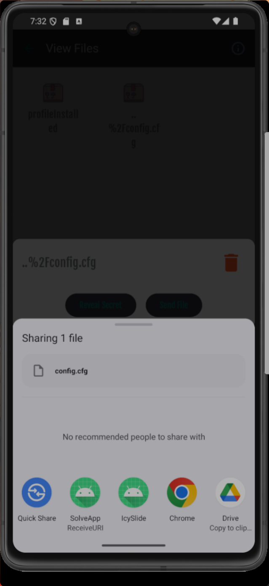
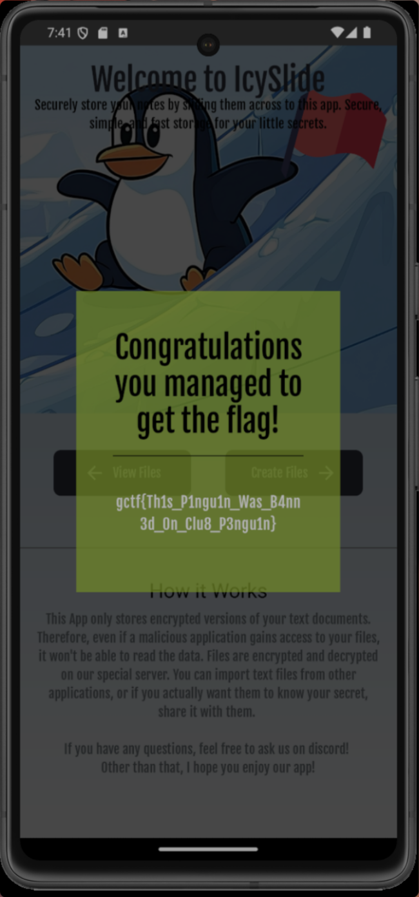

# GlacierCTF 2024 IcySlide

## 题目简述

IcySlide 是 Android 加密笔记应用。主界面的移动旗帜按钮会把应用私有目录中的 `config.cfg` 发给后端；只有配置中的 `server.canGetFlag` 为 `true`、API key 正确且请求带合法应用签名时，后端才返回 flag。

预期解法不需要篡改 APK 或恢复 Fernet 密钥，而是编写辅助 Android 应用，串联两处路径穿越：先通过 IcySlide 的 `ContentProvider` 越界读取并由官方后端解密配置，再通过接收分享的 `Activity` 伪造 `DISPLAY_NAME`，让 IcySlide 调用后端重新加密修改后的 JSON 并覆盖真实配置。

## 解题过程

### 1. 确认 Android 组件与目标文件

关键组件如下：

- `SlideProvider`：authority 为 `glacier.ctf.icyslide.slideProvider`，URI 形式为 `content://.../storage/<filename>`；provider 不直接导出，但允许通过分享 Intent 临时授予 URI 读权限。
- `ViewFileActivity`：为选中文件构造 `ACTION_SEND`，附加 `FLAG_GRANT_READ_URI_PERMISSION`。
- `SlideShareTarget`：接收其他应用分享的 `text/plain` URI，读取内容、查询显示文件名、调用后端加密，再保存到内部存储。
- `config.cfg`：位于 `/data/data/glacier.ctf.icyslide/config.cfg`，而普通笔记位于其子目录 `files/`。

原配置是 Fernet token，Base64 解码后仍不可直接阅读。配置和普通文件的加解密都由 IcySlide 携带原应用签名请求后端完成，因此最好复用应用现成的数据流，而不是尝试伪造签名或离线猜密钥。

### 2. 利用解码后的 path segment 读取配置

在 IcySlide 中创建一个字面文件名：

```text
..%2Fconfig.cfg
```

创建页面的 canonical path 检查看到的仍是包含 `%2F` 的普通文件名，所以它位于 `files/` 内并能正常保存。分享时生成的 URI 为：

```text
content://glacier.ctf.icyslide.slideProvider/storage/..%2Fconfig.cfg
```

辅助应用注册能接收 `ACTION_SEND`/`text/plain` 的 Activity。在 Android Sharesheet 中选择它：



接收端执行：

```kotlin
contentResolver.openFileDescriptor(uri, "r").use { fd ->
    val text = FileInputStream(fd!!.fileDescriptor)
        .bufferedReader().use { it.readText() }
    println(text)
}
```

`SlideProvider.openFile()` 使用 `uri.lastPathSegment`。该属性返回 URL 解码后的 `../config.cfg`，随后：

```kotlin
val file = File(context?.filesDir, filename)
```

实际指向父目录中的配置。provider 再调用 IcySlide 的 `decrypt()`；multipart 文件名取 `file.canonicalPath`，恰好是后端允许复制的 `/data/data/glacier.ctf.icyslide/config.cfg`，因此服务返回解密 JSON。

### 3. 修改权限字段并准备恶意 provider

保留原有结构和 API key，仅修改：

```json
"server": {
  "endpoints": {
    "encrypt": "upload",
    "decrypt": "getData"
  },
  "timeout": "None",
  "apiKey": "5233e94b-e63d-4a63-b8c3-7093104cf6ae",
  "canGetFlag": true
}
```

在辅助应用中实现导出的 `ContentProvider`：

- `openFile()` 返回含上述完整 JSON 的文件；
- `query()` 返回一列 `OpenableColumns.DISPLAY_NAME`，值固定为 `../config.cfg`；
- provider authority 可设为 `solveapp.glacier.icyslide`，并允许 URI 临时授权。

随后向 IcySlide 的 `glacier.ctf.icyslide.externalaccess.SlideShareTarget` 显式发送 `ACTION_SEND`，`EXTRA_STREAM` 指向恶意 provider，并授予读权限。

### 4. 借 IcySlide 加密并覆盖真实配置

`SlideShareTarget` 先从恶意 URI 读取 JSON，再无过滤地采用查询结果：

```kotlin
fileName = cursor.getString(nameIndex)
val outputFile = File(filesDir, fileName)
```

`../config.cfg` 使 `outputFile.canonicalPath` 等于真实配置路径。代码对此路径有一个特殊分支：先把输入写进 cache 下的 `receive_data...tmp`，再调用官方 `/upload` 加密接口。后端原本会拦截“复制配置结构”，但它只检查 multipart 文件名中是否包含预期 cache 路径；IcySlide 正好把临时文件的 canonical path 当作 filename，因此修改后的配置通过检查并得到合法 Fernet token。Activity 最后把返回 token 写入 traversal 后的 `outputFile`，完成覆盖。

### 5. 点击移动旗帜读取结果

回到 IcySlide 主界面，点击随企鹅横向移动的旗帜图标。`checkConfig()` 携带原应用签名和新配置请求后端；服务器解密后验证 API key，看到 `canGetFlag == true` 就返回 Base64 编码的 flag：



```text
gctf{Th1s_P1ngu1n_Was_B4nn3d_0n_Clu8_P3ngu1n}
```

原资料其余截图只展示“输入 `..%2Fconfig.cfg`”“选中文件”“分享成功”等可完整转写的文字和按钮状态，因此没有作为独立图片归档。

## 方法总结

完整链条是“encoded path segment 解码穿越 → URI 临时授权读取私有配置 → 恶意 provider 伪造显示文件名 → 接收分享 Activity 写路径穿越 → 借受信应用和后端完成加密 → 覆盖配置”。决定性机制来自 Android `ContentProvider`、Intent 和 URI 授权模型，因此归入 mobile。修复时既要对 provider 的解码后路径做 canonical 边界检查，也要把外部 provider 返回的 `DISPLAY_NAME` 当作不可信数据，并在保存前拒绝分隔符、点目录及解析后越界路径。
