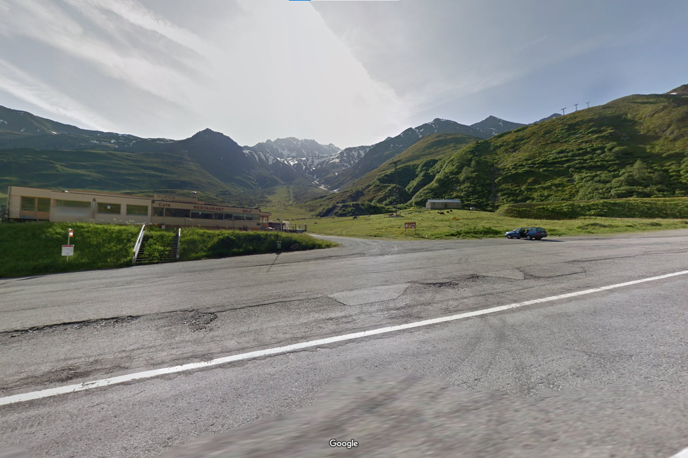
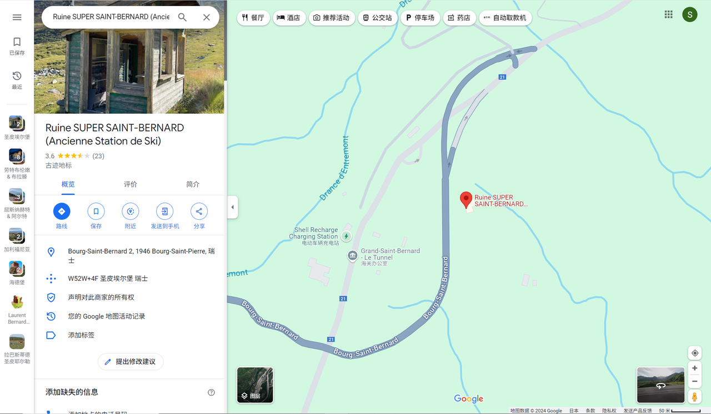
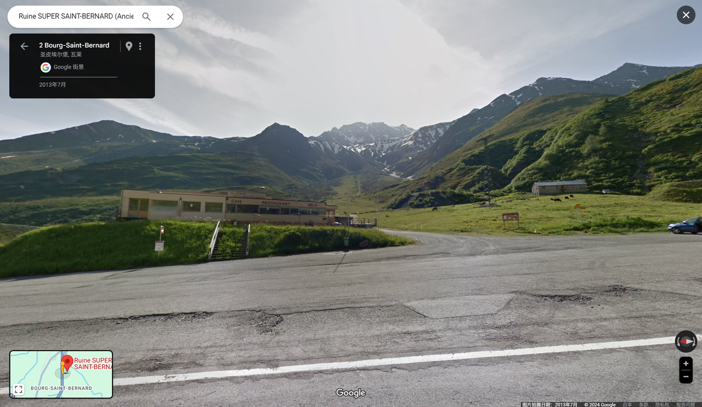

# 给我干哪来了，这还是国内吗？？

## 题目简述

题目给出一张街景截图，要求按照“国家、一级行政区、二级行政区、城市”的顺序确定拍摄地点，并以 `0xGame{Country_Region_District_City}` 的格式提交。



## 解题过程

截图底部残留了 Google 标识，说明画面来自 Google Street View。放大远处建筑，可以辨认出招牌上的 `SUPER ST BERNARD`，这是最关键的地名线索。

在 Google Maps 中搜索该名称，并对照道路走向、建筑外观和远处山体，可以把街景定位到瑞士瓦莱州大圣伯纳德山口附近的 Bourg-Saint-Pierre。



切换到街景后，招牌位置、房屋轮廓和道路视角均与题图一致，因此可以排除同名地点造成的误判。



接下来补全行政区划。瑞士瓦莱州政府的 [Entremont 区市镇列表](https://www.vs.ch/en/web/communes/-/entremont) 将 Bourg-St-Pierre 列在 Entremont 区下，因此四级信息依次为：

- 国家：Switzerland；
- 州：Valais；
- 区：Entremont；
- 市镇：Bourg-Saint-Pierre。

按照题目格式拼接，得到：

```text
0xGame{Switzerland_Valais_Entremont_Bourg-Saint-Pierre}
```

## 方法总结

这类图寻题应先提取图中的高辨识度文字，再用地图搜索缩小范围，最后通过街景中的建筑、道路和地形进行视觉复核。定位完成后还要查阅当地政府或行政区资料补齐层级，不能仅凭地图上显示的地名猜测行政关系。
