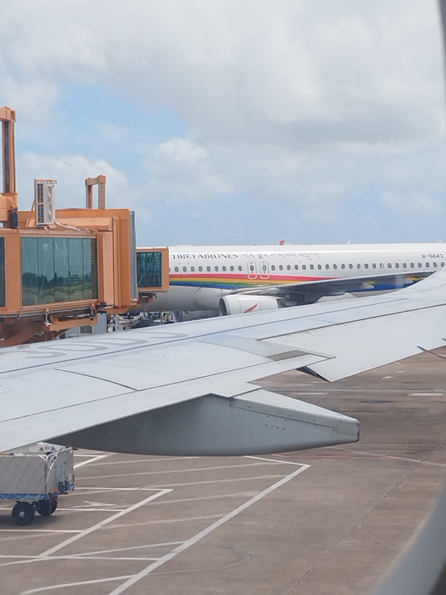

# 美好的旅行

## 题目简述

题目只给出一张停机坪照片，需要根据画面中的飞机注册号反查两架飞机何时在同一机场相遇。背景中西藏航空客机机身尾部可读到 `B-8843`，前景机翼上则有较浅的 `B-30DJ` 标识。



核心不是枚举答案，而是把两架飞机的历史执飞记录转换为“在某机场停留的时间区间”，再求同一机场上的区间交集。

## 解题过程

分别按注册号查询历史航班记录。对每次落地构造一条记录：

```text
(机场, 到达时间, 下一次起飞时间)
```

同一机场的两条停留记录 $A=[A_{arr},A_{dep}]$、$B=[B_{arr},B_{dep}]$ 存在相遇窗口，当且仅当：

$$
\max(A_{arr},B_{arr}) < \min(A_{dep},B_{dep})
$$

交集的起止时间分别为左侧的最大值和右侧的最小值。实现时先按机场连接两架飞机的记录，再计算区间交集：

```python
def overlap(record_a, record_b):
    if record_a["airport"] != record_b["airport"]:
        return None

    start = max(record_a["arrival"], record_b["arrival"])
    end = min(record_a["departure"], record_b["departure"])
    return (start, end) if start < end else None
```

原题解保存的历史数据得到四组候选：

| 机场 | B-8843 停留区间 | B-30DJ 停留区间 | 重叠区间 |
| --- | --- | --- | --- |
| KMG | 2025-08-31 11:16—12:50 | 2025-08-31 10:26—11:54 | 2025-08-31 11:16—11:54 |
| KMG | 2025-09-04 17:24—21:49 | 2025-09-04 18:36—20:42 | 2025-09-04 18:36—20:42 |
| ZUH | 2025-09-16 11:39—12:43 | 2025-09-16 11:14—12:33 | 2025-09-16 11:39—12:33 |
| KMG | 2025-09-21 18:29—21:19 | 2025-09-21 20:32—22:31 | 2025-09-21 20:32—21:19 |

候选不应直接当作四次猜测提交。先用照片中的航站楼、廊桥和机坪特征判断机场，再核对相应日期两架飞机的停机位或登机口是否相邻，便可确定唯一一次拍摄机会。公开原题解只保留了上述重叠结果，没有记录最终提交的日期、停机位和答案格式，因此不能在缺少证据时补写一个确定值。

## 方法总结

这类航班 OSINT 题应先从图片提取稳定标识——飞机注册号，再将网页中的重要历史记录保存到题解正文，避免链接失效后无法复核。两架飞机“同日到过同一机场”还不够，必须比较完整的到达—起飞区间；若仍有多个交集，再用航站楼外观和相邻登机口进行二次验证。本题没有保留具体飞行数据网站 URL，因为原始材料未注明来源，而且动态查询页并非复现解法所必需。
