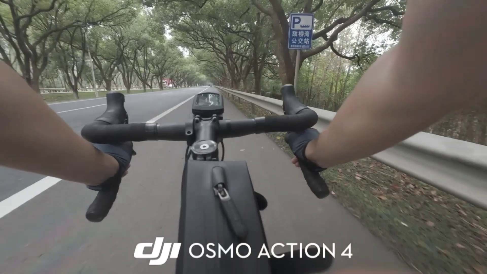

# 一直放坡一直爽

## 题目简述

附件 `OSINT4.mp4` 是一段约 `75.8` 秒、分辨率为 `1920×1080` 的公路自行车第一视角视频。视频容器只有编码器和创建时间等普通标签，没有可直接定位的 GPS 信息，因此需要从道路环境、交通设施和画面中的文字线索判断拍摄地点。

题目要求提交视频所在位置。决定性线索出现在视频末段的一块公交站牌上，但站牌不是最终要提交的 POI；还要把公交站位置与周边地图信息对应起来。

## 解题过程

### 1. 检查元数据并分段观察视频

先确认视频参数和元数据：

```bash
ffprobe -v error \
  -show_entries 'format=duration:format_tags:stream=codec_name,width,height' \
  -of default=noprint_wrappers=1 \
  OSINT4.mp4
```

视频较短，可以完整观看一遍，同时每隔五秒抽一帧做全局检查：

```bash
mkdir -p frames
ffmpeg -i OSINT4.mp4 -vf 'fps=1/5' frames/frame-%02d.png
```

大部分画面只有双向分隔公路、连续成荫的大树、波形护栏、弯道诱导标和限速 `50` 标志。这些特征只能缩小到绿化较好的国省干线，不能唯一定位。

### 2. 读取末段公交站牌

约 `72` 秒处，画面右侧出现一块蓝白色公交站牌。由于骑行速度较快，应连续抽取相邻帧，而不是只截取某一个运动模糊画面：

```bash
mkdir -p close
ffmpeg -ss 72 -t 3 -i OSINT4.mp4 -vf 'fps=4' close/frame-%02d.png
```

选择最清晰的一帧后，可以读出站牌文字为“敬梓湾公交站”。



### 3. 从公交站定位周边 POI

在地图中搜索“敬梓湾公交站”，可将范围锁定到浙江省湖州市长兴县的 `G104` 路段。继续核对道路方向、中央分隔带、两侧香樟树形成的林荫走廊、护栏和站牌相对位置，均与视频一致。

站点附近的显著 POI 是“香山公路驿站”，地图中也常简称为“香山驿站”。[浙江省交通运输厅对该驿站的介绍](https://jtyst.zj.gov.cn/art/2022/12/19/art_1229318207_59030315.html)给出了无需打开外链也应保留在题解中的关键核验信息：驿站位于 `104` 国道 `1314` 公里牌附近，面朝夹浦香山、背倚太湖，是浙江省首届“最美公路服务区（站）”。这些信息同时解释了视频中的国道路形、密集绿化以及最终 POI 名称。

题目要提交的是地点 POI，而不是公交站名，因此最终 flag 为：

```text
0xGame{香山公路驿站}
```

## 方法总结

视频地理定位应先区分“环境特征”和“唯一标识”：道路等级、植被、护栏与限速只能用于排除和复核，公交站牌上的专名才是最强检索锚点。遇到高速运动造成的模糊时，应在目标时间段连续取帧，从多帧中选择字符最完整的一张；得到站名后，再用地图中的道路形态和周边 POI 做二次验证。最后还要注意题目询问的对象，本题的“敬梓湾公交站”只是定位入口，实际提交项是附近的“香山公路驿站”。
