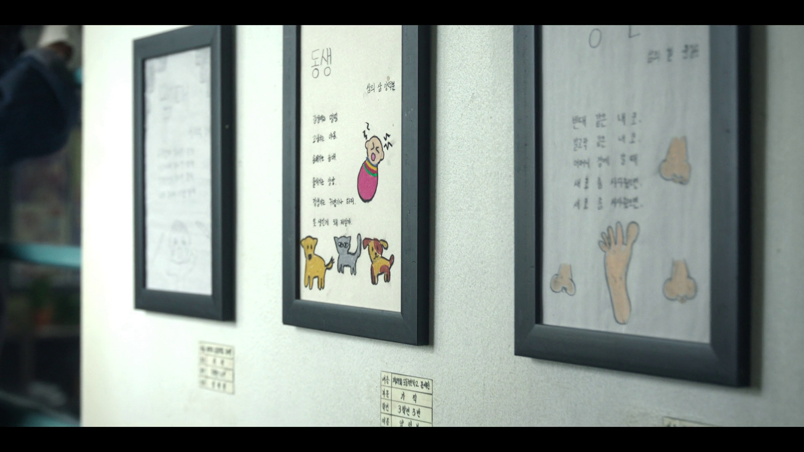
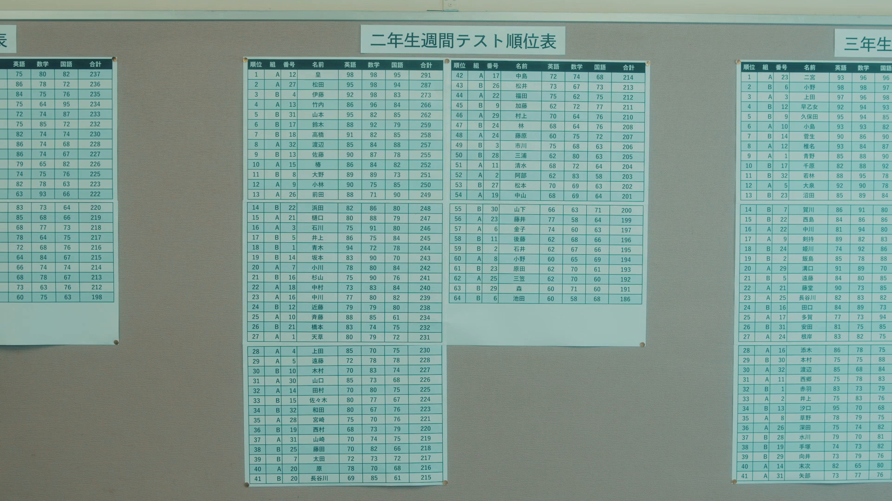

# master of movie

## 题目简述

题目给出若干部电影、电视剧或动画截图，要求识别作品名。简单截图可以直接进行反向图片搜索；困难截图没有可直接命中的主体，需要从画面中的文字、语言、场景和人物关系逐步缩小范围。

本题的关键不是依赖某一个搜索引擎，而是把截图变成可验证的文本线索：先裁剪和放大局部，再识别语言与稀有词组，最后用作品简介、角色表等独立来源交叉确认。

## 解题过程

### 通用检索流程

对人物或构图特征明显的截图，可先尝试 Google、Bing、百度或 Yandex 的以图搜图。动画截图还可使用 [SauceNAO](https://saucenao.com/) 和 [trace.moe](https://trace.moe/)：前者聚合多个插画、动画、电影和剧集索引，适合查找原始出处；后者按动画视频帧匹配，通常还能给出作品、集数和时间点。即使工具直接返回答案，也应再用角色、剧情或播出信息复核，避免把相似画面误认成来源。

反向搜索无结果时，按以下顺序处理：

1. 裁出招牌、表格、校服徽章、字幕等信息密度高的区域。
2. 判断文字属于哪种语言，并人工校正 OCR 容易混淆的字符。
3. 优先搜索完整短语、罕见姓氏、学校名等低频线索，不先搜索宽泛的场景描述。
4. 将候选作品中的角色名、学校、年代和画面环境逐项与截图核对。

### Hard_2：从韩文展签定位学校

画面主体是墙上的绘画和诗歌。直接搜索诗句很难命中，因为这些内容并非剧情中的知名台词；真正有区分度的是作品下方的小展签。放大后可辨认出第三行的 `3학년3반`，即“三年级三班”，因此这是校内展览。

第一行末尾接近 `학교`（学校），结合墙面环境，末尾还可判断为 `문예전`（文艺展）。继续比较韩国学校称谓：`초등학교`、`중학교`、`고등학교` 都与截图字形不完全一致，而旧称 `국민학교` 更吻合。枚举前面的近似字形后得到完整校名 `도동국민학교`（道洞国民学校）。

以 `도동국민학교` 与 `드라마`（电视剧）或 `영화`（电影）组合检索，可以定位到韩剧《苦尽柑来遇见你》，韩文名为 `폭싹 속았수다`。学校名、年代感和剧中场景三者均与截图一致，因此可以确认答案。

### Hard_0：从成绩榜中的罕见姓氏定位角色

截图中央标题是 `二年生週間テスト順位表`，说明场景来自日本学校的二年级周测排名。榜首姓名只有一个罕见姓氏 `皇`，成绩为 $98+98+95=291$；同一张榜单中还能看到 `椿`、`天草` 等姓氏。相比大量常见姓氏，这三个名字的组合更适合作为检索键。

搜索 `ドラマ 皇 椿 天草 二年生`，可定位到《Love Live! 学园偶像音乐剧 the DRAMA》（`ラブライブ！スクールアイドルミュージカル the DRAMA`）。其角色表中同时存在二年级学生皇柚叶、椿琉璃香和天草光，恰好对应榜单中的 `皇`、`椿`、`天草`。此外，剧情发生在以学业见长的椿咲花女子高中，剧中也明确出现“保持成绩”这一条件，与周测排名场景相符。[MBS 官方角色表](https://www.mbs.jp/sim_LoveLive/cast_staff.shtml)列出了三名角色及演员，可作为最终交叉验证来源。

## 方法总结

电影截图 OSINT 的核心是选择高区分度线索。人物脸部和普通场景适合反向图片搜索；反向搜索失败时，应转向画面中的稀有文本，并从“语言—场景类型—专名—角色或剧情”逐层验证。Hard_2 依靠韩文展签恢复学校名，Hard_0 则利用成绩榜上的罕见姓氏组合命中角色表。外部工具只负责生成候选，最终结论仍需由截图细节和权威作品信息共同支撑。
