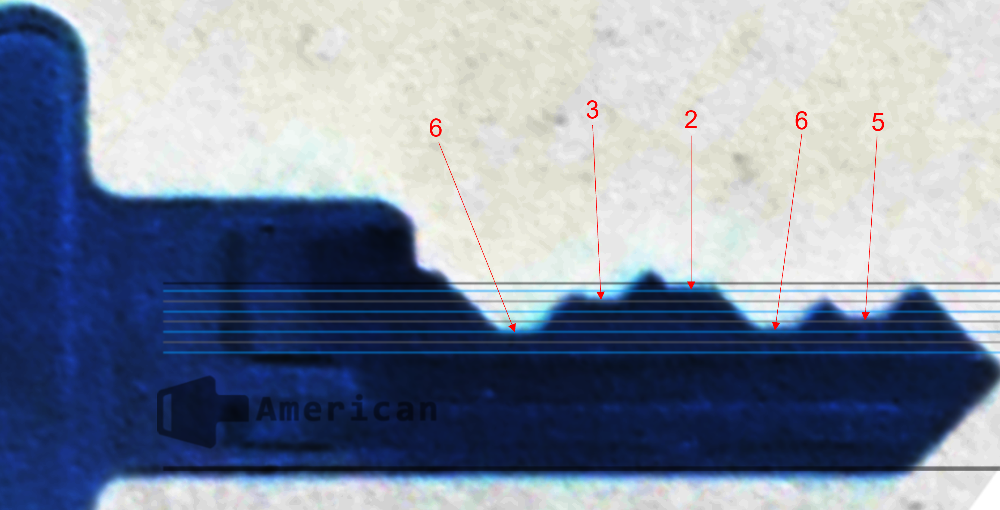

# Keys to the Kingdom

## 题目简述

题目要求从网络工程师公开发布的钥匙环照片中识别最大钥匙的完整品牌名，并读取五个齿位的 bitting code。flag 格式为“品牌-齿码”，品牌只保留大写字母。

官方解法确认题面所指的人就是出题人，并从其公开社交资料中找到原照片。长期 WP 不依赖仍然在线的个人主页，而保留仓库中已经固定下来的原始视觉证据。

## 解题过程

放大最大钥匙后，可以在钥匙头部识别出 American Lock 标识，因此规范化品牌字段为：

~~~text
AMERICANLOCK
~~~

齿码不能只凭“看起来深浅”随意估计。解法使用 Deviant Ollam 维护的 [American Lock key decoding chart](https://raw.githubusercontent.com/deviantollam/decoding/master/Key%20Decoding/Decoding%20-%20American.png)：把钥匙刃的基准线、肩部方向和图表的平行深度线对齐，再按从肩部到尖端的顺序逐个判断切口落在哪条标准深度线上。

五个位置依次得到：

~~~text
6 3 2 6 5
~~~

去掉空格并和品牌拼接：

~~~text
shellmates{AMERICANLOCK-63265}
~~~

## 方法总结

这类物理钥匙 OSINT 题包含两次独立判断：先从公开照片中的品牌、轮廓和尺寸锁定钥匙系列，再使用对应厂商的标准齿深图读取 bitting。必须说明照片方向和读码顺序，否则同一组深度可能被反向抄写。外部图表的核心作用、对齐基准和本题读数已经写入正文，即使链接失效仍能理解结论来源。
