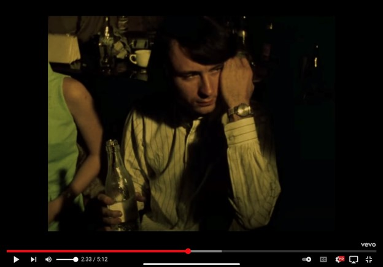

# BYUCTF 2022 - 43

## 题目简述

题面给出密文 `S fsu om yjr aogr 2:34`，并用 “at your fingertips” 暗示键盘。目标是沿音乐视频中的人物、乐队和旧站 FAQ 逐步定位一个姓名。

## 解题过程

每个密文字母都是目标字母右侧的键，把它替换成美式 QWERTY 键盘左邻键，可得：

```text
A day in the life 2:34
```

这指向 The Beatles 的《A Day in the Life》音乐视频。在 2:33～2:34 处出现一名访客：



结合视频演职员表和评论中的时间索引，可确认此人是 Michael Nesmith。他是 The Monkees 成员，因此后续应把 “keyboard code”、Monkees 和题名数字 `43` 联合搜索。旧站 `monkeesrule43` 的 FAQ 第 13 项解释了 Micky 页面上的古怪键盘文字，并指出这种写法来自 Micky Dolenz。

将姓名按题目格式连接：

```text
byuctf{Micky_Dolenz}
```

## 方法总结

这条 OSINT 链每一步都为下一步增加限定词：键盘密文给出视频与时间，画面给出人物，人物给出乐队，乐队与 `43` 才能定位 FAQ。不要只对低质量视频帧做反向搜图，演职员表与时间戳评论通常更稳。
