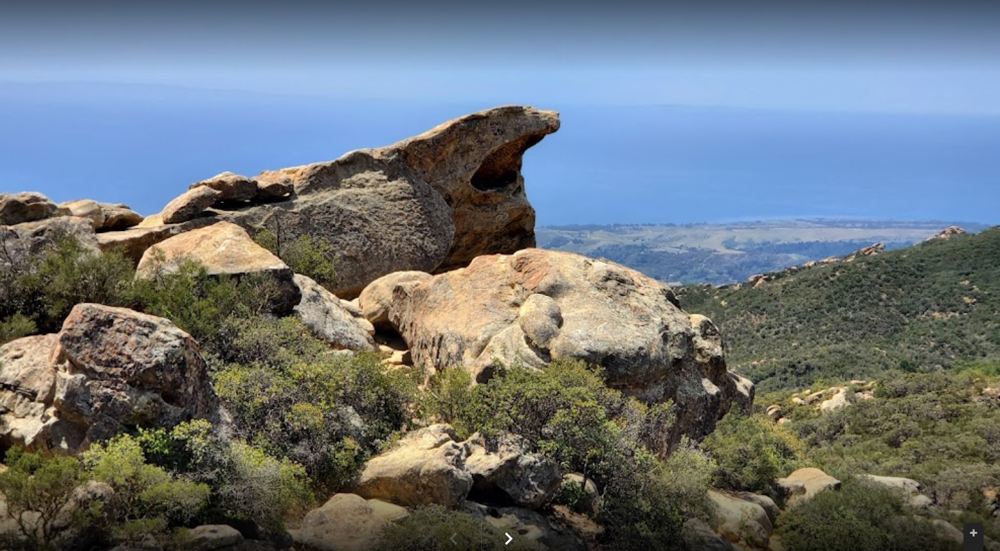

# BYUCTF 2022 - B0uld3r1ng

## 题目简述

附件是一处俯瞰海岸的砂岩攀岩点，题面要求找到与地点相关的 “Sam”。决定性工作是先地理定位，再在攀岩社区中关联用户身份。



## 解题过程

岩石外形像张嘴的蜥蜴，背景是加州海岸山地。用 “lizard mouth rock California bouldering”等组合检索，可定位到 Santa Barbara 的 Lizard's Mouth。

地点在 [Mountain Project 的 Lizard's Mouth 页面](https://www.mountainproject.com/area/105885134/the-lizards-mouth) 上有独立条目；其评论区中，`Samuel Sender` 于 2022-05-05 留言称自己探亲时总会来这里。进入该用户资料页，`Other Interests` 字段直接写着：

```text
byuctf{ju5t_5end_1t_br0_v8bLDrg}
```

本地官方截图同时保存了地点标题、评论用户名与个人资料 flag，即使网页内容后来变化，证据链仍可复核。

## 方法总结

识别地点后还没有结束；题目中的攀岩语境提示应转向垂直社区，而不是只查通用地图。地点评论把 “Sam” 收敛为 Samuel Sender，个人资料中的可编辑字段则是出题人植入 flag 的位置。
