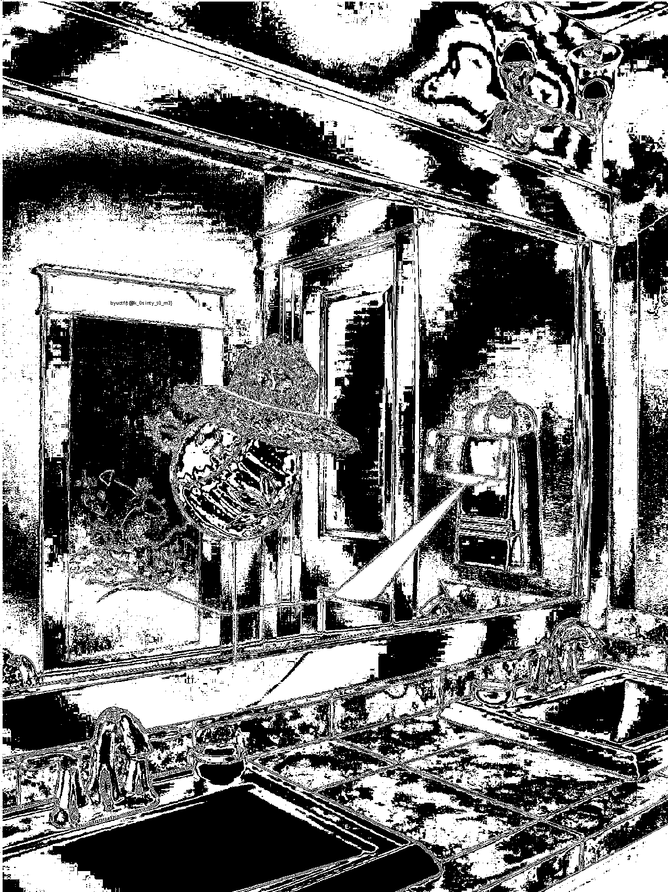

# BYUCTF 2022 - Buckeye Billy #2

## 题目简述

第二题要求调查 Buckeye Billy 的社交媒体。搜索可定位到账号 `@William_buckeye`，其大量帖子中混有一张镜子自拍；flag 被写成与门框相近的浅色，并非额外嵌入的文件数据。

## 解题过程

账号头像、BYU 标志与 Buckeye 主题共同确认目标。帖子中的 “Man in the Mirror” 等线索提示重点查看镜子自拍，而不是把所有歌词和地点都当成独立密码。

原图左侧门框上已有极低对比度文字。提高对比度或分别查看 RGB 位平面后，蓝通道第 4 位、绿通道第 3 位都能把字形从背景中分离：



可读内容为：

```text
byuctf{t@lk_0s1nty_t0_m3}
```

这里的位平面操作只是增强对比；flag 本身已作为相近颜色写在图片里，不应误称为严格的 LSB 数据嵌入。

## 方法总结

OSINT 先负责找到出题人控制的账号和目标照片，图像增强再负责显现低对比文字。对公开资料中的完整 `byuctf{...}` 应优先检查可被出题人编辑的图片、简介和帖子字段。
