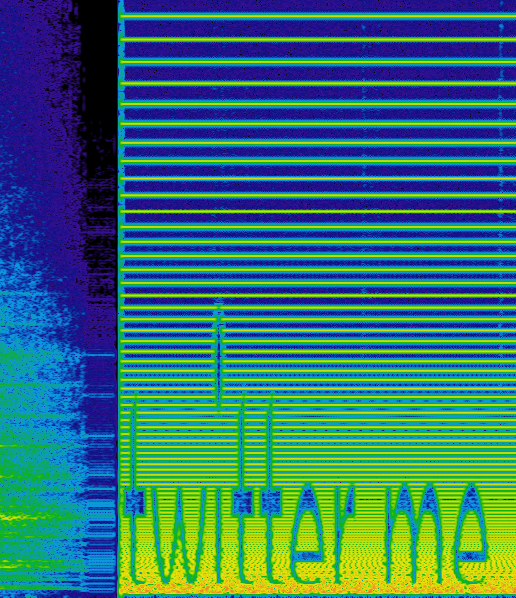

# BYUCTF 2022 - Chad "The Jaw" Bronson

## 题目简述

题目只给一段音乐和人物 Chad 的描述。解法跨越音频频谱、公开账号、Pastebin 文本、简单计数编码和加密 RAR；决定后续能否推进的主线是公开账号与其发布内容，因此归入 OSINT。

## 解题过程

把 MP3 切换到频谱视图，在音频末段能清楚看到文字：



据此搜索 [ChadTheJaw](https://twitter.com/ChadTheJaw)，历史账号发布了两个 Pastebin 链接：一个图片内附密码保护 RAR，另一个是重复 `chad`、`the`、`jaw` 的多行文本。前 14 行的 `chad` 出现次数为：

```text
9, 1, 13, 20, 8, 5, 3, 8, 1, 4, 4, 5, 19, 20
```

按 A1Z26 解为 `iamthechaddest`；末三行 `thejaw`、`the`、`thejawthe` 分别含 2、1、3 个组成词，补成口令：

```text
iamthechaddest213
```

用该口令解开 RAR，按修改时间排序其中的猫视频和图片，最后修改的图片底部写有：

```text
byuctf{cyb3r_ch@ds_are_th3_r3aL_ch@ds}
```

当前 Git 仓库只保留原始 MP3 和官方题解，没有保存当年的 Pastebin 图片、RAR 与猫媒体；频谱线索已本地复核，后半链条按官方记录完整转写，未伪造缺失附件的现场验证。

## 方法总结

频谱中的指令不是 flag，而是搜索渠道。公开账号把两个外部制品关联起来，计数文本提供 RAR 口令，文件时间再确定最终图片。归档时必须明确区分已本地验证的音频证据与已失效外部制品的官方记录。
