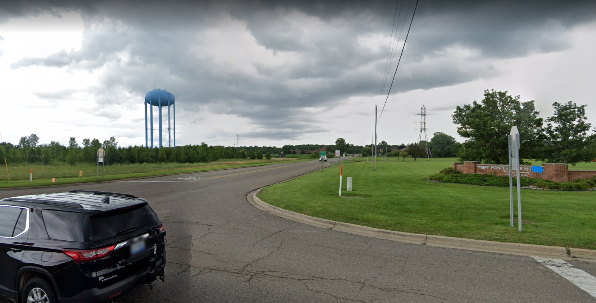

# BYUCTF 2022 - Squatters Rights

## 题目简述

题目给出一张道路街景，画面左侧有蓝色水塔，右侧企业入口标牌只露出部分文字。目标是定位地点，并在相关公开地点信息中寻找出题人植入的 flag。



## 解题过程

放大右侧标牌可读出 `Pioneer State Mutual Insurance`。搜索其总部并在地图中查看附近路口，可把左侧水塔定位为 Michigan Flint Township 的 Wyatt P. Memorial Water Tower，地址信息指向 4610 Beecher Rd 一带。

继续查看该地点的 Google 信息面板，而不是只提交州名或水塔名。在 “From Wyatt P. Memorial Water Tower” 的地点介绍中展开全文，可见出题人植入的末句：

```text
byuctf{h0w_d1d_1_st34l_4_w4t3r_t0w3r}
```

原赛事仓库中的官方截图记录了地点名、地址和这段介绍；正文已把这些关键内容完整转写，避免公开地点贡献后来被删除便丢失解题依据。

## 方法总结

街景中的企业标牌比普通水塔外形更适合作为检索锚点。定位后还要检查地点介绍、评论、照片等可由用户贡献的字段；本题 flag 不在建筑物本身，而在公开地图条目的文本中。
