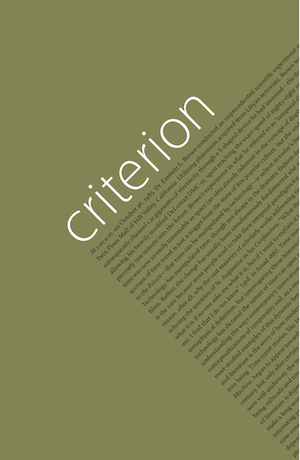

# BYUCTF 2023 - Criterion

## 题目简述

BYU 文学批评期刊 Criterion 的数据库缺失早期刊次。题目要求找回第四期封面，并识别封面引用的电影。

## 解题过程

搜索早期作者论文、旧 Amazon 目录和 LinkedIn 记录，可以恢复第三期文章标题，并得到已失效的原始链接：

```text
http://english.byu.edu/criterion/links/interior3.pdf
```

把该 URL 放入 Wayback Machine 后可恢复第三期 PDF。再查看 [Wayback 保存的原始 links 目录 URL 清单](https://web.archive.org/web/*/http://english.byu.edu/criterion/links/*)，可以找到缺失刊次及相应封面文件。第四期封面归档在：

[Wayback Machine 中的 cover4.png](https://web.archive.org/web/20160708192713/http://english.byu.edu/criterion/links/cover4.png)



封面的斜向标题和电影海报式构图引用《Back to the Future》，按题目格式去掉空格：

```text
byuctf{BackToTheFuture}
```

## 方法总结

本题的关键 pivot 是“死链并非死路”：从一条旧 PDF URL 进入 Wayback，再枚举同目录的历史文件。外部搜索结果只是发现入口，最终结论由归档封面本身验证。
