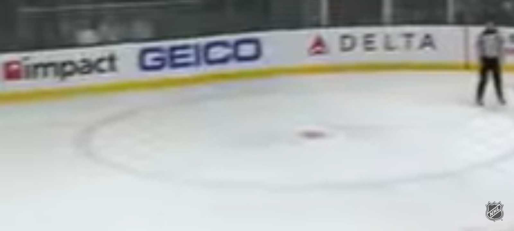

# BYUCTF 2023 - It All Ads Up 2

## 题目简述

第二张照片仍是冰球围板，但广告更通用，需要从较小的赞助商标识反查球队和主场。



## 解题过程

图中 `Impact` 标识辨识度最高。检索 `impact hockey sponsor`，再核对同一围板上的其他品牌，可确认这些广告来自 Los Angeles Kings 的比赛场地。

Kings 在比赛期间的主场名称是 `Crypto.com Arena`。题目保留域名式句点，只把空格替换为下划线：

```text
byuctf{Crypto.com_Arena}
```

## 方法总结

当主品牌不足以唯一定位时，应把照片看成“赞助商集合指纹”。先由稀有品牌找候选球队，再用其他标识和主场信息复核；不要把搜索结果第一页当作最终证据。
