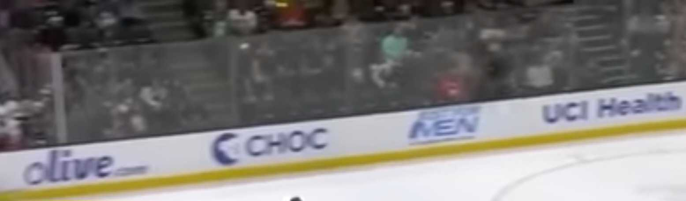

# BYUCTF 2023 - It All Ads Up

## 题目简述

题目给出冰球场围板广告照片，要求确定拍摄建筑。可见广告品牌和冰球队环境构成地理定位线索。



## 解题过程

先确认场地类型：白色冰面、黄色踢脚板和透明围板表明这是冰球馆。把图中任一清晰品牌与 `hockey sponsor` 组合检索，再交叉检查其赞助球队，可将线索收敛到 Anaheim Ducks。

Ducks 的主场是 Honda Center；不是只凭城市或球队猜测，而是由多块围板广告共同支持。按题目要求把空格写成下划线：

```text
byuctf{Honda_Center}
```

## 方法总结

场馆定位应使用多个独立广告线索交叉验证，避免某个全国品牌造成误判。识别顺序通常是运动项目、球队赞助关系、球队主场，最后统一题目规定的建筑名格式。
