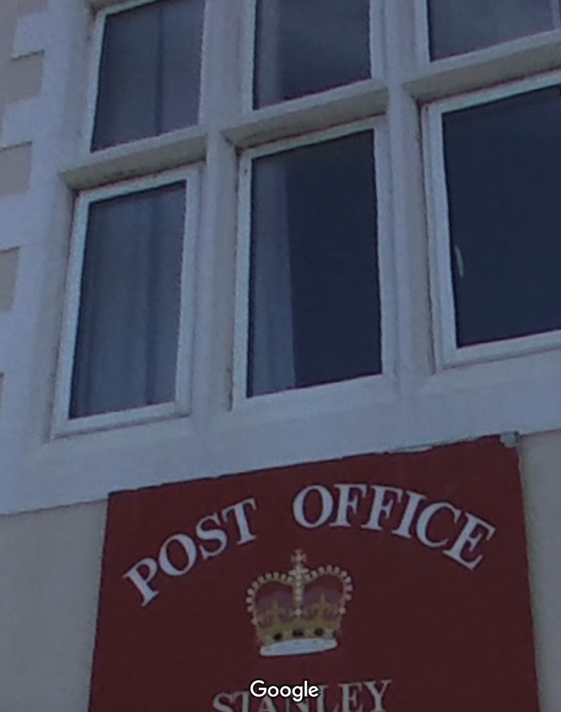

# Mail Time

## 题目简述

附件是一张邮局外景，要求提交 Google Maps 上列出的完整地址。画面没有 GPS 文本，定位线索来自招牌的视觉元素和地名，因此保留原图作为证据。

## 解题过程



招牌顶部王冠与英国邮政体系相符，正文可辨认出 `POST OFFICE` 和 `STANLEY`。直接在英国本土搜索 Stanley 会产生大量噪声；题目描述强调“被时间遮蔽的地址”，应把英国海外领地也纳入范围。

在 Falkland Islands 的首府 Stanley 可以找到外观、王冠和招牌布局均一致的邮局。比赛时 Google Maps 条目给出的完整地址是：

```text
845P+98W, Ross Rd, Stanley FIQQ 1ZZ, Falkland Islands (Islas Malvinas)
```

按原样保留标点、空格和括号：

```text
byuctf{845P+98W, Ross Rd, Stanley FIQQ 1ZZ, Falkland Islands (Islas Malvinas)}
```

## 方法总结

地理定位应把可见文字、机构标识、建筑外观和地图条目逐层交叉验证。本题的关键 pivot 是从英国王冠邮政标识扩展到海外领地，再用 `STANLEY` 唯一化；最终还要严格采用题目指定平台的地址格式。
