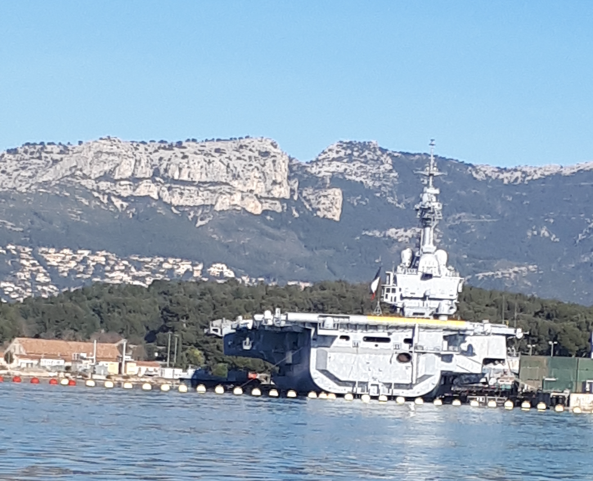

# Vacation Boats

## 题目简述

附件拍到远处的一艘航空母舰，要求识别舰名。舰体轮廓、飞行甲板与舰岛具有真实视觉辨识价值，因此保留图片，而不把结论替代成无证据文字。

## 解题过程



先裁取舰体区域做反向图片搜索，Bing Visual Search 能命中同一视角或相近照片。再用可见结构交叉核对：斜角甲板、舰岛位置和整体轮廓都与法国海军 `Charles de Gaulle`（舷号 R91）一致，而不是仅凭搜索结果标题提交。

题目接受空格、连字符或下划线分隔的舰名。规范答案为：

```text
byuctf{Charles de Gaulle}
```

## 方法总结

反向图片搜索是候选生成器，不是最终证据。应对候选舰艇的舰岛、甲板、舷号和拍摄背景逐项复核；对远距离低清照片，多个独立外形特征的一致性比单个搜索命中更可靠。
