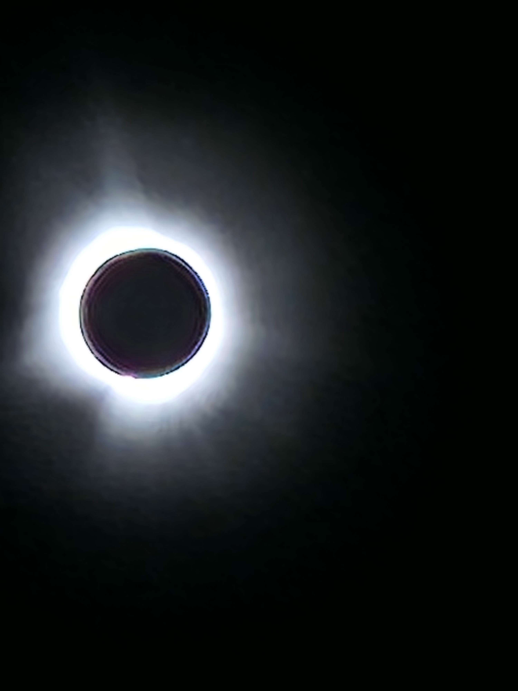
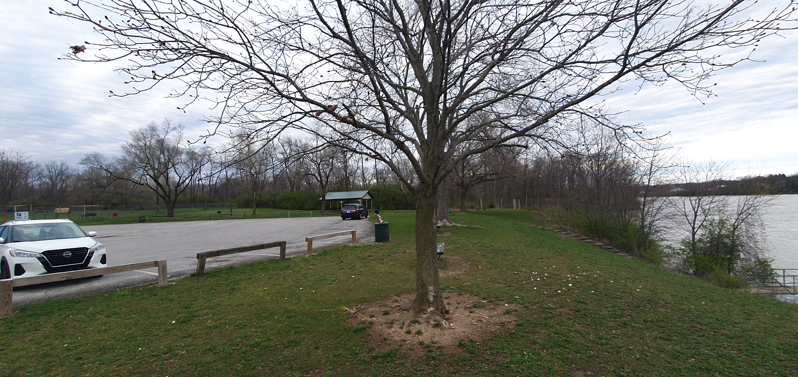
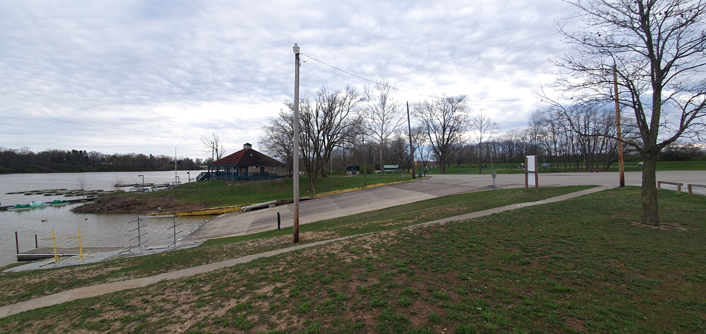
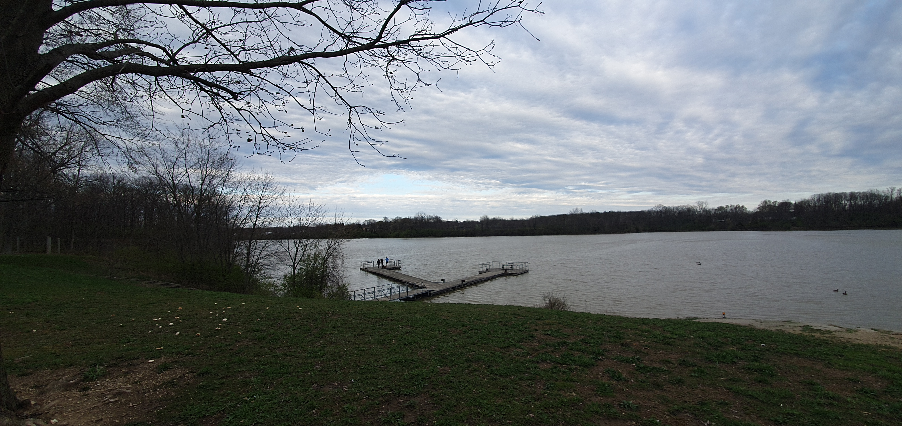

# Water You Doing, Step-Eclipse?

## 题目简述

题面称 2024 年 4 月 7 日下午在水边长椅拍摄三张环境照，24 小时后在同一长椅拍到太阳，要求定位到 what3words 的 3 米方格。四张照片共同提供天文时间、企业标志和岸线几何证据，均予保留。

## 解题过程



照片显示的是 2024 年 4 月 8 日北美日全食；[NASA 的路径与时间资料](https://science.nasa.gov/eclipses/future-eclipses/eclipse-2024/where-when/)可把 15:00—15:30 EDT 的候选范围缩到全食带内的美国中东部。



第二个强线索是画面中的 Hill's 标志。沿全食带核对 Hill's Pet Nutrition 工厂，候选主要落在 Indiana 与 Ohio；Ohio 候选附近缺少与照片相符的大水面，而 Richmond, Indiana 的 Hill's 工厂附近有 Middlefork Reservoir。





在卫星图和街景中继续比对停车区、船坡道、亭棚、T 形码头、岸线方向以及长椅相对位置，可锁定 Middlefork Reservoir 左侧目标长椅。what3words 网格边界恰好让可接受位置落在相邻方格，官方接受：

```text
byuctf{mindset.keynote.dollars}
byuctf{lately.nominations.manly}
```

任选其一即可。

## 方法总结

这是一条多源地理定位链：日全食时间缩小区域，企业标志定位城市，水体与码头几何定位公园，最后用长椅方向落到 3 米网格。每一步都应保留前后候选淘汰依据，不能从最终三词地址倒推一个看似合理的故事。
