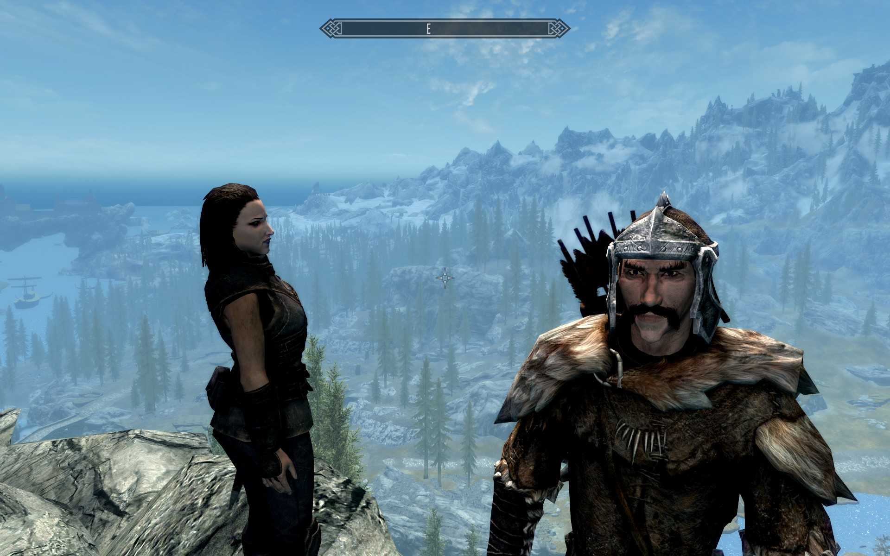

# Skywim

## 题目简述

题目给出一张 Skyrim 游戏截图，要求确定角色所在的命名地点。截图本身是决定性证据：角色站在高处，视野左侧远处有海港船只和 Solitude 一带的巨大天然拱形地貌，前方还能看到一座单独跨河桥梁。

## 解题过程



先用城市轮廓定位大区域。Solitude 建在天然石拱上，港口和船只位于其下方；截图左侧的轮廓与这一组合吻合。再利用画面顶部指南针显示朝东、观察点位于裸露高崖、视线中只有一座显著桥梁等关系确定相对方位。

在 [MapGenie Skyrim 交互地图](https://mapgenie.io/skyrim/maps/skyrim) 上同时对照 Solitude 港口、Dragon Bridge、河谷和周围高点。满足“从高崖向东俯视、桥与港口处于画面相对位置”的命名地点是 `Dragon Bridge Overlook`。

按题目格式提交：

```text
byuctf{Dragon_Bridge_Overlook}
```

## 方法总结

- 核心技巧：先用独特城市地貌确定锚点，再用桥梁数量、海港、海拔和指南针方向做地图几何匹配。
- 识别信号：游戏地理定位题中，远景地标和相对方位往往比角色/NPC 更有价值；命名观景点通常位于可复核的高差位置。
- 复用要点：至少同时匹配两个地标与一个方向关系，避免仅凭“看起来像某地区”下结论。
