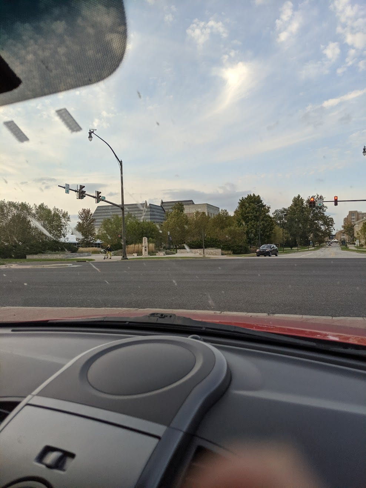

# Universal-ty

## 题目简述

题目要求识别 Cameron Snider 高中时期一日游参观的大学。这里存在仓库材料漂移：比赛页面截图显示附件名为 `school2.jpg`，独立解题记录保存的原图是一座具有多组尖顶、横向深浅条纹外墙的建筑；当前源码仓库中的 `school.jpg` 却是带 `US 40` 路牌的道路照片，两者并非同一图像。后者只能辅助说明 Indiana 背景，不能直接验证最终校园，因此不作为决定性证据保留。

## 解题过程

下面保留的是独立比赛题解中保存的实际竞赛图像，来源与完整调查过程见 [Universal-ty 解题记录](https://ch1se.medium.com/universal-ty-byuctf-2025-osint-challenge-18d8b0ccc434)：



先检查 EXIF，未发现可用 GPS。图片检索工具曾给出芝加哥 Reva and David Logan Center for the Arts，但其外墙和屋顶结构不符，应排除。裁剪建筑主体后进行反向图片搜索，命中 DeBartolo Performing Arts Center 的公开照片；可比对的稳定特征包括：

- 多个高低错落的尖顶体块；
- 外墙连续的深浅水平条纹；
- 中央较窄的山墙入口与右侧浅色矩形体量；
- 建筑、绿地和十字路口之间的观察角度。

地图/街景进一步确认道路几何和建筑朝向一致。Notre Dame 官方页面说明 [DeBartolo Performing Arts Center 位于 University of Notre Dame 校园南侧](https://performingarts.nd.edu/directions-parking/)，因此答案为：

```text
byuctf{University_of_Notre_Dame}
```

当前仓库附件与比赛附件的差异已明确写出，结论依据实际竞赛图像、独立解题记录、建筑视觉匹配和大学官方地点信息，而不是把错误图片强行解释成校园。

## 方法总结

- 核心技巧：裁剪独特建筑轮廓做反向图片检索，再用街景道路几何和官方地点信息交叉验证学校归属。
- 识别信号：建筑定位应优先利用屋顶体块、外墙纹理和路口视角；AI 单点猜测只能产生候选，不能作为结论。
- 复用要点：若仓库附件、比赛页面和第三方题解出现漂移，必须保留来源链并明确哪张图实际支撑答案，不能混写证据。
