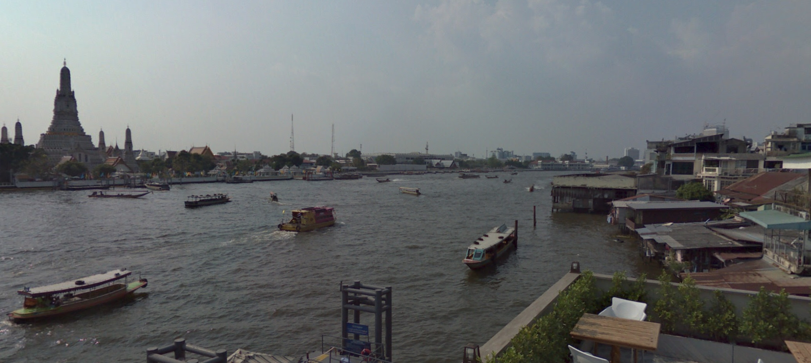

# Questionable Trip

## 题目简述

题目给出一张从河畔餐饮场所拍摄的城市景观，要求确认拍摄者所在商家的名称。照片中的寺庙轮廓、河流和对岸建筑共同提供地理定位线索。

## 解题过程

照片左侧的高塔具有曼谷郑王庙（Wat Arun）标志性的塔身轮廓，说明相机位于湄南河对岸并朝向寺庙。先在地图中定位 Wat Arun，再沿东岸筛选能同时满足以下条件的临河商家：

1. Wat Arun 位于画面左侧而非正中央；
2. 河岸距离、栏杆与前景平台形态一致；
3. 对岸建筑的相对间距和视角吻合。

在 Google Earth 调整观察方向，再用街景和商家照片比对拍摄平台，匹配到 Chom Arun。按题目要求使用商家名提交：

    byuctf{Chom_Arun}

## 方法总结

单张城市景观定位应先找具有唯一性的地标，再用视角几何缩小相机所在岸线，最后以街景、室内外照片和商家边界确认具体地点。图像在这里承载了不可由纯文本替代的构图证据，因此保留并使用语义化文件名。
