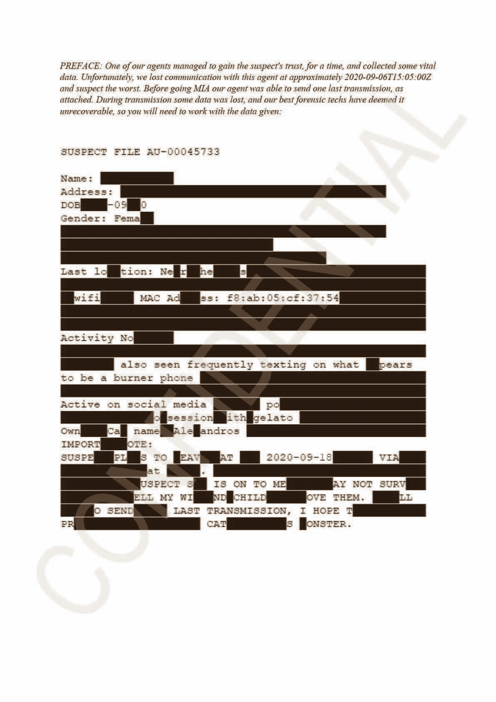

# DownUnderCTF 2020 - A turn of events w/ some REALLY bad OPSEC

## 题目简述

题目给出一页严重遮挡的嫌疑人档案，要求找出其离开澳大利亚所乘交通工具的 call sign 与名称。仍可见的 MAC 地址、宠物/gelato 片段、社交媒体活动、burner phone 和计划日期不是独立答案，而是跨前置题身份、Wi-Fi 地理位置、社交媒体音视频与船舶历史记录的关联键。

## 解题过程



### 还原嫌疑人和最后位置

档案中可可靠读取的关键片段包括：

```text
Gender: Female
wifi MAC Address: f8:ab:05:cf:37:54
also seen frequently texting on what appears to be a burner phone
Active on social media
obsession with gelato
Own cat named Alexandros
SUSPECT PLANS TO LEAVE ... 2020-09-18
```

Alexandros 与 gelato 把嫌疑人关联到前题确认的 Emily Theresa Waters 及其账号 `emwaters92`、`gelato_elgato`。在 WiGLE 的公开无线接入点数据库中查询 BSSID `f8:ab:05:cf:37:54`，可定位 Titanic Theatre Restaurant, 1 Nelson Place, Williamstown, Victoria，靠近 Port of Melbourne。

### 从公开动态恢复交通方式和时间

Emily 的 Twitter 动态引用 “the front fell off” 油轮段子并表达对 tanker 的担忧；Instagram 又有在 Docklands “Gelateria on the Docks” 拍摄的视频。两个位置和话题共同指向从 Melbourne 港乘船离开。

视频背景的拨号音不是随机噪声，而是 DTMF。解码按键序列得到：

```text
6338063028090300
```

按 `0` 分隔并用 T9 解释，前半段是 `MEET ME AT`；尾部 `9 30` 表示 9:30。因此调查条件变为：2020-09-18、Port of Melbourne、9:30 之后、tanker。

### 查询港口历史记录

在船舶历史到离港记录中筛选 2020-09-18 全天的 Melbourne 港，只剩一艘在 9:30 后离港且类型为 tanker 的合理候选：CAP VICTOR。船舶资料页给出 call sign `SWHR`，于是：

```text
DUCTF{SWHR_CAP_VICTOR}
```

本题原始版本日期曾是 2020-09-06，最终重发版改为 2020-09-18；最终版本的筛选条件是“9:30 后唯一 tanker”，而不是“恰好 21:30 抵港”。这个版本差异必须写清，否则复查历史船期会出现矛盾。

## 方法总结

- 核心技巧：从遮挡文档提取稳定实体键，串联前置身份、BSSID 地理定位、社交媒体 DTMF/T9 和历史船期。
- 识别信号：MAC/BSSID 可指向 Wi-Fi 地理数据库；burner phone 加按键音提示 DTMF/T9；港区位置、tanker 话题和离境日期共同构成运输记录筛选条件。
- 复用要点：每次 pivot 都要由至少两条线索支持；重发题要记录最终日期和原版差异；船名与 call sign 应在 vessel detail 中交叉确认，不能只按离港时间猜船。
