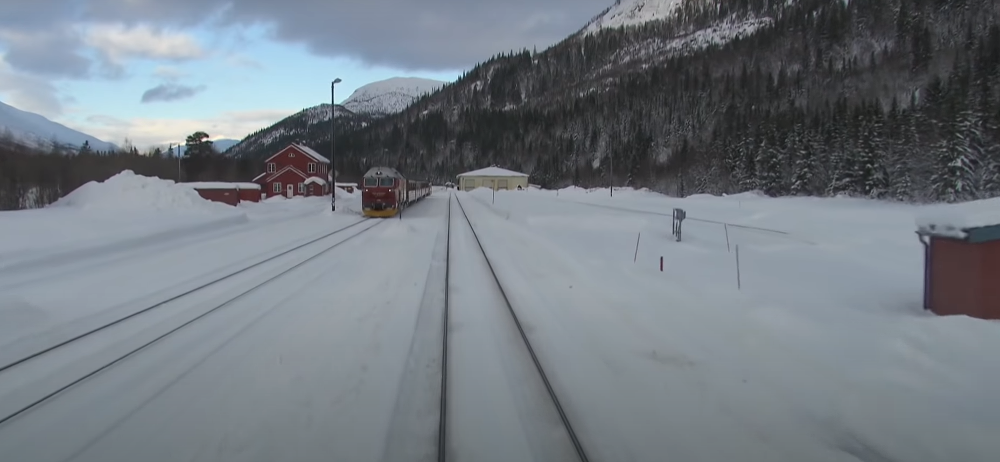

# DownUnderCTF 2020 - Off the Rails 2: Electric Boogaloo: Far from Home

## 题目简述

题目给出一张雪地铁路驾驶室视角截图，要求识别车站。图中有一列红灰色机车、两条轨道、一座两层红色站房、一座单层浅色建筑，周围没有停车场或密集聚落，并紧贴山谷。核心是先从机车外观确定国家与线路，再沿有限站点做视觉比对。

## 解题过程



裁剪左侧机车做反向图片搜索，或对其涂装、车头轮廓和 logo 做车型比对，可识别为挪威 NSB Di 4。该柴油机车的常见运营线路包括 Nordland Line，因此候选从全球雪地车站收敛到这条线路的站点。

接着从原图提取可排除条件：

- 站场有两条可会车轨道；
- 站房为两层红色木结构，旁边有低矮红色附属体；
- 对侧为一层浅色建筑；
- 周围非常偏远，位于陡峭山谷中。

在 [OpenRailwayMap](https://www.openrailwaymap.org/) 上沿 Nordland Line 逐站检查，再用公开照片核对少量候选。Dunderland Station 的轨道数、建筑相对位置、红色站房和山体轮廓都与截图一致，其他站点至少有一项明显冲突。

最终提交：

```text
DUCTF{dunderland}
```

原截图来自一段 Nordland Line 驾驶室视频，但正文已经把识别所需的车型、线路与空间特征全部保留；外链视频不是复现主线的必要依赖。

## 方法总结

- 核心技巧：用车型识别把地点约束到具体铁路，再以轨道、建筑和地形组合逐站排除。
- 识别信号：铁路图像中车辆涂装/型号往往比普通景观更能缩小范围；双线数量、站房相对位置和山谷形态是稳定比对点。
- 复用要点：反向搜图只用于提出车型候选，最终应以线路运营资料和站点多特征一致性确认，不能只因一张相似照片就停止。
