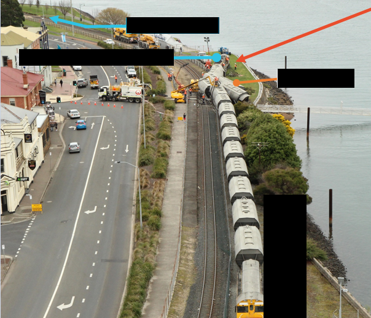
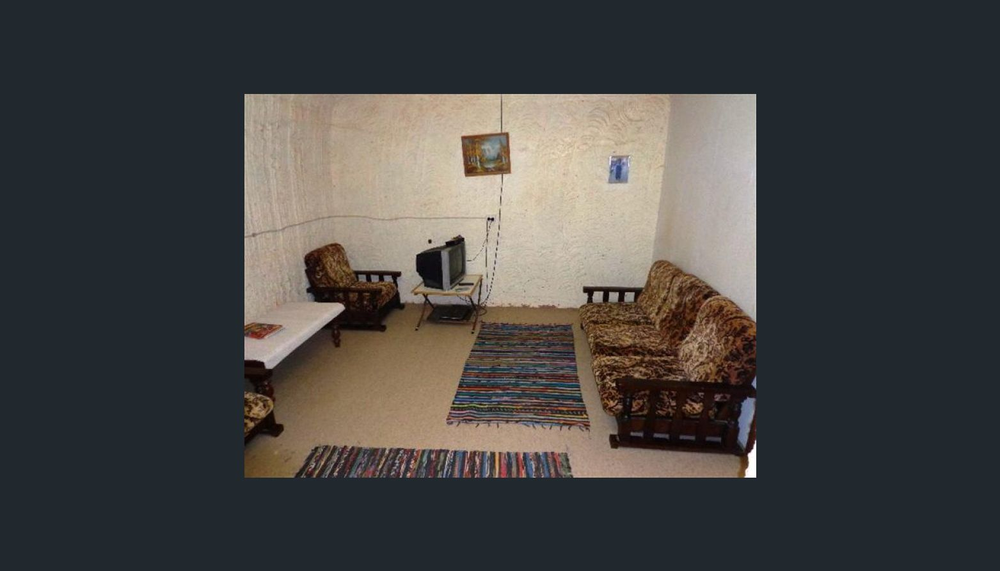

# DownUnderCTF 2020 - Off the Rails 3: LOCOmotive

## 题目简述

题目由两组独立的澳大利亚公开情报线索构成。第一张图是部分遮挡的临水铁路事故现场，要求列车出发地和事故军用时间；第二张图是弧形墙面的地下住宅，题面给出数字 1134，要求上一住户汽车颜色和房内谷物品牌。最终格式为 `DUCTF{origin_time_carcolour_cereal}`。

## 解题过程

### 第一段：Railton 与 0909



图中能保留的稳定特征是：货运列车、黄色机车、海滨道路和列车冲出轨道。搜索 “freight train derailment waterfront Australia” 可定位 2018-09-21 Devonport 无人驾驶货列事故。

再用权威事故调查报告确认，而不是从新闻中的 “just after 9am” 猜时间。[ATSB 调查 RO-2018-014](https://www.atsb.gov.au/publications/investigation_reports/2018/rair/ro-2018-014/)记录：列车约 08:46 从 Tasmania 的 Railton loading facility 溜逸，行驶约 21 km，并在 09:09 于 Devonport 冲过尽头侧线。第一段因此为：

```text
railton_0909
```

### 第二段：Coober Pedy 房产记录



曲面开凿墙体加上 “live downunder(ground)” 明确指向以 dugout homes 闻名的 Coober Pedy。`1134` 不是时间，而是房产检索键；在 sold-property 数据中搜索 Coober Pedy 与 1134，可定位一条 2017 年出售记录。

对比挂牌照片可验证题图就是该住宅的客厅。照片组里：

- 第 4 张左下角有 Nutri-Grain cereal；
- 第 13 张唯一可见汽车为白色。

因此第二段为：

```text
white_nutri_grain
```

组合后得到：

```text
DUCTF{railton_0909_white_nutri_grain}
```

## 方法总结

- 核心技巧：事故图用权威调查记录确认时间与起点；住宅图用建筑特征和 sold-property 图集恢复细节。
- 识别信号：题目要求精确军用时间时，新闻只适合定位事件，最终应查事故报告；地下住宅与数字共同出现时，数字可能是房产列表过滤键。
- 复用要点：视觉相似只是入口，最终每个字段都要有独立记录支撑；浏览房产图集时记录图片序号和所见对象，避免把当前住户、上一住户或不同挂牌批次混为一谈。
