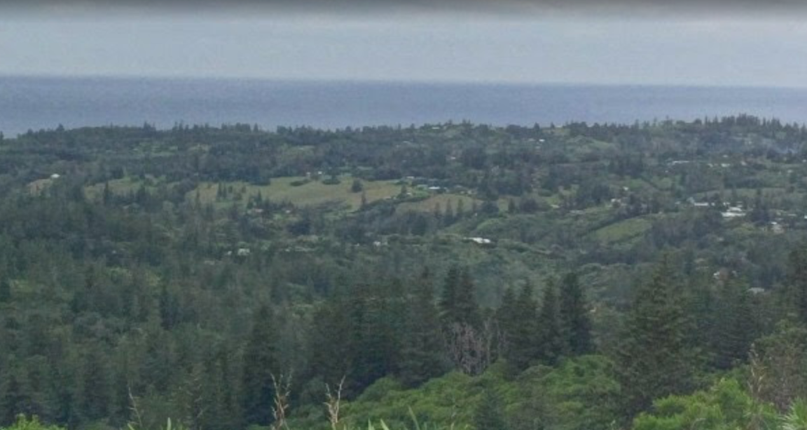

# DownUnderCTF 2020 - Off the Rails 4: Back by unpopular demand

## 题目简述

题目把 flag 拆成三段、六个字段：2018 年某澳大利亚地点的汽车数和 1.77 GHz 发射站 site ID；一段驾驶室视频中司机挥手次数和车辆 registration；以及横跨 “metaphorical fence” 的 airstrip 名称与 postcode。两张题图保留了地点与交通工具的视觉线索，第三段完全依赖文字双关和地图关联。

## 解题过程

### 第一段：Mount Pitt



海岸、大片 Norfolk pine 和高海拔视角将地点收敛到 Norfolk Island 的 Mount Pitt。Google Maps 上该点有一张 Alex Wolfson 于 2018 年上传的 photosphere；在对应全景中可数到 2 辆车。

题面同时给出 `1.77ghz` 与 `siteID`，这是无线电发射站登记信息。在 Australian Communications and Media Authority（ACMA）的 Register of Radiocommunications Licences 中按地点/频率交叉筛选 Mount Pitt，匹配站点 ID：

```text
10008340
```

第一段是 `2_10008340`。

### 第二段：Canberra Light Rail


图中 T 信号灯、道路中央的专用轨道、崭新的混凝土和左侧 Civil Quarters 建筑把地点锁定为 Canberra light rail。挡风玻璃左上角直接可读出 registration `004`；题目问 “wave” 则表明静态截图只是视频定位线索。

在公开视频中匹配相同驾驶室、红帽司机和路段，完整观看并逐次计数司机对其他轻轨司机或施工人员的挥手动作，共 7 次。第二段为 `7_004`。

### 第三段：Emu Fence Road

“Australia lost the war” 指知名的 Emu War；“metaphorical fence” 不是实体防护网，而是地图上的 Emu Fence Road。沿该道路查看卫星图，可以找到一条 dirt/sand airstrip 直接横跨道路。该设施标注为 Marvel Loch airstrip，所在地邮编 6426。

第三段为 `marvel_loch_6426`。拼接全部字段：

```text
DUCTF{2_10008340_7_004_marvel_loch_6426}
```

## 方法总结

- 核心技巧：把自然景观、公共频率登记、视频行为计数和地图文字双关分别转成可验证字段，再按固定顺序组装。
- 识别信号：`siteID + frequency` 指向监管登记库；静态图却要求动作次数时必须找原视频；“fence” 与 airstrip 同时出现时应检查道路/地名而非只搜实体围栏。
- 复用要点：多段 OSINT 要为每个字段维护独立证据，避免一个错误假设污染全 flag；计数类结果应完整观看原视频，地图地点则用道路交叉关系与邮编双重确认。
