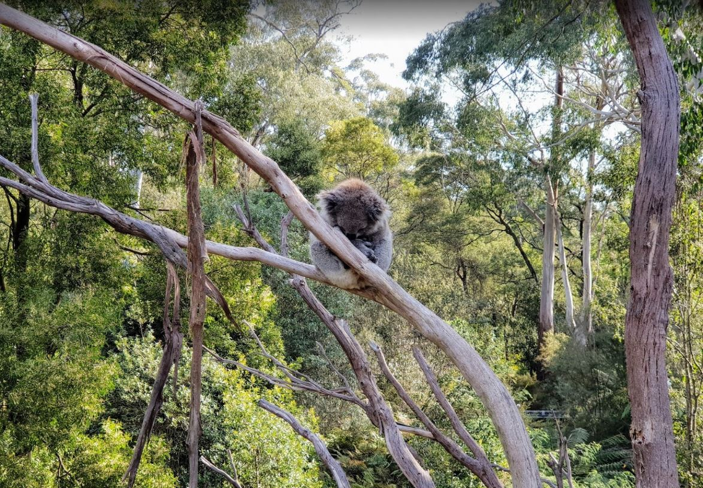
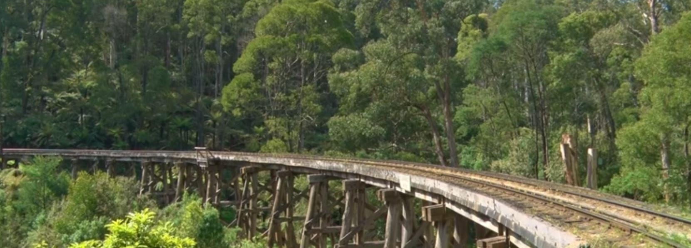
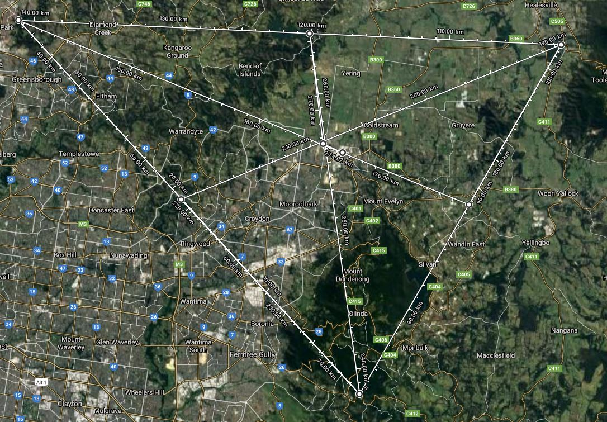
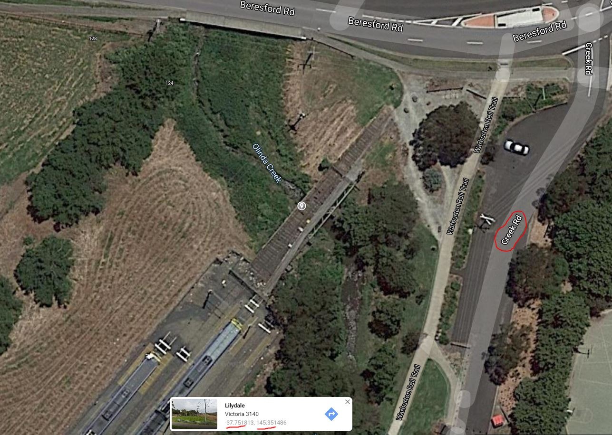

# DownUnderCTF 2020 - Off the Rails

## 题目简述

题目要求定位一座距朋友住宅约 2 km 的铁路桥，并提交桥中心坐标与平行道路名。住宅没有直接给出，而是由三点约束：一张含 GPS 元数据的 koala 照片、一张可识别的木制 trestle bridge 照片，以及 2019 年底距离住宅约 25 km 的郊区山火。朋友位于这三点形成区域的中部。

## 解题过程

### 确定两个图片位置



对 `koala.jpg` 读取 EXIF GPS，并把度分秒转换为十进制度，可定位 Healesville Sanctuary。这里要保留原文件，因为 GPS 是图片容器中的证据；重新截图会丢失元数据。



第二张图的弯曲轨道、木制 trestle 支架和森林环境与 Puffing Billy Railway 的 Monbulk Creek trestle bridge 匹配。桥梁照片比普通绿地更适合做局部反向图片搜索，再用公开照片确认弧度和外伸支架。

### 结合 2019 年底山火做三点定位

“late last year、near suburbs” 对应 2019-12-30 左右的 Plenty Gorge/Mill Park bushfire。把 Healesville Sanctuary、Monbulk Creek bridge 和实际火场位置作为三个顶点，取三角形重心附近，得到 Lilydale 西北部的住宅候选区域。



题目只说 “middle”，因此这一步本来就是近似约束，不应把截图上的测距线当成高精度定位。

### 找出 2 km 内的铁路桥

以候选住宅区为中心检查约 2 km 范围内的铁路。附近现役 Lilydale line 与废弃 Healesville/Warburton branch 都留下铁路结构；符合 “不易被看到、又靠近车站逃离” 的目标，是 Lilydale station 后方废弃支线跨 Olinda Creek 的桥。



地图标注给出桥中心约为 $(-37.751813,\ 145.351486)$，按题面要求取 3 位小数应为 `-37.752`、`145.351`；平行道路标注为 `Creek Rd`。比赛期间按题面格式提交的正常答案是：

```text
DUCTF{-37.752_145.351_creek_rd}
```

比赛早期校验曾错误接受或拒绝相邻舍入值，并一度把经纬顺序写反；官方 WP 因此还列出了多个兼容值。当前公开源码仓库的 `challenge/flag.txt` 则保存了未压缩到 3 位小数的精确版本：

```text
DUCTF{-37.7518_145.3515_creek_rd}
```

因此复现原比赛题面时使用前一个 3 位小数答案；与当前仓库文件做自动核对时使用后一个 4 位小数存档值。两者指向同一座桥，并非两套不同解法。

## 方法总结

- 核心技巧：EXIF 定位、视觉桥型识别、历史事件地理定位和三点近似约束结合，再在局部铁路网内筛桥。
- 识别信号：题面明确说某人位于三个点 “middle”，通常不是要求精确三边测量，而是先把搜索范围降到一个城区；随后距离与基础设施类型才是精确筛选条件。
- 复用要点：图片元数据应从原文件读取；火灾要定位实际 fireground 而非报道中的宽泛 suburb；经纬度按纬度在前、经度在后并用标准四舍五入，遇到赛事校验错误要在 WP 中明确区分正确答案与历史兼容值。
