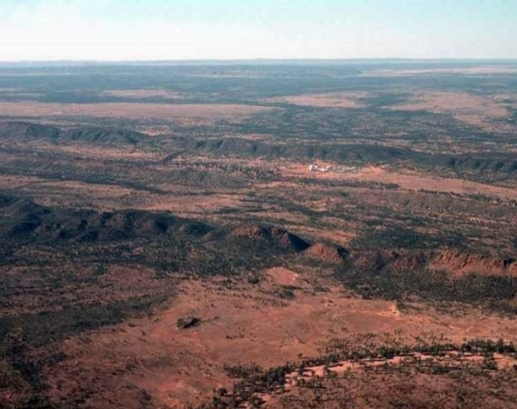

# DownUnderCTF 2020 - Outback Stakeout

## 题目简述

题目给出一张低清晰度的澳大利亚内陆航拍图，要求回答地点和 “dish” 数量。图中可见两列近乎平行的山脉，中间有一处孤立的大型设施；标题 “Outback” 和 dish 一词共同指向位于 MacDonnell Ranges 间的卫星地面站。

## 解题过程



先记录而不是猜测图像特征：

- 干旱红土地貌；
- 两侧狭长、方向一致的山脊；
- 中央设施规模大，但附近没有普通城镇道路网；
- 题面问的是 dishes，而不是 buildings 或 antennas。

搜索 “parallel mountain ranges Australian outback” 会把范围收敛到 Alice Springs 附近的 MacDonnell Ranges。继续组合 “MacDonnell Ranges dish” 或在卫星地图中沿山脉间搜索，可定位 Pine Gap 联合防务设施。设施在两列山脊之间的位置与航拍图完全一致。

下一步用精确实体名查询公开报道中的天线规模。官方 writeup 所用的公开资料记录 Pine Gap 当时有 38 个 radome/satellite dishes，因此按小写地点名、空格改下划线格式提交：

```text
DUCTF{pine_gap_38}
```

图片原始来源是 Ludo Kuipers 于 1976-09-10 拍摄的 Pine Gap 航拍照片；正文保留了能独立识别地点的地貌和设施关系，不要求读者只靠反向搜图。

## 方法总结

- 核心技巧：从地貌布局和题面双关确定设施类型，再用卫星地图与公开报道分别验证地点和数量。
- 识别信号：航拍图中孤立设施位于独特地形之间，题面又给出具体设施术语时，应把地形搜索词与设施词组合，而不是泛化反搜整图。
- 复用要点：数量可能随年份变化，应采用与题目时间相符的资料并记录口径；位置验证和数量验证最好来自不同公开证据。
